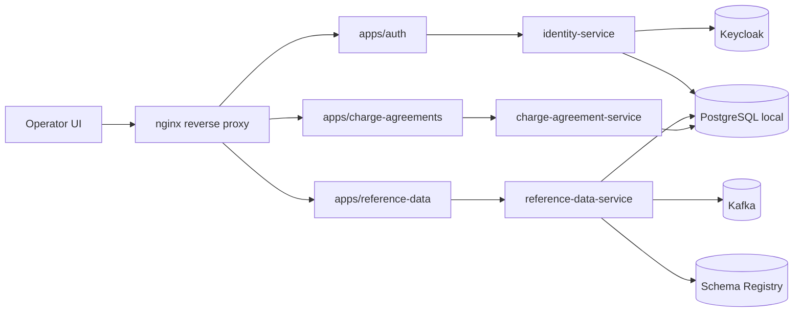
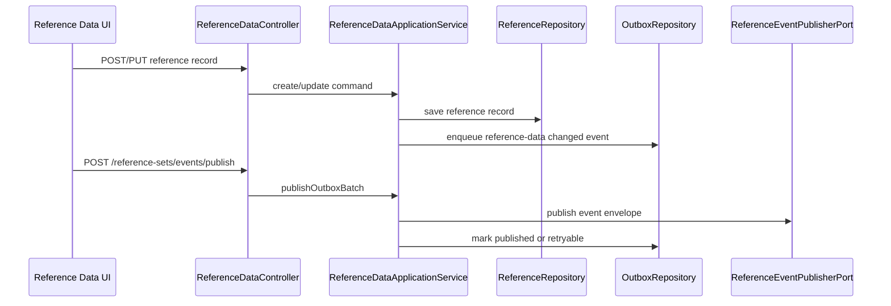
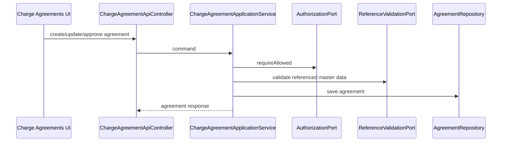
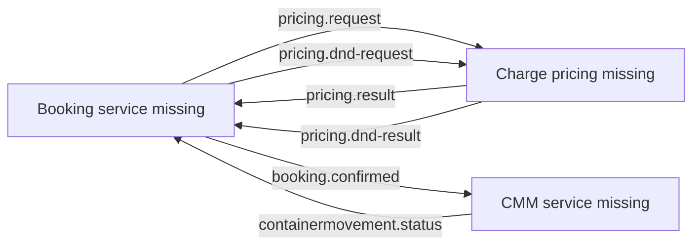

# Architecture - TST_Codex

## Reverse Engineering Context

This architecture summary was refreshed for the LinerCore Enterprise AI-DLC intent. Graphify was used first for architecture discovery, including `graphify query`, `graphify explain ReferenceDataApplicationService`, `graphify explain ChargeAgreementApplicationService`, and `graphify path ReferenceDataApplicationService ChargeAgreementApplicationService`.

Subagent caveat: the configured reverse-engineering subagent failed because its model is unavailable for this account. This synthesis was completed inline from Graphify and focused repository reads.

## Architectural Style

The backend follows a modular service style with explicit submodules per service:

- `domain-core`: domain model, value objects, domain validation, outbox/domain event model where present.
- `application-service`: application orchestration, ports, command/query objects.
- `dataaccess`: in-memory repository adapters.
- `messaging`: placeholder or integration adapters for event/schema seams.
- `container`: Spring Boot application wiring and HTTP controllers.
- `published-language` and `application`: module placeholders or API language packages.

The frontend follows a Yarn workspaces monorepo:

- `apps/*`: Next.js applications.
- `packages/*`: shared UI, auth, config, API client, transformers, shared types, utilities.

Runtime architecture is Compose-based for local execution, with PostgreSQL, Keycloak, Kafka, Schema Registry, Spring services, Next apps, nginx, and observability components.

## Current Component Relationships

Text fallback: users reach Next apps through nginx; apps call service APIs; services use local infrastructure. Reference Data has Kafka and Schema Registry seams. Identity integrates with Keycloak concepts. Charge Agreement is present in code but not currently included as an app service in `compose.yaml`.

## Service Architecture

### Identity Service

Graphify identifies `IdentityApplicationService` as a central application service. It handles authorization, role assignment, effective permissions, subject resolution, and audit repository seams. HTTP surface is under `/internal/identity`.

### Reference Data Service

Graphify identifies `ReferenceDataApplicationService` as central with references to repositories, authorization, outbox, event publisher, and schema registry ports. It supports reference set record CRUD/validation, history, outbox status, claiming, and publishing.

### Charge Agreement Service

Graphify identifies `ChargeAgreementApplicationService` as central with lifecycle methods including create, update, approve, suspend, expire, active lookup, reference validation, authorization, and event publisher port. This is a partial commercial foundation, not complete pricing.

### Missing Enterprise Services

No implemented Booking service or CMM service was found. Enterprise contracts exist in `docs/enterprise-contracts`, but executable provider/consumer code is absent for Booking/CMM and for pricing request/result.

## Interaction Diagrams

### Reference Data Mutation and Outbox

Text fallback: reference-data writes are saved and mirrored into an outbox. A publish operation claims events, publishes through the event publisher port, then updates outbox status.

### Charge Agreement Lifecycle

Text fallback: charge agreement operations pass through controller, authorization, reference validation, repository persistence, and response mapping.

### Target Enterprise Flow Not Yet Implemented

Text fallback: the required Booking, CMM, and pricing/D&D interactions exist as enterprise contract documents but are not implemented in code yet.

## Architecture Risks

- Compose currently lacks a `full` profile and does not run Charge Agreement, Booking, or CMM services.
- Reference Data messaging adapters are placeholders, so Kafka/SR integration requires hardening.
- Contract catalog compatibility statuses are pending.
- Backend persistence currently uses in-memory adapters in the scanned service modules.
- Booking and CMM are greenfield from the current repository perspective.

## Architecture Implications

Inception application design must preserve the service boundaries already implied by the code and approved scope. Shared Platform should not absorb Booking, Charge, or CMM business rules. Booking and CMM should be added as separate bounded services with their own databases, contracts, tests, and UI surfaces.
