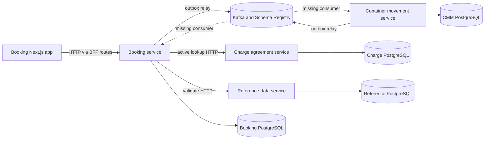
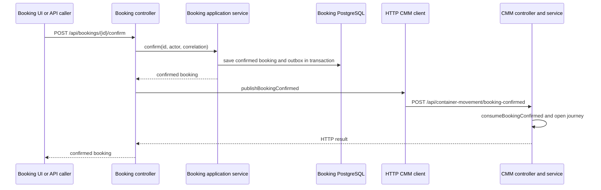
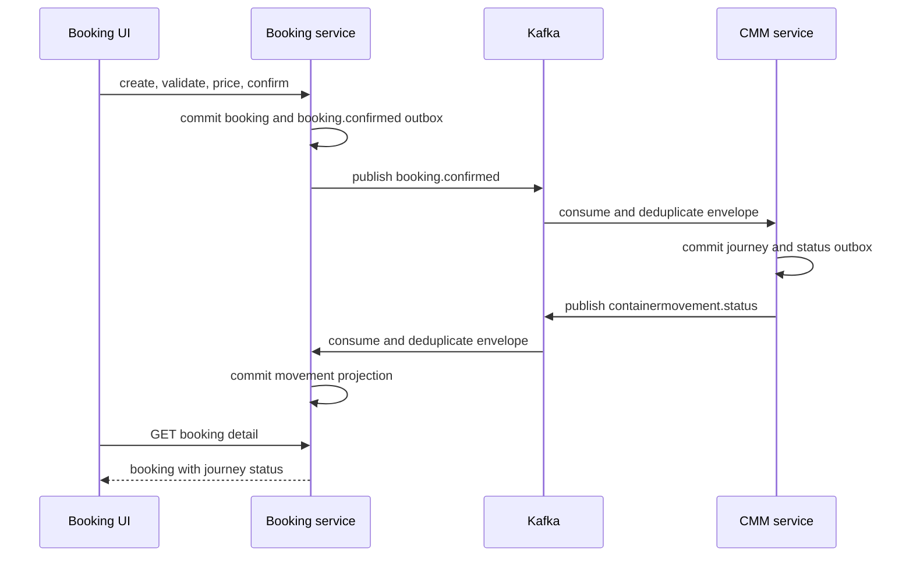

# Architecture - LinerCore W1-01 Baseline

## System Topology

The repository is a modular monorepo. Java 21/Spring Boot services use domain, application-service, data-access, messaging, and container modules. Next.js apps and shared TypeScript packages are managed by Yarn workspaces and Turbo. PostgreSQL stores each service's data in a separate database. Kafka and Schema Registry provide the event backbone; nginx exposes the local web surface.

Text fallback: the Booking web app calls Booking; Booking calls Reference Data and Charge synchronously; Booking and CMM each persist an outbox and publish to Kafka; the corresponding Kafka consumers are absent; every service owns PostgreSQL state.

## Backend Module Pattern

Booking, CMM, and Charge use ports-and-adapters boundaries. Domain records enforce lifecycle rules, application services coordinate authorization/idempotency/persistence, JDBC adapters implement repository ports, messaging adapters map outbox payloads to Avro `GenericRecord`, and Spring container modules wire HTTP and runtime concerns. Charge, Identity, and Reference Data additionally retain `application` and `published-language` modules; Booking and CMM use the leaner five-module form.

The shared `platform-messaging` module owns `KafkaGenericRecordPublisher`, `ConfluentSchemaRegistrar`, `AvroSchemaRepository`, `ScheduledOutboxRelay`, retry classification, broker metadata, and `NoopMessagingGuard`. Service modules correctly adopt this shared infrastructure for publishing.

## Interaction Diagrams

Current confirmation behavior duplicates the async intent with a synchronous delivery path:

Text fallback: confirmation commits Booking plus an outbox row atomically, then the controller makes a blocking HTTP call to CMM. The outbox publishes too, but no CMM Kafka consumer handles it.

The target W1 interaction removes the Booking-to-CMM and CMM-to-Booking HTTP handoffs:

Text fallback: the two services communicate through Kafka, each consumer performs deduplication and state mutation transactionally, and the UI reads the resulting Booking projection.

## Persistence and Delivery

Booking uses `booking_records`, `booking_idempotency`, `booking_audit`, and `booking_outbox`. CMM uses journey, idempotency, audit, and outbox tables. Charge uses normalized agreement/term/activity tables, manual pricing cases, and an outbox. Outbox rows track status, attempts, claim ownership, retry time, broker coordinates, and errors.

Schemas are mutable startup SQL files with `CREATE TABLE IF NOT EXISTS` and incremental `ALTER TABLE` statements, not a versioned Flyway/Liquibase chain. This is adequate for the current local baseline but makes upgrade ordering and rollback evidence weak.

## Runtime Profiles

Compose profiles are `core`, `app`, `devtools`, `observability`, and `full`. The default PostgreSQL host mapping is `${POSTGRES_HOST_PORT:-55432}:5432`, avoiding host port 5432. Service-internal connections remain on `postgres:5432`. Kafka runs at container address `kafka:9092`; Schema Registry at `schema-registry:8081`; nginx listens on host port 8088.
