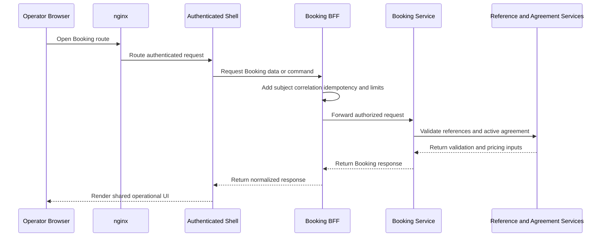
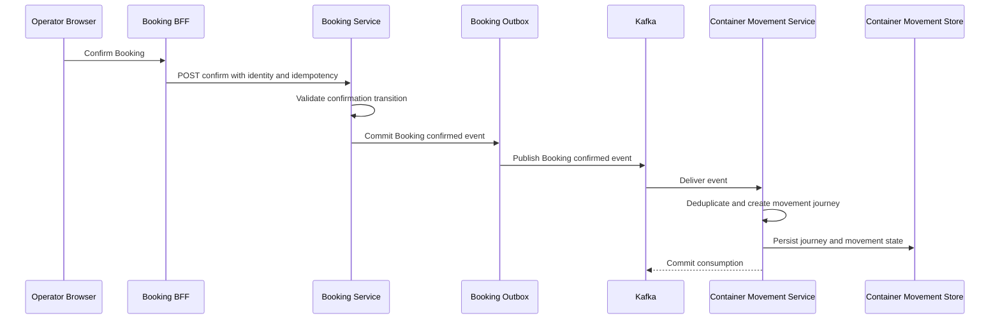

# Architecture

## Architectural Context

The repository is a hybrid monorepo: Yarn workspaces and Turbo coordinate TypeScript/Next.js applications and shared packages, while a Maven reactor coordinates Java/Spring Boot services. The dominant runtime style is independently bounded services behind an nginx edge, combined with a shared authenticated frontend shell and module BFF routes. Local integration is Docker Compose based. Evidence paths include `package.json`, `services/pom.xml`, `infrastructure/nginx/default.conf`, `apps/shell/`, `apps/booking/`, and `services/booking-service/`.

Backend services retain service-owned data and use layered/hexagonal module boundaries (`domain-core`, `application-service`, adapters, and `container`). Cross-module asynchronous delivery uses Kafka and Schema Registry through `services/platform-messaging/`; synchronous lookup dependencies remain explicit adapters. Frontend ownership is intentionally centralized: `apps/shell` is the canonical authenticated route owner and `packages/ui` is the shared visual contract.

## Component Relationships and Decisions

The preserved decision is one authenticated shell, one token system, and one Booking business implementation. `infrastructure/nginx/default.conf` maps `/`, `/booking`, and legacy `/bookings` traffic to the shell. `apps/shell/lib/booking-client.ts` proxies to the Booking app, whose BFF in `apps/booking/lib/bookings.ts` adds authentication, correlation, idempotency, request-size, and timeout behavior before calling `booking-service`.

This decision keeps the service boundary and BFF protection intact while W2-02 changes presentation consumption. A second frontend or module-local navigation would duplicate session, routing, accessibility, and state behavior. A backend redesign would increase blast radius without closing the observed design-system DoD gaps.

## Interaction Diagrams

### Canonical authenticated Booking UI, BFF, and service flow

Text fallback: nginx directs the operator to the authenticated shell; the shell reaches Booking through its BFF; the BFF enforces request metadata and protection; Booking validates against reference/agreement services; the response returns through the same route and is rendered with the shared UI contract.

Evidence: `infrastructure/nginx/default.conf`, `apps/shell/lib/booking-client.ts`, `apps/booking/lib/bookings.ts`, and `services/booking-service/container/src/main/java/com/linercore/platform/booking/container/api/BookingApiController.java`.

### Booking confirmation to container movement

Text fallback: confirmation enters through the protected Booking BFF. Booking commits its state and outbox event, the shared messaging path publishes to Kafka, and Container Movement Management consumes idempotently and persists the resulting journey. This remains asynchronous; W2-02 changes neither event contracts nor service ownership.

Evidence: `apps/booking/app/api/bookings/[bookingId]/confirm/route.ts`, `services/booking-service/`, `services/platform-messaging/`, and `services/container-movement-service/`.

## Architecture Risks and Closure Implications

- `apps/booking` declares `@erp/ui` in `apps/booking/package.json` but does not consume it in rendered surfaces; local raw controls and `booking-*` classes bypass the shared visual boundary.
- `apps/booking/app/booking.css` forms a separate hardcoded local theme, and the current ESLint rule does not inspect CSS or fully prohibit local `CSSProperties` systems.
- `apps/booking/app/layout.tsx` supplies standalone module chrome while `apps/shell/app/ShellFrame.tsx` owns the canonical runtime shell. Reconciliation must preserve shell routes rather than invent a new host.
- `packages/ui/src/index.tsx` contains fixed brand values and a `Record<string, CSSProperties>` inside the owning package. That may be acceptable as an ownership seam only if tokens and enforcement make it the single source of truth.
- No durable Playwright suite or `artifacts/w2-02-live/` evidence currently proves keyboard, responsive, theme, or network-state behavior.

## Alternatives and Trade-offs

Retaining Booking-local CSS and simply taking screenshots was rejected because it cannot prove package consumption or prevent drift. Replacing `apps/shell` with `PlatformShell` wholesale was rejected because W2-02 is a closure pass and shell/auth behavior is owned by W2-01. Reworking Booking backend APIs was rejected because the existing BFF/service flow already supplies the business journey. The selected approach is the reversible, smallest-blast-radius migration: shared primitives and tokens in `packages/ui`, Booking rendering changes at the canonical shell/module seam, targeted enforcement, and live evidence.
