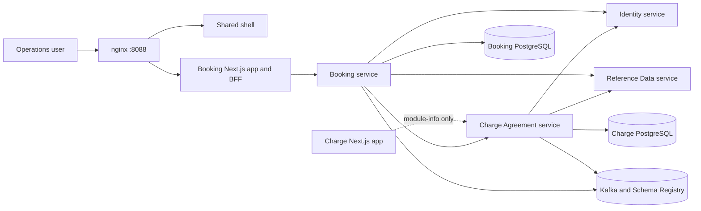
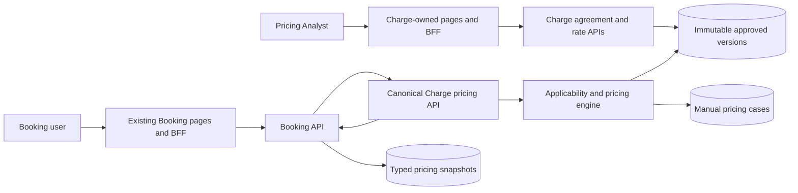
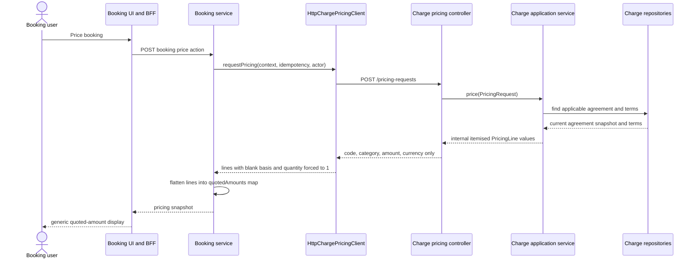
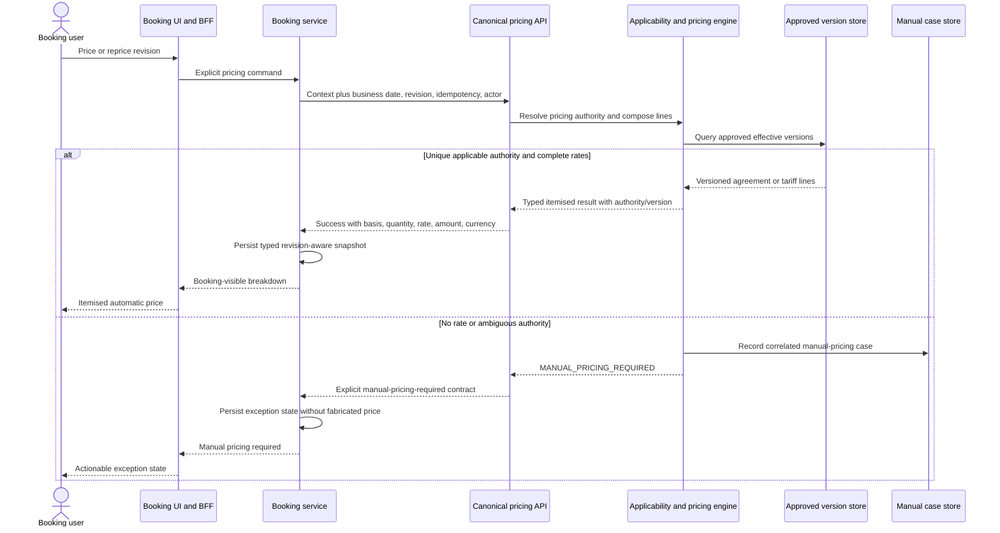
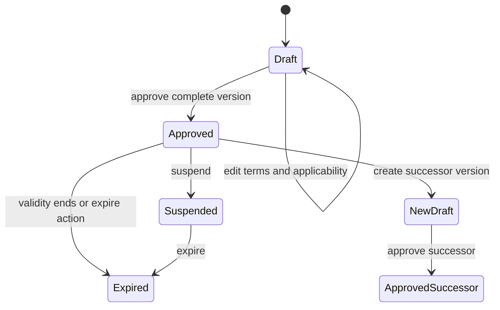

# Architecture — LinerCore Charge and Booking Pricing

## Architecture Analysis

### System Overview

The repository is a polyglot monorepo. Next.js applications and shared TypeScript packages provide authenticated operational UIs and backend-for-frontend routes. Java 21/Spring Boot services implement domain capabilities using domain, application, port/adapter, persistence, messaging, and container modules. PostgreSQL databases are service-owned; Kafka/Avro outboxes carry integration events; nginx exposes the local stack on port 8088.

The Charge-to-Booking path is synchronous for pricing and asynchronous for lifecycle events. Booking owns the customer transaction and pricing snapshot. Charge owns agreement/rate governance, applicability, calculation, manual-case creation, and the pricing authority used.

### Architectural Style

- **Repository**: modular monorepo with independently deployable applications and services.
- **Backend**: service-oriented ports-and-adapters architecture. `domain-core` holds rules; `application-service` orchestrates use cases and ports; `dataaccess`, `messaging`, and HTTP controllers are adapters; `container` composes Spring Boot runtimes.
- **Frontend**: Next.js App Router applications with server-side BFF routes. Shared auth and UI packages are cross-application platform seams.
- **Integration**: REST for synchronous authorization/reference/pricing calls; Kafka/Avro with outbox persistence for business events.
- **Data ownership**: dedicated databases for identity, reference data, Charge/pricing, Booking, and container movement.

## Component Relationships

### Current baseline topology

Text fallback: nginx fronts the authenticated web surfaces. Booking reaches its service through a BFF and calls Charge synchronously for pricing. Both business services depend on identity/reference seams, own separate PostgreSQL stores, and publish through Kafka/outboxes. The baseline Charge UI is not a functional client, and `/charge-agreements` has no explicit nginx route.

### Intended W2-03 delta

Text fallback: W2-03 makes Charge-owned pages operational, adds immutable approved pricing authorities, and extends the existing Booking-to-Charge seam. Successful responses become typed snapshots; unmatched or ambiguous requests create a manual case and return an explicit manual-pricing-required outcome. Shared shell and UI ownership do not move to W2-03.

## Interaction Diagrams

### Current automatic pricing transaction

Text fallback: internal Charge calculation already knows basis, quantity, and rate, but the HTTP controller drops those fields. The Booking client reconstructs an incomplete line, and Booking persists it as string-keyed map entries. This information-loss seam is a baseline defect, not intended behavior.

### Intended itemised pricing and repricing transaction

Text fallback: Booking sends all pricing context and a stable revision-aware identity. Charge either returns a typed breakdown linked to an immutable approved authority or records a manual case and returns `MANUAL_PRICING_REQUIRED`. Booking preserves either outcome and renders it without loss.

### Approved-version lifecycle

Text fallback: edits are confined to Draft. Approval freezes the version used for pricing. A future commercial change creates a successor Draft and preserves the prior approved evidence. The baseline has immutability after approval but does not yet persist separately addressable approved-version snapshots.

## Data Flow and Authority

- Identity supplies the actor; BFFs must derive it from the signed session rather than accept a caller-provided identity.
- Reference Data supplies controlled identifiers for parties, locations, trade lanes, equipment, charge codes, currency, and commodities.
- Booking supplies transaction context and owns the selected pricing snapshot in the Booking record.
- Charge owns matching, calculation, approved authority/version references, idempotency, and manual cases.
- Pricing HTTP responses are the canonical synchronous seam. Charge lifecycle events remain asynchronous and do not replace the pricing response.

## Key Baseline Decisions and Constraints

- Booking already has a `PricingPort` and `ChargePricingPortAdapter`; W2-03 should evolve these seams instead of adding a parallel pricing subsystem.
- Charge already has request idempotency/lease persistence and manual cases; preserve them while changing result vocabulary and itemisation.
- The current latest-row Charge schema is insufficient for immutable version history. The storage choice remains an Inception design decision.
- `pricing.v1.yaml` matches the implemented `/pricing-requests` seam; the legacy Charge OpenAPI advertises divergent pricing paths and needs explicit authority/deprecation treatment.
- Charge schema initialization and Booking Flyway migration strategies differ; migration ownership and upgrade safety need explicit design.
- The stable Charge edge mount is unresolved. A minimal nginx or shell proxy seam is permitted only as integration work; shared navigation/shell ownership remains protected.

## Architecture Risks and Improvement Opportunities

| Area | Baseline risk | Bounded W2-03 direction |
|---|---|---|
| Versioning | Latest snapshot plus numeric version cannot reproduce every approved authority | Append immutable approved snapshots/versions with stable identifiers |
| Applicability | Agreement-level selection and validity-only term filtering | Explicit line-level equipment, location, lane, and origin-local rules |
| Contract | HTTP drops basis/quantity/rate | Extend canonical versioned pricing response compatibly |
| Booking storage | Schemaless flattened map | Add typed itemised snapshot while preserving old snapshot decoding |
| Time | `LocalDate.now()` introduces clock-dependent selection | Carry/inject a defined business date |
| Manual result | `NO_RATE`/`MANUAL_PRICING` translation is inconsistent | Specify `MANUAL_PRICING_REQUIRED` end to end |
| Routing | Charge app starts but has no edge route | Add a regression-protected stable mount without shell redesign |
| Runtime evidence | Static tests do not establish live composition | Prove via `scripts/wave-a-compose.mjs`, Playwright, and audits |

## Current Gaps Versus Intended Changes

Nothing in this document should be read as proof that W2-03 is already implemented. The diagrams labeled “intended” are target architecture for requirements/design. Runtime behavior remains the baseline described above until code, contracts, migrations, tests, and live evidence are completed.
