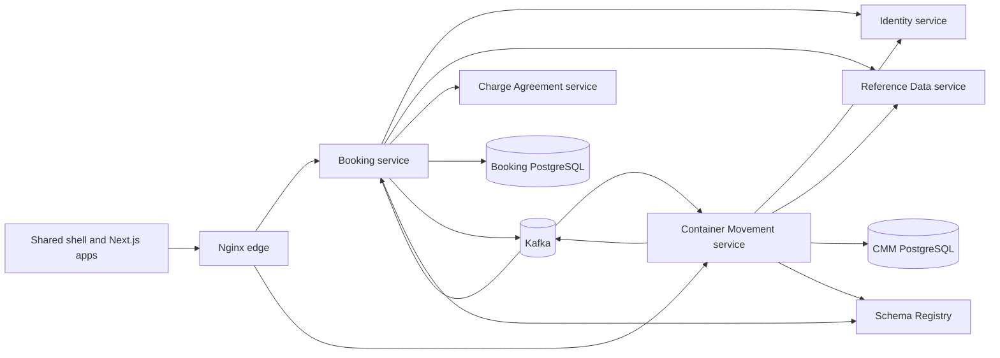
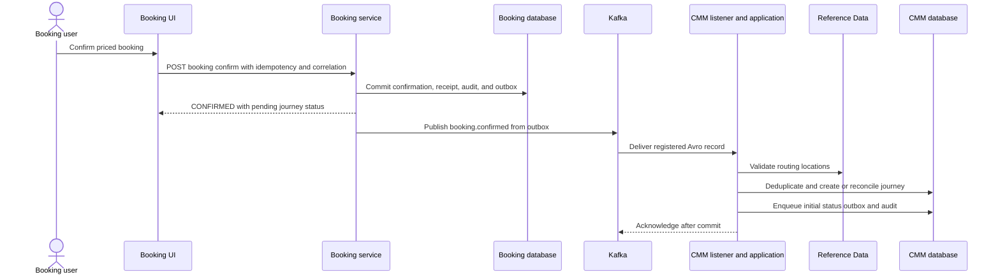
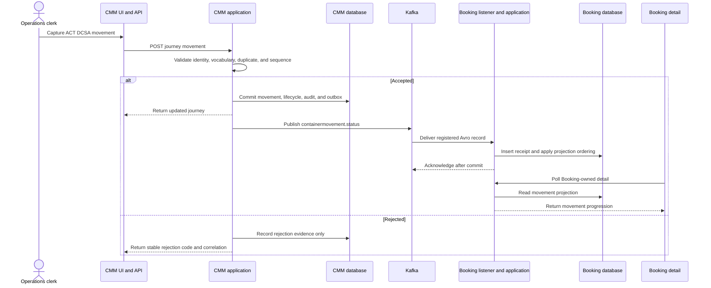

# Architecture Analysis

## System Overview

The repository is a hybrid Java/TypeScript monorepo. Backend bounded contexts are independently packaged Spring Boot services built from Maven modules; frontend modules are Next.js applications built in a Yarn/Turbo workspace. PostgreSQL databases are service-owned. HTTP is used for synchronous reference, identity, and pricing seams; Kafka plus Confluent Schema Registry is used for asynchronous business facts. Nginx and the shared shell provide the canonical browser edge.

The dominant backend style is hexagonal/layered within independently deployable services:

1. `domain-core` holds records, value objects, invariants, and outbox facts.
2. `application-service` orchestrates transactions through ports.
3. `dataaccess` implements PostgreSQL/in-memory repositories.
4. `messaging` maps Avro records and publishes/consumes Kafka records.
5. `container` wires Spring, REST controllers, schedulers, and configuration.

This combines microservice data ownership with event-driven integration and transactional outboxes. The frontend uses one authenticated shell with module-owned routed content and shared `@erp/ui` primitives.

## Component Relationships

Text fallback: the browser reaches Booking and CMM through the shared shell and Nginx. Each service owns a PostgreSQL database and uses Identity/Reference Data through explicit ports. Booking publishes confirmation events to Kafka for CMM; CMM publishes status events back to Kafka for Booking. Both use Schema Registry.

## Interaction Diagrams

### Booking to CMM: confirmation opens or reconciles a journey

Text fallback: Booking confirmation commits locally with an outbox. The relay publishes `booking.confirmed`; CMM maps and validates the event, validates locations, then atomically records receipt/idempotency, journey state, audit, and initial status outbox. Duplicate envelopes and stale booking revisions do not create another journey.

Observed compatibility issue: documentation names channel `booking.confirmed`, while executable configuration uses Kafka topic `booking.events` with envelope discriminator `type=booking.confirmed`. W2-04 must explicitly retain or change this mapping through coordinated contract evidence; it must not silently rename one side.

### CMM to Booking: accepted movement becomes Booking projection

Text fallback: an accepted CMM movement transaction saves the movement/lifecycle/audit/outbox, publishes `containermovement.status`, and Booking atomically deduplicates and applies its local projection before its detail UI reads it. A duplicate or out-of-sequence capture returns an explicit reason and does not change journey, status outbox, or Booking projection; only rejection evidence is added.

The accepted-path sequence is the W2-04 target. The baseline currently accepts generic event types, uses timestamp-only ordering, and silently returns the existing journey for a reused idempotency key. The executable status schema and Booking projection also lack `sequenceNumber`, so producer, consumer, fixtures, SQL, and compatibility checks must evolve together.

## Data Ownership and Persistence

| Store | Owner | Relevant data | Current mechanism |
|---|---|---|---|
| `linercore_booking` | Booking | Booking aggregate, confirmation outbox, consumed movement receipts, latest per-container projection | Ordered Flyway migrations and transactional application methods |
| `linercore_container_movement` | CMM | Journey JSON snapshot, idempotency, audit, movement-status outbox | Mutable SQL initialization; no Flyway baseline yet |
| Kafka topics | Shared Platform transport; contract producer owns schema | `booking.events`/`booking.confirmed` facts and `containermovement.status` facts | At-least-once delivery, keyed ordering, outbox relays |
| Schema Registry | Shared Platform | Avro subjects and BACKWARD compatibility | Shared registrar/publisher adapters |

CMM's current SQL/Java outbox vocabulary is internally inconsistent: Java uses `PENDING`, `IN_PROGRESS`, `PUBLISHED`, `RETRYABLE`, `FAILED_PERMANENT`; the repository claims `PENDING`/`RETRYABLE`; the schema recognizes `PENDING`, `CLAIMED`, `PUBLISHED`, `FAILED_RETRYABLE`, `FAILED_PERMANENT`. Startup normalization may therefore turn legitimate rows back into `PENDING`. This is a high-risk persistence correction for W2-04 and requires additive migration plus existing-data/restart proof.

## Architectural Decisions and Trade-offs

| Decision | Evidence and benefit | Cost / rejected alternatives |
|---|---|---|
| Preserve asynchronous Booking-CMM integration. | Existing Kafka listeners, outboxes, Avro contracts, and durable receipts provide decoupling and replay safety. | Eventual consistency and more operational evidence; synchronous callback/HTTP delivery is rejected because it violates program rules. |
| Keep service-owned databases. | Booking and CMM projections are local and no request-time cross-database read is required. | Data is duplicated as projections; shared tables/cross-module joins are rejected. |
| Evolve the CMM aggregate in place. | Existing journey intake, REST routes, authorization, reference validation, outbox, and tests remain useful. | Requires careful data migration; replacing the service would discard proven W1 seams. |
| Add sequence to the contract compatibly. | The intent requires observable semantic ordering; a defaulted field can remain backward readable if Avro compatibility confirms it. | Producer/consumer/schema/fixture/SQL changes require dual review; timestamp-only ordering is insufficient. |
| Add a CMM event-history read model rather than overloading Booking's latest projection. | CMM detail needs expected-versus-actual timeline; Booking currently stores only the latest status per container. | More schema/query work; fabricating a timeline from one projection is rejected. |
| Compose CMM pages from shared shell/UI assets. | Maintains one canonical UI and Wave A ownership. | W2-04 may need to report missing primitives to W2-02; redesigning `packages/ui` or shell is rejected. |

## Security and Failure Boundaries

Controllers and Kafka consumers call authorization ports, but local actor/correlation defaults and shallow local profiles require care. Non-local behavior must fail closed. Kafka access is broker/topic authorized; envelope source and correlation carry provenance. Reference Data and Identity are remote dependencies whose unavailable vs invalid responses need distinct retry/permanent treatment.

Movement capture currently maps missing records to 404, validation to 400, security to 403, and illegal state to 409. `ApiErrorResponse` supports stable code/message/fields/correlation, but handlers substitute `local-correlation`; W2-04 must preserve the incoming correlation and expose deterministic duplicate/sequence rejection codes without leaking infrastructure details.

## Graph and Analysis Limitations

Graphify was queried before targeted source inspection. Its checked-in graph (generated before the active intent artifacts) contains isolated `booking.confirmed` contract and `MovementTimeline` nodes and no traversable bidirectional Booking-CMM path. It is useful for locating concepts, not for proving the runtime seam. Codebase-memory indexed the baseline source and exposed CMM routes, clusters, and key call relationships; targeted source then verified the critical methods. Some codebase-memory call traces cross-link common method names into unrelated modules, so only exact qualified symbols and verified source paths are treated as evidence.

No build, test, Compose run, broker observation, or database query was performed during this reverse-engineering pass. Runtime statements are therefore architectural/source observations unless explicitly attributed to retained W1 evidence.
