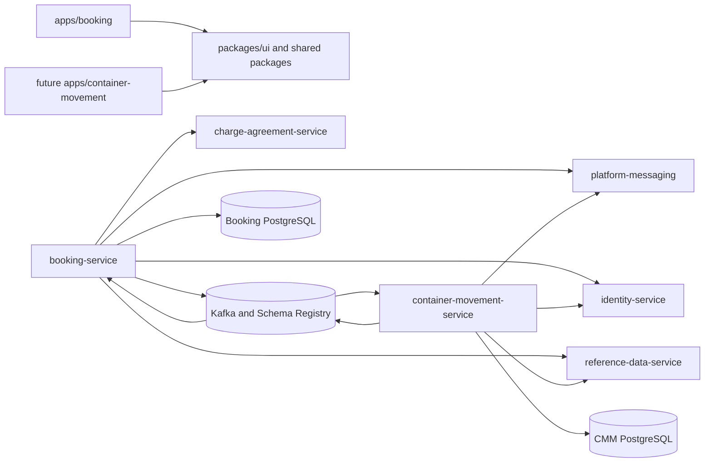

# Dependencies

## Dependency Model

LinerCore is a hybrid Java/Maven and TypeScript/Yarn monorepo. Backend services are independently deployable bounded contexts with inward, hexagonal module dependencies; frontend applications consume shared workspace packages. Cross-context business delivery is through versioned HTTP contracts or Kafka events, never shared-table access.

Text fallback: Booking and the future CMM app depend on shared TypeScript packages. Booking and CMM use the shared messaging library, their own PostgreSQL databases, and explicit Identity/Reference ports. Booking also calls Charge. Booking confirmation flows through Kafka to CMM, and CMM movement status flows back through Kafka to Booking.

## Backend External Dependencies

| Dependency | Observed version | Consumers | Purpose / risk |
|---|---:|---|---|
| Java | 21 | Maven services | Runtime and language baseline. |
| Spring Boot | 3.3.7 | Service containers/adapters | REST, transactions, Kafka wiring, scheduling, health. |
| JUnit | 5.11.3 | Java tests | Unit and integration testing. |
| Apache Avro | 1.11.4 | Messaging adapters/contracts | Registered record mapping. |
| Confluent libraries | 7.7.1 | `platform-messaging`, business services | Schema Registry and Avro serialization. |
| PostgreSQL | 15 | Service-owned data adapters | Durable aggregates, receipts, projections, audit, and outbox. |
| Kafka / Schema Registry | Compose-managed | Booking, CMM, shared messaging | At-least-once cross-context facts and BACKWARD compatibility. |

Booking uses ordered Flyway migrations. CMM currently initializes a mutable SQL schema and therefore lacks the same migration dependency/discipline. That difference is a W2-04 persistence risk, not evidence that CMM has a safe migration path.

## Frontend External Dependencies

| Dependency | Observed version | Purpose |
|---|---:|---|
| Yarn | 4.5.3 | Workspace package management. |
| Turbo | 2.3.3 | Workspace task orchestration. |
| TypeScript | 5.7.2 | Strict frontend typing. |
| Next.js | 15.1.3 | App Router applications. |
| React | 18.3.1 | UI rendering. |
| ESLint | 9.17.0 | Frontend static analysis. |
| Vitest | 2.1.8 | Component/unit tests. |
| Playwright | 1.61.1 | Browser acceptance and visual evidence; not currently enforced by CI. |

The CMM UI must consume existing `@erp/ui` primitives and shared shell behavior. W2-02 owns `packages/ui` and the shell; W2-04 may add the CMM application/mount but must not create another token or component system.

## Internal Service and Module Dependencies

The normal service module direction is `container -> messaging/dataaccess/application-service -> domain-core`; adapters implement ports declared inward, and `domain-core` has no Spring, Kafka, JDBC, or UI dependency. `platform-messaging` is the shared Kafka/Avro boundary used by Booking and CMM.

| Upstream | Downstream | Contract | Current W2-04 concern |
|---|---|---|---|
| Booking | CMM | `booking.confirmed` Avro fact on executable `booking.events` topic | Logical channel/topic naming drift must be resolved explicitly. |
| CMM | Booking | `containermovement.status` Avro fact | Schema, mapper, fixture, SQL, and Booking projection omit semantic sequence. |
| Identity | Booking/CMM | Authorization port/HTTP adapter | Non-local behavior must fail closed; local actor defaults are not production proof. |
| Reference Data | Booking/CMM | Reference-validation port/HTTP adapter | Invalid and unavailable outcomes need distinct permanent/retry handling. |
| Charge Agreement | Booking | Pricing HTTP contract | Outside W2-04 change scope. |
| Booking DB | Booking only | Repository/Flyway adapters | Stores consumed receipts and latest projection; no cross-module reads. |
| CMM DB | CMM only | JDBC adapters/current SQL initializer | Outbox status vocabulary and migration strategy are inconsistent. |

## Dependency Risks and Constraints

- Java outbox states (`PENDING`, `IN_PROGRESS`, `PUBLISHED`, `RETRYABLE`, `FAILED_PERMANENT`) do not align with CMM SQL states (`PENDING`, `CLAIMED`, `PUBLISHED`, `FAILED_RETRYABLE`, `FAILED_PERMANENT`). Restart normalization can mask or regress valid relay state.
- The executable `containermovement.status` contract omits `sequenceNumber`; adding it requires compatible Avro defaults plus coordinated producer, consumer, fixtures, SQL, and UI types.
- `apps/container-movement` is absent although a runtime profile names it; Compose, Nginx, and shell navigation do not currently mount it.
- Graphify did not expose a reliable cross-service path in this snapshot. Codebase-memory plus exact source/contract inspection supplied the dependency evidence.
- EDI ingestion, public DCSA APIs, multi-leg/transshipment, fleet registry, depot stock, and M&R dependencies are intentionally excluded from W2-04.

## Verification Boundary

This dependency map is source/configuration analysis only. No dependency installation, build, test, Compose startup, broker observation, or database query was performed during reverse engineering. Final W2-04 proof must use the isolated `linercore-wave-a` stack through `scripts/wave-a-compose.mjs`, with `npm run demo:guard` before and after to protect the manager demo on port 8088.
