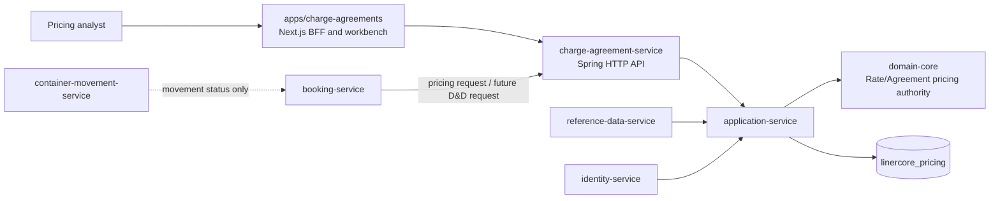
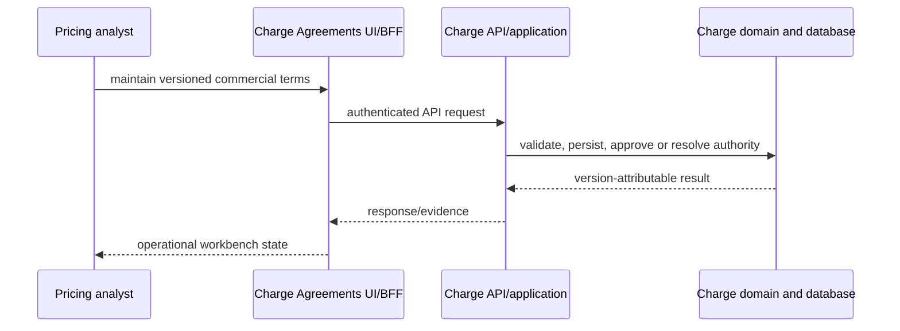
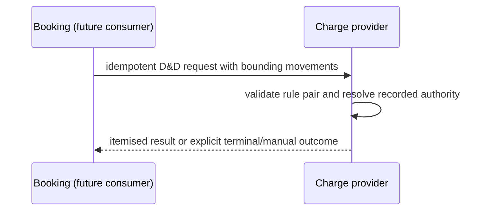

# Architecture

## System overview

The repository is a hybrid microservice and modular-web monorepo. Java/Spring services use layered modules (`domain-core`, `application-service`, `dataaccess`, `messaging`, `container`); Next.js apps are Yarn workspaces. PostgreSQL is logically separated per service, while Kafka and Schema Registry carry asynchronous domain events. Compose supplies the local live environment.

Charge Agreement is the relevant provider boundary. Its HTTP container delegates to application services and domain pricing authority, persists its own PostgreSQL schema, and exposes contracts to the Charge Agreements BFF. Booking reaches Charge synchronously for pricing; the current D&D adapter is a consumer-side seam, not a justification for bypassing Charge ownership.

Text fallback: the Charge UI and Booking both call Charge; Charge owns the pricing domain and its database. CMM does not call or own a D&D calculator.

## Interaction diagrams

Text fallback: W3-01 adds the provider calculation path. Booking integration stays bounded until W3-02; no CMM-to-Charge ruleset coupling is introduced.

## Architectural decisions and constraints

- Preserve service and database ownership: extend `charge-agreement-service`; do not create a D&D service or share Charge persistence.
- Preserve the W2-03 OpenAPI/persistence contracts; add a D&D provider operation and schemas compatibly, with signed Booking/Charge fixtures.
- Use the existing hexagonal separation and version lineage for reproducible calculations and explainable results.
- Keep calendar semantics explicit and port-local. MVP is calendar days; holiday/working-day calendars and customer overrides remain deferred.

