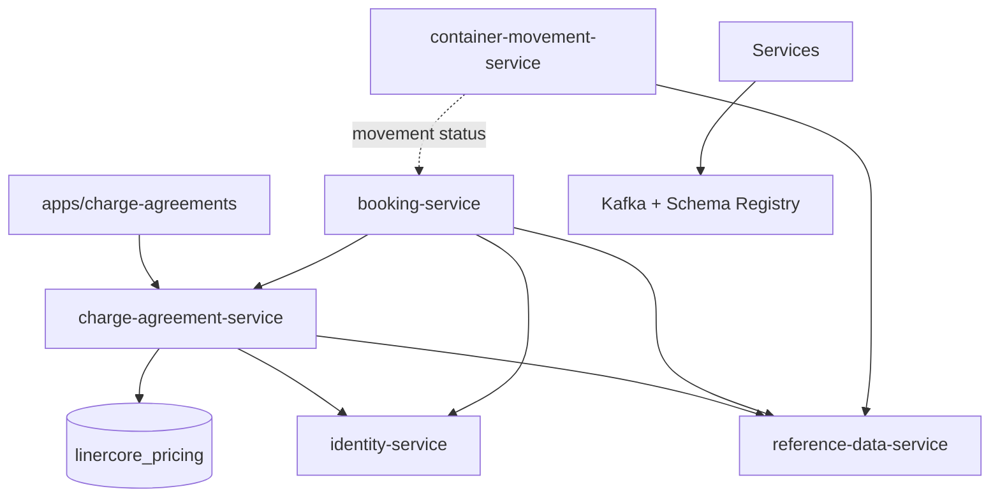

# Dependencies

## Internal dependency map

Text fallback: Charge is the provider for Booking and the Charge UI; it depends on its own database plus reference and identity services. CMM supplies movement facts to Booking, not a D&D rule dependency to Charge.

## W3-01 dependency rules

- W2-03 is a hard upstream contract: Rate/RateVersion, Agreement/AgreementVersion, existing pricing result semantics, and `contracts/openapi/pricing.v1.yaml` must remain compatible.
- The bilateral Booking/Charge document governs the D&D seam: DCSA `DISC`/`GTOT`/`GTIN`, idempotency, correlation, all-or-nothing result and dual review are mandatory.
- The Charge UI depends on the existing LinerCore shell and `packages/ui`; its new work must be a page-level extension.
- W3-02 is downstream: it consumes the provider contract but does not block W3-01 provider-side live acceptance.

