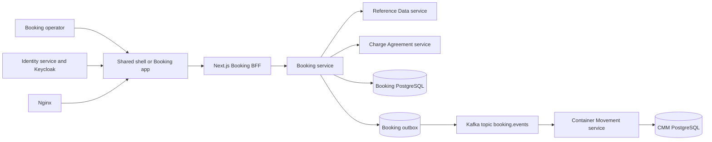
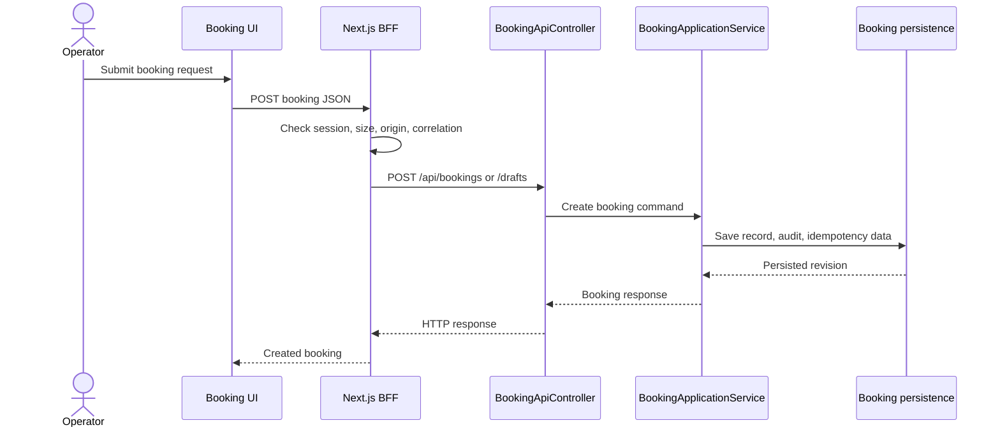
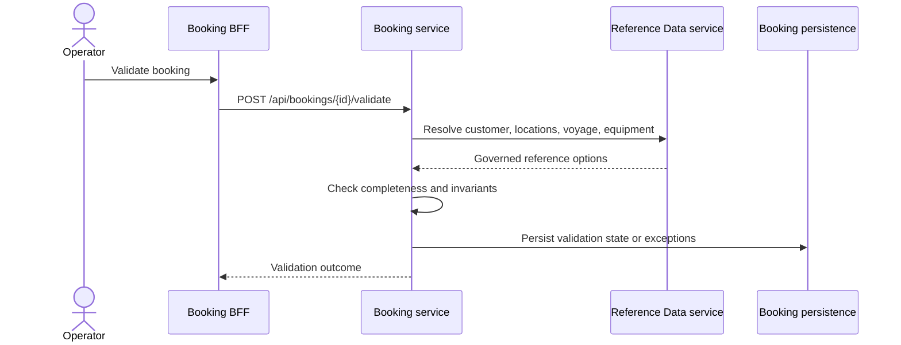
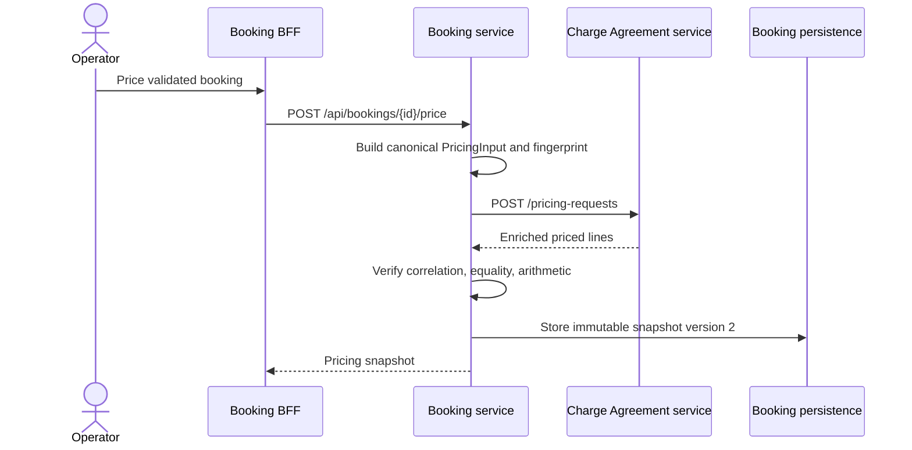
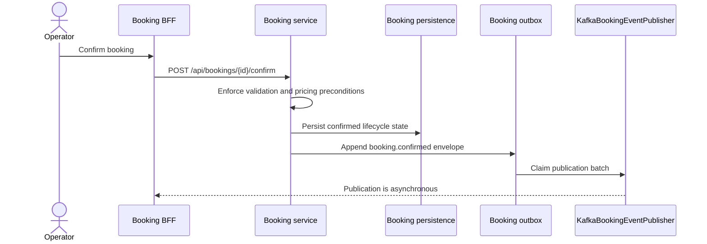
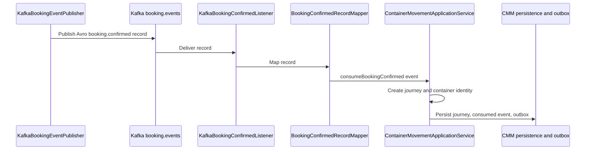

# Architecture

## System Overview

The repository is a single source tree containing five Next.js operational applications, shared TypeScript packages, six Java/Maven services, platform contracts, infrastructure, scripts, and end-to-end tests. W3-04 crosses four business services: Booking is the transaction owner; Reference Data supplies governed identifiers and voyage facts; Charge Agreement prices a validated booking; CMM consumes confirmation to begin a container journey. Identity, Nginx, Kafka/Schema Registry, PostgreSQL, and the shared shell support those flows.

## Architectural Style

The backend is a service-oriented, event-enabled architecture. Booking and CMM use hexagonal module boundaries: `domain-core` is depended on by `application-service`, with `dataaccess` and `messaging` providing adapters and `container` composing the executable service. Reference Data and Charge Agreement add `published-language` modules for shared contracts. Web applications use Next.js App Router BFF routes and shared workspace packages. PostgreSQL holds relational projections and JSON snapshots; transactional outboxes bridge committed state to Kafka.

The style is hybrid synchronous/asynchronous:

- Synchronous HTTP connects browsers/BFFs to Booking and Booking to Reference Data and Charge Agreement.
- Asynchronous Avro events connect Booking confirmation to CMM through Kafka.
- Each Java service owns its persistence boundary; no shared application database model was identified.

## Component Relationships

Text fallback: the operator enters through the shared shell or Booking app; a Next.js BFF calls Booking. Booking validates reference data, requests pricing from Charge Agreement, commits records and an outbox row, then publishes to Kafka. CMM consumes the confirmation and persists a journey. Identity/Keycloak and Nginx sit at the access edge.

## Data Flow

1. A BFF receives same-origin JSON, establishes the session actor, enforces a 32 KiB body limit, creates/propagates correlation data, and calls Booking with service credentials and a 2.5-second command timeout.
2. `BookingApiController` maps the request to Booking application commands. Current create input carries customer, one route, one equipment assignment, currency/cargo-mode/reefer/dangerous-goods flags, and untyped attributes.
3. Booking validates reference options over HTTP. Its current reference-set enum exposes only customer, location, vessel voyage, and equipment type.
4. `PricingInput` creates canonical JSON, SHA-256 fingerprint, and key `bookingRef:amendmentSeq`; `ChargePricingPortAdapter` validates enrichment, correlation/equality, and quantity-by-unit arithmetic before creating immutable `BookingPricingSnapshot` schema version 2.
5. Confirmation maps the aggregate through `BookingEventMapper.confirmedEvent`, writes `booking_outbox`, and `KafkaBookingEventPublisher` publishes the byte-identical Avro contract.
6. `KafkaBookingConfirmedListener` and `BookingConfirmedRecordMapper` create a CMM `BookingConfirmedEvent`; `ContainerMovementApplicationService.consumeBookingConfirmed` creates/updates `ContainerJourney`, JDBC state, and its outbox.

Persistence includes booking records, idempotency, audit, outbox, snapshot migration, consumed-event, movement, and immutable pricing-snapshot tables. Flyway migrations V1-V4 are present; W3-04 has an additive V5 seam. `BookingSnapshotCodec` reads routing and equipment snapshots. Legacy canonicalization is safe only with authoritative origin, destination, voyage, equipment type, and physical equipment ID; it otherwise marks `legacyIncomplete`.

## Key Design Decisions

| Decision observed in source | Consequence |
|---|---|
| Hexagonal Java modules | Domain and application logic are isolated from JDBC, Kafka, and Spring composition. |
| Relational projection plus versioned JSON snapshot | Supports queryability and schema evolution, but requires an explicit, idempotent W3 upcast/migration policy. |
| Transactional outbox | Couples publication to committed state and supports retry, while topic/config drift remains an operational risk. |
| Canonical pricing fingerprint and immutable snapshot | Makes price evidence reproducible if and only if all commercial inputs are authoritative. |
| Avro copies are byte-identical | Contract hash `F718793FFCB3E64E67681DF2DCF92211B1354D39DB20C9DBC6F82932F7A9F5BF` protects schema drift across contract, Booking, and CMM copies. |
| Nullable `equipmentId` in Avro | Correctly permits pre-assignment confirmation, but current Booking/CMM domain invariants contradict it. |
| Two Booking frontends/BFF paths | Allows shared-shell and local operation, but creates duplicate ownership and behavior drift. |

## Interaction Diagrams

### Create booking

Text fallback: the UI posts through a Next.js BFF, which enforces edge controls and forwards to `BookingApiController`; the application service persists booking, audit, and idempotency state and returns the created revision.

### Validate booking

Text fallback: Booking resolves governed references, applies aggregate/completeness rules, stores the validation result or exceptions, and returns the outcome through the BFF.

### Price booking

Text fallback: Booking builds and fingerprints exact pricing input, Charge Agreement prices it, Booking verifies the response and arithmetic, and stores an immutable schema-version-2 snapshot.

### Confirm booking

Text fallback: confirmation verifies lifecycle prerequisites, atomically persists confirmed state and an outbox envelope, and leaves publication to the Kafka outbox publisher.

### Booking confirmation to CMM

Text fallback: Booking publishes the Avro record on runtime topic `booking.events`; the CMM listener maps it and invokes `consumeBookingConfirmed`, which creates journey state and persists idempotency/outbox data. Today CMM rejects a nullable equipment ID even though the Avro schema permits it.

## Improvement Opportunities

1. Replace physical-container `EquipmentAssignment` with a commercial equipment request that permits quantity greater than one and no physical ID; keep physical allocation in CMM.
2. Promote all W3 commercial fields, commodity, and requested departure from untyped attributes to versioned domain/API/persistence fields.
3. Extend voyage/reference contracts with timezone-aware ETD/ETA, cargo cutoff, and documentation deadline, and expose them through the Booking adapter; the current object has only scheduled departure/arrival and no cutoff/deadline/OHS data.
4. Remove `NA-EU` and `commodity-general` defaults; incomplete exact pricing input must fail visibly.
5. Align CMM with nullable equipment IDs and defer `journeyContainerId` construction until a physical unit exists.
6. Reconcile runtime `booking.events` with Enterprise/AsyncAPI `booking.confirmed` and test the executable contract.
7. Establish one owner and one canonical route/form for Booking; remove or deliberately delegate the duplicate implementation.
8. Publish a complete Booking OpenAPI contract and enforce it alongside Avro/Pact/consumer tests.
9. Implement an additive V5 snapshot migration/upcast with explicit `legacyIncomplete`, idempotency, and rollback evidence.

These findings are static. No live Compose, database migration, Kafka delivery, test, performance, accessibility, or audit outcome is claimed.
