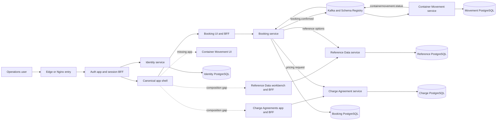
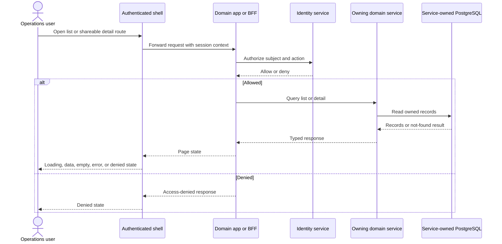
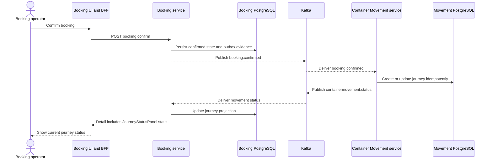

# Architecture — TST_Codex_W4-01

## System overview

The repository is a monorepo containing independently bounded Java services and multiple Next.js applications. The dominant backend style is ports-and-adapters within service-owned bounded contexts, combined with synchronous REST calls and asynchronous Kafka/Avro integration. Each business service owns its PostgreSQL data. Frontends use BFF/server-route seams and shared packages, with `apps/shell` intended as the canonical authenticated composition surface.

Verified evidence includes five Spring Boot services, a Maven reactor, Yarn/Turbo workspaces, `platform-messaging`, Avro contracts, service-owned data sources, and indexed HTTP/async call edges. Inference: the overall topology is best described as a service-oriented, event-assisted system rather than a modular monolith or a fully independently proven production microservice estate; deployment independence was not exercised.

## Architectural style and decisions

1. **Bounded services with owned data.** Identity, Reference Data, Charge Agreements, Booking, and Container Movement keep separate domain models and databases. This limits cross-domain coupling but introduces distributed consistency and operational overhead.
2. **Hexagonal service internals.** Maven modules separate framework-free domain cores, application services/ports, and container/data-access/messaging adapters. This improves isolated testing and changeability at the cost of more modules and translation code.
3. **Mixed synchronous and asynchronous integration.** Booking calls Charge Agreements for pricing and Reference Data for options. Booking confirmation and movement-status propagation use Kafka/Avro. This keeps pricing/request validation immediate while decoupling the movement lifecycle.
4. **One shared UI system and shell.** Applications consume `@erp/ui`, auth, API/core types, and configuration packages. This avoids domain-local themes; current shell composition remains incomplete for three W4-01 domains.

Alternatives considered: a single service/shared database would simplify local transactions but violate verified ownership boundaries; synchronous Booking-to-Container-Movement calls would simplify tracing but increase temporal coupling and conflict with the observed event contracts; separate domain shells would speed isolated delivery but duplicate authentication/navigation and violate the product UI contract.

## Component Relationships and Data Flow

Text fallback: the user enters through the edge and auth/session boundary, then uses the canonical shell. Domain BFFs call their owning services. Booking synchronously reads Reference Data and requests Charge pricing. A confirmed booking is published through Kafka to Container Movement, which persists journey state and publishes status back for Booking to project. Every service writes only its owned PostgreSQL database. Dotted shell links represent incomplete or absent UI composition, not verified runtime calls.

## Interaction Diagrams

### Operational list/detail read

Text fallback: the shell delegates to a domain app/BFF carrying session context. Authorization is checked before the owning service reads its database. The UI then renders a typed result or an explicit denied/not-found/empty/error state. The generic sequence reflects the intended common route shape; only Booking is currently proven as canonically shell-mounted by the static scan.

### Booking confirmation to journey projection

Text fallback: confirmation persists Booking state and produces `booking.confirmed`. Container Movement consumes it, persists the journey, and publishes movement status. Booking consumes that event and stores a projection rendered by `JourneyStatusPanel`. Correlation, idempotency, and outbox evidence were found statically; live at-least-once behavior was not executed in this synthesis.

## Data ownership, resilience, and security boundaries

- Service-owned PostgreSQL databases are the system-of-record boundaries; no shared write model was identified.
- Avro plus Schema Registry forms the published language for asynchronous integration. Pact/example catalogs provide additional contract evidence; no concrete OpenAPI YAML was found.
- Correlation, idempotency, and outbox patterns are present in the scan and graph. Exact retry, dead-letter, circuit-breaker, and production alert behavior was not fully verified.
- Authentication is mediated by the auth application/session gateway; authorization calls are exposed by Identity. Whether Reference, Charge, and future Container Movement shell routes carry the same real session end to end remains unproven.

## Risks and improvement opportunities

- Complete one shell-owned route map for Reference Data, Charge Agreements, and Container Journeys without creating domain-local shells.
- Add stable list/detail URLs for Reference Data and a Container Movement frontend/BFF composition seam.
- Resolve Charge Agreement route overlap (`[agreementId]` and `agreements/[agreementId]`) and standalone-shell behavior.
- Publish executable OpenAPI specifications and keep them synchronized with REST controllers and consumer contracts.
- Verify Graphify/index freshness, Nginx route ownership, session propagation, Compose behavior, contract compatibility, and live event projection before making release claims.
- Treat index-derived fan metrics cautiously: tests and design artifacts are included, and package fan-in/fan-out reporting was incomplete.

## Evidence and limitations

Verified evidence is static and sourced from the developer scan, Graphify traversal, and codebase-memory architecture/routes. The diagrams synthesize those relationships; dotted composition edges and the generic list/detail sequence are explicitly architectural inferences. No runtime, browser, Compose, audit, performance, security scanner, or coverage execution occurred. Production availability, scaling, disaster recovery, and CI security completeness are not claimed.
