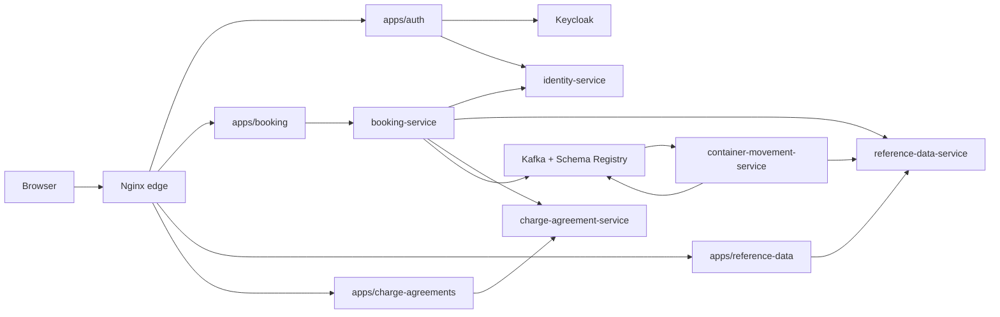
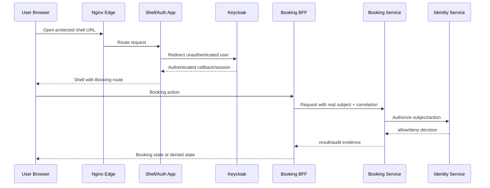

# Architecture - TST_Codex_integ

## Overview

The system is a monorepo with Java Spring services, Next.js/React apps, shared TypeScript packages, local Docker Compose runtime, and Nginx edge routing. Services follow bounded-context ownership: identity, reference data, charge agreements/pricing, booking, container movement, and platform messaging.

## Component Topology

<!-- Text fallback: Browser enters through Nginx. Nginx routes to Next.js apps. Auth app talks to Keycloak and identity-service. Booking app talks to booking-service, which integrates with identity, reference-data, charge-agreement, Kafka, and container movement. -->

## W2-01 Interaction Diagram

<!-- Text fallback: User authenticates through Keycloak, returns to shell, triggers Booking BFF action, Booking service authorizes through identity-service, and evidence returns to UI. -->

## Patterns

- Backend services use Java/Spring and bounded-context service directories.
- Frontend apps are separate Next.js apps under `apps/*`.
- Shared frontend code lives under `packages/*`.
- Local runtime is `compose.yaml` with PostgreSQL, Keycloak, Kafka, Schema Registry, services, Next.js apps, and Nginx.
- Internal service authorization currently has local-service-token patterns and identity-service authorization APIs.

## W2-01 Architectural Risks

- The current frontend architecture is still separate apps rather than one shell host.
- Booking BFF function `serviceHeaders` sets `x-linercore-actor-id` to `local-user`.
- Booking controller actor fallback returns `local-user` when actor subject is blank.
- Local identity filter allows static local actors by service id; W2-01 must constrain this to local/test bypasses.

## Graph Summary

Fresh MCP index contains 72,695 nodes and 82,668 edges. Major packages include `booking-service`, `charge-agreement-service`, `reference-data-service`, `container-movement-service`, `identity-service`, `platform-messaging`, `apps/auth`, `apps/booking`, `apps/reference-data`, `apps/charge-agreements`, and `packages/ui/auth/api-core/shared-types/transformers/config/utils`.
