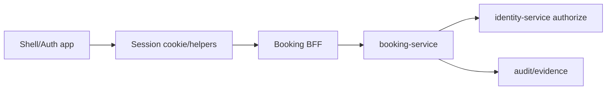

# Dependencies - TST_Codex_integ

## External Runtime Dependencies

| Dependency | Used by | Notes |
|---|---|---|
| PostgreSQL 15 | All backend services | Compose service `postgres`; separate service databases/schemas configured by env. |
| Keycloak 24 | Auth/identity | Compose service `keycloak`; W2-01 login proof depends on it. |
| Kafka 7.7.1 | Messaging services | Used for event transport; preserve prior W0/W1 work. |
| Confluent Schema Registry | Messaging contracts | Required by Kafka profile. |
| Nginx 1.27 | Browser edge | W2-01 acceptance must run through it. |
| Observability stack | Operation/smoke | Prometheus, Grafana, Jaeger, OTel, Elastic/Kibana under profiles. |

## Frontend Dependencies

Root `package.json` dev dependencies include React 18.3.1, TypeScript 5.7.2, Turbo 2.3.3, ESLint 9.17.0, Vitest 2.1.8, Testing Library, jsdom, and Vite/plugin-react support.

Workspaces:

- `apps/*`
- `packages/*`

## Internal Dependencies

Fresh MCP boundary analysis highlights service dependencies:

- Booking -> reference-data
- Booking -> charge-agreement
- Booking -> container-movement/Kafka context
- Booking -> identity-service for W2-01 authorization integration
- Charge-agreement -> reference-data and identity-service
- Container-movement -> reference-data and booking event/status context
- Reference-data and identity-service are core shared-platform dependencies.

## W2-01 Critical Dependency Chain

<!-- Text fallback: Shell/auth session feeds Booking BFF; BFF calls booking-service; booking-service authorizes through identity-service and emits audit/evidence. -->

## Dependency Risks

- W2-01 should not add cross-service database dependencies.
- W2-01 should not consume W4-01 broad module migration work.
- W2-01 should not depend on W1 live proof being converted to PASS.
- W2-01 should keep local bypass dependencies explicit and local-only.
