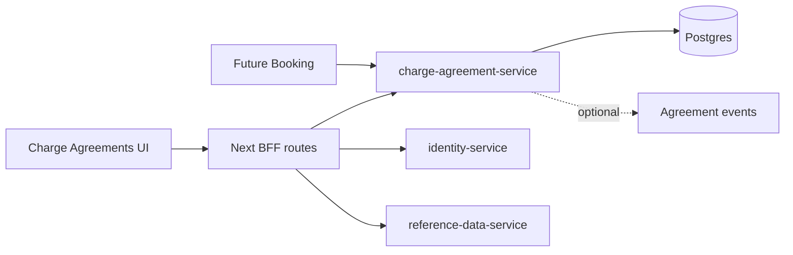

# Component Dependency - Charge & Customer Agreement

## Dependency Matrix

| Component | Depends on | Must not depend on |
| --- | --- | --- |
| `domain-core` | Java standard library only | Spring, persistence, messaging, frontend packages. |
| `application-service` | `domain-core`, ports, clock/id abstractions | Spring Web, JPA implementation details. |
| `dataaccess` | application ports, persistence technology | UI packages. |
| `container` | application-service, Spring Boot/Web/Actuator | Frontend code. |
| `messaging` | application ports, published language | UI code. |
| `apps-charge-agreements` | shared `@erp/*` packages, BFF service clients | Direct DB access. |
| Future Booking | Charge active lookup API | Charge DB tables. |

## Data Flow

Text fallback: the UI calls BFF routes, BFF calls Charge Agreement plus Shared Platform services, Charge Agreement persists in Postgres, optional events can be published later, and future Booking calls active lookup.

## Shared Resources

| Resource | Owner | Consumers |
| --- | --- | --- |
| Reference records | Shared Platform | Charge Agreement UI/API. |
| Agreement records | Charge Agreement | Charge UI, future Booking. |
| Identity roles/permissions | Shared Platform | Charge BFF/API authorization. |
| Postgres instance | Local platform/runtime | Existing services and new service, separated by tables/schema. |

## Dependency Rules

1. Charge Agreement stores reference IDs, not copied reference records.
2. Booking uses the active lookup API, not Charge Agreement tables.
3. Domain-core is pure and dependency-tested.
4. UI calls backend through BFF/service clients.
5. Event publication failure must not prevent first local CRUD/lookup when event publisher is disabled.
