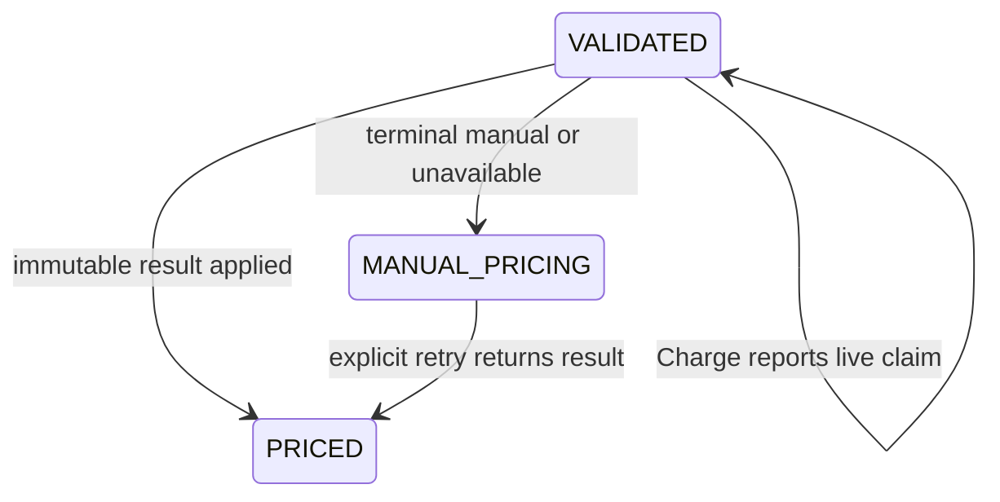

# Domain Entities - U03 Agreement Pricing

## Charge Pricing Entities

### `PricingRequest`

The Charge domain request is expanded from the current lookup-oriented record to the exact v1 business shape:

| Attribute | Type | Constraint |
|---|---|---|
| `bookingRef` | string | Nonblank stable Booking ID/reference. |
| `tradeLane`, `pol`, `pod` | typed references | Exact canonical values; locations are UN/LOCODE. |
| `equipmentType`, `partyId`, `commodityCode` | typed references | Nonblank canonical identifiers. |
| `reeferIndicator`, `dgIndicator` | boolean | Explicit, never nullable/defaulted. |
| `dates` | `PricingDates` | Effective and requested departure dates. |
| `quantities` | `PricingQuantities` | Positive equipment/TEU and non-negative amendment sequence. |
| `correlationId` | string | Nonblank request provenance. |

The idempotency header is adapter input, not a domain attribute, but it is verified against `bookingRef` and `quantities.amendmentSeq` before the application service runs.

### `StoredPricingRequest`

| Attribute | Purpose |
|---|---|
| `idempotencyKey` | Primary identity. |
| `bookingRef`, `amendmentSeq` | Unique business-version identity. |
| `requestHash` | SHA-256 of canonical request body. |
| `status` | `IN_PROGRESS`, `COMPLETED`, or `MANUAL`. |
| `ownerToken`, `leaseUntil`, `startedAt` | Claim ownership and recovery fence. |
| `responseSnapshot` | Immutable exact terminal business response, nullable while in progress/manual error. |
| `terminalCode`, `completedAt`, `correlationId` | Terminal outcome provenance. |

The repository exposes atomic insert-claim, expired-lease compare-and-set takeover, owner-fenced completion, and lookup. A unique index covers `(booking_ref, amendment_seq)`.

### `ChargeTerm` and `PricingLine`

`ChargeTerm` retains stable term ID, charge-code reference, basis, unit `MoneyAmount`, and validity, and adds required `ChargeCategory`. Persistence adds a non-null `category` column with an explicit legacy migration value only where existing known fixture data is base freight; unknown production-like values must be migrated through a reviewed mapping rather than text inference.

`PricingLine` contains term ID, charge code, category, basis, quantity, unit amount, and extended amount. The API mapper exposes only contract fields `chargeCode`, `category`, `amount`, and `currency`.

### `PricingResult`

An immutable success result contains booking reference, `AGREEMENT|TARIFF` basis, pricing reference, non-empty ordered charge lines, and ordered D&D applicability metadata. U03 produces `AGREEMENT` and an empty D&D list. `PricingTerminalOutcome` is a sealed application type with `Priced(PricingResult)` and `Manual(reasonCode, correlationId, diagnostic)` variants; the fenced completion transaction accepts this type. Manual/error outcomes are never represented as a successful `PricingResult` with empty lines.

### `ManualPricingCase`

Extend the existing diagnostic with unique pricing-request identity, booking/amendment identity, stable reason code, correlation ID, opened time, and optional candidate agreement IDs. It is Charge-owned only when Charge reached terminal `MANUAL`; transport/circuit failures do not create it.

## Booking Pricing Entities

### `BookingStatus` extensions

Add `MANUAL_PRICING` as a first-class confirm-blocking business state. `PRICED` remains explicit. Legacy `PRICING_PENDING` remains deserializable after migration but new U03 commands do not persist it; an upcaster/recovery path maps orphaned legacy pending without a terminal snapshot back to `VALIDATED` with retry audit.

Text fallback: a valid result moves validated/manual state to priced; terminal failures become manual pricing; a live Charge claim preserves durable state and returns retry guidance. No U03 edge reaches Confirmed.

### `PricingSnapshot`

Replace the current string map with an immutable typed model:

| Attribute | Type | Purpose |
|---|---|---|
| `pricingRequestId` | string | Booking attempt identity. |
| `bookingRef`, `amendmentSeq` | value/version | Apply and replay guard. |
| `pricingBasis` | enum | `AGREEMENT` or future `TARIFF`. |
| `pricingRef` | string | Agreement/tariff authority. |
| `charges` | immutable ordered `ChargeSnapshot` list | Complete itemized quote. |
| `applicableDndRuleTypes` | immutable list | Empty in U03 but persisted exactly. |
| `requestHash`, `receivedAt`, `correlationId` | provenance | Audit/replay identity. |

`ChargeSnapshot` stores exact contract code, category, decimal amount, and currency. A display total is derived and not persisted as a replacement for lines.

### `ManualPricingWorkItem`

Booking owns a unique `(bookingId, amendmentSeq)` work item with status `OPEN`, source `CHARGE|TRANSPORT|CIRCUIT`, reason code, safe message, optional pricing request ID, correlation ID, and opened/updated timestamps. Upsert prevents duplicate work from one retry/replay. Resolution is outside W1.

## Port and Repository Types

- `PricingPort.requestPricing(PricingRequest, idempotencyKey, correlationId)` returns `PRICED`, `MANUAL`, `IN_PROGRESS`, or `CONFLICT` without flattening status/code distinctions.
- `PricingClaimRepository` owns atomic claim/takeover/fenced-completion SQL.
- `ManualPricingCaseRepository` supports terminal completion in the same Charge transaction and uniqueness by pricing request.
- `BookingRepository` applies a pricing result by expected revision/amendment/fingerprint.
- `ManualPricingWorkItemRepository` upserts Booking-owned operator work in the same transaction as the manual lifecycle state.

## Persistence Ownership

Charge adds Flyway `V1__charge_agreement_baseline.sql` copied from the current schema and additive `V2__charge_agreement_w1.sql` for `pricing_requests`, term category, and manual-case uniqueness/provenance. Charge disables `spring.sql.init`, uses `classpath:db/migration`, and sets `baseline-on-migrate=false`. Its `FlywayMigrationStrategy` runs V1/V2 for an empty schema, validates/migrates existing Flyway history, and explicitly baselines a non-empty no-history schema at version 1 only after an exact checked-in Charge V1 catalog fingerprint matches; unknown/partial schemas abort before baseline or migration. Booking's U01 V2 migration chain stores typed pricing snapshots and a `booking_manual_pricing` table. Neither service reads or writes the other's database; the HTTP contract is the only pricing boundary.

## Source Coverage

The model implements U03 from `unit-of-work.md`, maps story ownership in `unit-of-work-story-map.md`, carries typed pricing data from `requirements.md`, preserves C02/C05/C06 ownership in `components.md`, realizes persistence and port signatures from `component-methods.md`, and enforces database/API separation from `services.md`.
