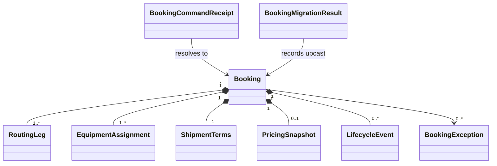

# Domain Entities - U01 Booking Draft Skeleton

## Aggregate Model

### `Booking`

The framework-free aggregate owns identity, lifecycle, canonical shipment shape, pricing placeholder, exception history, lifecycle facts, and safe legacy metadata.

| Attribute | Type | U01 rule |
|---|---|---|
| `id` | `BookingId` | Immutable opaque identity. |
| `bookingNumber` | `BookingNumber` | Immutable unique display reference. |
| `revision` | positive integer | Starts at 1; later re-confirmation increments. |
| `status` | `BookingStatus` | U01 creates `DRAFT`; later states remain readable. |
| `customerId` | stable reference code | Required, no customer PII. |
| `routing` | ordered immutable `List<RoutingLeg>` | W1 one leg, model array-capable. |
| `equipment` | immutable `List<EquipmentAssignment>` | W1 one line/quantity one, model array-capable. |
| `shipmentTerms` | `ShipmentTerms` | USD, FCL dry, non-reefer, non-DG defaults visible to user. |
| `pricingSnapshot` | optional existing/migrated snapshot | Preserved by U01; replaced by canonical U03 model. |
| `exceptions` | immutable list | Preserved, no routing/equipment authority. |
| `lifecycleEvents` | immutable ordered list | Preserved; draft creation appends one fact. |
| `legacyAttributes` | immutable map | Audit/backward-read only, never business authority. |
| `snapshotVersion` | integer | Canonical U01 write version is 2. |

The aggregate exposes `draft(...)`, lifecycle transition methods used by later units, and invariant validation. It has no Spring, JDBC, JSON, Kafka, HTTP, or frontend dependencies.

## Value Objects

### `RoutingLeg`

| Attribute | Type | Constraint |
|---|---|---|
| `legSequence` | positive integer | Unique/contiguous from 1; W1 exactly 1. |
| `loadUnLocode` | `UnLocode` | Uppercase stable Shared Platform code. |
| `dischargeUnLocode` | `UnLocode` | Uppercase stable Shared Platform code; differs from load in W1. |
| `voyageId` | `VoyageId` | Nonblank stable voyage reference. |

### `EquipmentAssignment`

| Attribute | Type | Constraint |
|---|---|---|
| `equipmentTypeCode` | `EquipmentTypeCode` | Uppercase stable equipment-type reference. |
| `quantity` | positive integer | W1 exactly 1. |
| `equipmentId` | optional-capable `EquipmentId` | Contract supports null later; W1 create requires one ISO 6346-valid physical ID. |

### `ShipmentTerms`

`currency=USD`, `shipmentMode=FCL`, `cargoType=DRY`, `reefer=false`, `dangerousGoods=false`, and any U03-required commodity/date values are explicit typed attributes rather than hidden map entries.

### Identity and standards values

- `BookingId`, `BookingNumber`, `CustomerId`, `VoyageId`, and `EquipmentTypeCode` reject null/blank values and preserve stable source codes.
- `UnLocode` normalizes uppercase and validates structural syntax in U01; U02 verifies live existence/active state.
- `EquipmentId` normalizes uppercase and validates ISO 6346 structure/check digit. UI may pre-check syntax but domain construction is authoritative.

## Application Data Types

### `CreateBookingCommand`

Contains idempotency key, customer ID, ordered routing commands, ordered equipment commands, explicit shipment terms, actor subject, and correlation ID. It no longer exposes origin/destination/equipment aliases or a generic authoritative attributes map.

### `BookingCommandReceipt`

| Attribute | Purpose |
|---|---|
| `idempotencyKey` | Unique external command token. |
| `operation` | `CREATE` in U01; prevents cross-command reuse. |
| `requestHash` | SHA-256 normalized business payload. |
| `bookingId` | Stable response owner generated at claim. |
| `state` | `IN_PROGRESS` or `COMPLETED`; U01 commits final state atomically. |
| `responseRevision` | Revision returned on replay. |
| `createdAt`, `completedAt` | Operational/audit timing. |

This is an application/persistence idempotency record, not part of the Booking aggregate.

### Queries and views

- `BookingListQuery(search, statuses, page, pageSize)` validates caps and deterministic sorting.
- `BookingListItem` exposes booking ID/number, customer reference, POL/POD, voyage, equipment type/ID, revision, status, and updated time.
- `BookingDetailView` exposes canonical routing/equipment plus lifecycle/pricing/status extension sections without leaking JSON snapshot or legacy attributes as authority.

## Persistence Model

### `booking_records`

Retains the primary row and canonical snapshot while adding typed/canonical query columns needed for stable list/detail and migration markers. The JSON snapshot is aggregate persistence, not a public wire contract. Optimistic version/update timestamps support deterministic reads; later confirmation adds locking/CAS behavior using U01-owned structures.

### `booking_command_receipts`

Replaces/extends the weak key-to-booking table with operation, request hash, state, response revision, and timestamps. Primary key is idempotency key; booking ID is a foreign key and indexed. Unique constraints, not a Java pre-check, own concurrency correctness.

### `booking_migration_results`

Records booking ID, source/target snapshot versions, outcome, reason code, and migrated time for deterministic backfill evidence. It contains no payload copy or PII.

### Legacy adapter types

`LegacyBookingSnapshotV1` exists only in `dataaccess`; `BookingSnapshotCodec` maps it into the domain and writes canonical v2. The domain module never imports the legacy DTO or Jackson annotations.

## Entity Relationships

Text fallback: one Booking owns ordered routing/equipment and lifecycle data; command receipts and migration results refer to but are not contained in the aggregate.

## Lifecycle in U01

`NEW COMMAND -> DRAFT` is the only U01-created lifecycle transition. Existing `VALIDATED`, `PRICING_PENDING`, `PRICED`, `CONFIRMED`, `EXCEPTION`, `AMENDED`, and `RECONFIRMED` records remain deserializable and unchanged through migration; later units refactor their transition semantics.

## Source Coverage

Entities realize the U01 boundary in `unit-of-work.md`, US-W1-001 mapping in `unit-of-work-story-map.md`, data/standards requirements in `requirements.md`, C02-C04 ownership in `components.md`, command/repository signatures in `component-methods.md`, and separate Booking DB/API ownership in `services.md`.
