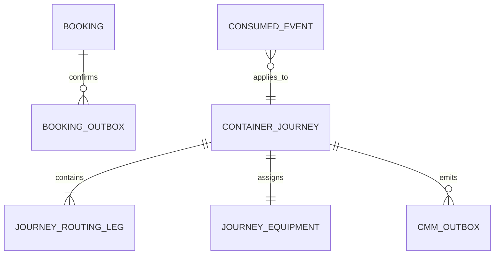

# Domain Entities - U04 Confirm to CMM Journey

## Booking Confirmation Entities

### `BookingConfirmedEvent`

An immutable application event mirrors the canonical envelope plus nested payload:

| Attribute | Type | Constraint |
|---|---|---|
| `id` | UUID string | Deterministic RFC 4122 UUIDv5 per booking/revision. |
| `source` | string | Approved Booking producer identity. |
| `type` | string | Exactly `booking.confirmed`. |
| `time` | instant | Confirmation commit fact time. |
| `correlationId` | string | Originating command provenance. |
| `dataSchemaVersion` | Avro `int` / Java `int` | Exactly `1` for W1. |
| `data` | `BookingConfirmedData` | Canonical domain payload. |

`BookingConfirmedData` contains booking ID, positive revision, immutable ordered `RoutingLeg` list, and immutable `EquipmentAssignment` list. It has no flat compatibility aliases. UUIDv5 constants and U+001F-delimited UTF-8 name encoding are shared test fixtures so producer, outbox, and serde tests derive identical IDs.

### `BookingOutboxEvent`

The W0 lifecycle fields remain adopted: event identity/type/version, aggregate identity/revision, schema subject, producer, deduplication key, correlation, occurrence time, canonical snapshot, status, attempts, claim metadata, retry schedule, and broker metadata. U04 changes the payload snapshot/mapping and adds logical uniqueness; it does not create another relay abstraction.

### `ConfirmationCommandReceipt`

Stores operation, idempotency key, request hash, booking ID/revision, event ID, result status, actor, correlation, and completion time. It participates in the Booking confirmation transaction.

## CMM Ingestion Entities

### `BookingConfirmedEnvelope`

The CMM application type preserves exact envelope and nested values after `GenericRecord` mapping. Validation helpers derive route location references but do not flatten or discard routing/equipment structure.

### `ConsumedEventReceipt`

| Attribute | Purpose |
|---|---|
| `eventId` | Primary dedupe identity. |
| `eventType`, `source`, `dataSchemaVersion` | Contract provenance. |
| `bookingId`, `bookingRevision` | Applied/ignored business identity. |
| `topic`, `partition`, `offset` | Delivery evidence. |
| `correlationId`, `consumedAt` | Trace and timing. |
| `disposition` | `APPLIED`, `DUPLICATE`, or `STALE`; duplicate conflicts do not insert another row. |

The receipt exists only after successful transaction commit.

### `ContainerJourney`

Refactor the flat current aggregate to retain:

- stable journey ID;
- booking ID and highest applied revision;
- physical container reference and equipment type;
- immutable ordered routing legs with sequence, load/discharge, and voyage;
- lifecycle status `PLANNED`;
- expected movement plan and real validated movement history;
- created/updated timestamps and last source correlation.

Identity for W1 is `(bookingId, containerRef)`. Higher revision reconciliation preserves journey ID and history. Physical container reference is immutable.

### `PlannedMovementStatusFact`

The CMM status-outbox domain object records canonical nested status data: booking/container references, null movement ID, `LOAD`, `PLN`, confirmation/ingestion timestamps, `PLANNED`, `LADEN`, false transshipment, and POL location. It is a planned announcement and is not inserted into actual movement history.

## Repository Ports

### `JourneyRepository`

- `findByBookingIdAndContainerRef(bookingId, containerRef)` locates the W1 journey.
- `findHighestRevisionByBookingId(bookingId)` protects stale handling across container-key lookup.
- `save(journey)` uses optimistic versioning or row lock and persists canonical snapshot/columns.

### `CmmConsumedEventRepository`

`recordIfAbsent(receipt)` uses an insert-on-conflict primitive in the caller's transaction. It is separate from command idempotency because envelope identity and retention semantics differ.

### `OutboxRepository`

Uses the existing expanded W0 claim/save/status methods and CMM table. U04 adds a unique logical status-fact key where needed; publication remains shared relay behavior.

## Persistence Migration

CMM adds Flyway `V1__container_movement_baseline.sql` copied from the current schema and `V2__container_movement_w1.sql` for canonical journey routing/equipment, highest booking revision, `container_movement_consumed_events`, and logical status-outbox uniqueness. CMM disables `spring.sql.init`, uses service-local `classpath:db/migration`, and sets `baseline-on-migrate=false`. Its `FlywayMigrationStrategy` runs V1/V2 for an empty schema, validates/migrates existing history, and explicitly baselines a non-empty no-history schema at version 1 only after an exact checked-in CMM V1 catalog fingerprint matches; unknown/partial schemas abort before baseline or migration. Existing IDs, histories, audit/idempotency, and outbox lifecycle are preserved through deterministic migration/upcast. Booking's U01 migration chain adds confirmation receipt/outbox uniqueness without destructive table recreation.

Text fallback: a Booking can have confirmation outbox facts; each successfully consumed envelope applies to one CMM journey; the journey owns routing/equipment and emits CMM status outbox facts.

## Source Coverage

The entities implement U04 from `unit-of-work.md`, map US-W1-004 in `unit-of-work-story-map.md`, carry exact contract and idempotency needs from `requirements.md`, preserve C01/C07-C09 ownership in `components.md`, realize repository/mapping signatures in `component-methods.md`, and maintain service database isolation from `services.md`.
