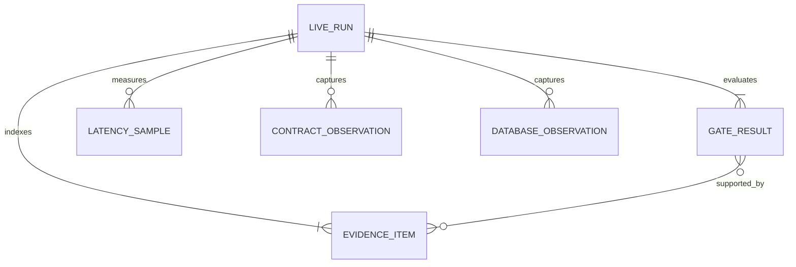

# Domain Entities - U07 Live Release Acceptance

## Acceptance Evidence Model

U07 adds test/release artifacts, not production business entities or cross-service persistence.

### `LiveRunManifest`

| Attribute | Purpose |
|---|---|
| `runId`, `startedAt`, `completedAt`, `status` | Immutable run identity/lifecycle. |
| `branch`, `commit`, `dirtySummary` | Source provenance. |
| `environment` | Redacted tool/Compose/image/port versions. |
| `businessIds` | Booking, pricing, event, journey, container, correlation identities. |
| `gates` | Ordered `GateResult` list. |
| `artifacts` | Indexed `EvidenceItem` list with hashes. |

### `GateResult`

Contains gate ID mapped to FR/NFR/DoD, command/action, start/end, exit code, measured assertion, artifact paths, and `PASS|FAIL|BLOCKED`. A gate cannot be `PASS` based only on file existence when it claims runtime behavior.

### `EvidenceItem`

Contains relative path, media type, SHA-256, capture time, producer command, redaction classification, and linked gate IDs. Topic and database evidence also records source coordinates/query and shared business IDs.

### `LatencySample`

Contains workload name, sequence, warm-up flag, concurrency slot, monotonic start/end/duration, booking/container identity where applicable, success/error code, and correlation. Summary derives nearest-rank p95/p99 without deleting failures.

### `ContractObservation`

Records topic/key/partition/offset/schema ID/subject/version/fingerprint, decoded canonical record path, and exact-field validation result. It references raw redacted evidence rather than becoming application state.

### `DatabaseObservation`

Records service/database, transaction time, parameterized query identifier, selected business keys/counts/statuses/hashes, and result artifact. Passwords/connection secrets are never stored.

## Evidence Directory Shape

```text
artifacts/w1-01-live/<run-id>/
  manifest.json
  index.md
  preflight/
  schema-registry/{before,after}/
  compose/
  journey/{browser,api,topics,databases}/
  negative/
  performance/{pricing,round-trip}/
  replay-restart/
  accessibility/{desktop,mobile}/
  quality/
  audits/{aidlc,erp-fidelity}/
```

## Traceability Relationships



Text fallback: one live run evaluates many gates and indexes many evidence items; evidence supports gates; samples and contract/database observations belong to the run.

## Production Data References

Evidence references but never owns Booking, pricing request/result, Booking/CMM outbox, consumed receipts, CMM journey, and Booking movement projection. Cross-checks use stable IDs/correlation and hashes. No release script patches these entities to manufacture acceptance.

## Source Coverage

The evidence model implements U07 from `unit-of-work.md`, maps US-W1-007 in `unit-of-work-story-map.md`, captures proof required by `requirements.md`, keeps C12 outside production owners from `components.md`, records execution of `component-methods.md`, and represents Compose/topic/database/latency/audit observations from `services.md`.
