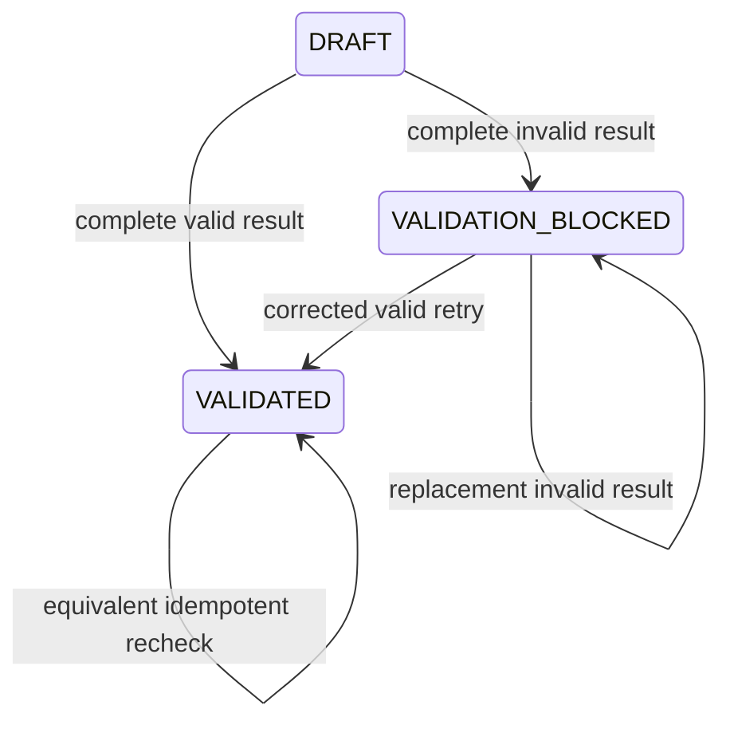

# Domain Entities - U02 Reference Validation

## Booking Extensions

### `BookingStatus.VALIDATION_BLOCKED`

A first-class retryable business status meaning a completed provider evaluation found invalid, inactive, missing, or incoherent canonical references. It differs from transport unavailable and from generic operational exceptions. Allowed U02 transitions are:

Text fallback: draft or blocked can become validated after a complete valid check; invalid checks create/replace blocked state; equivalent validated recheck is a no-op. Provider outage creates no state edge.

### `ReferenceValidationSnapshot`

| Attribute | Type | Purpose |
|---|---|---|
| `bookingRevision` | integer | Guards stale application. |
| `referenceFingerprint` | SHA-256 string | Ties result to exact customer/routing/equipment values. |
| `outcome` | `VALID` or `BLOCKED` | Aggregate business decision. |
| `fieldResults` | immutable ordered list | Complete field-level evidence. |
| `checkedAt` | instant | Provider evaluation time. |
| `correlationId` | string | Cross-boundary provenance. |

It is owned by the Booking aggregate and replaced atomically. It contains no full provider record or customer PII.

## Application Types

### `BookingReferenceValidationRequest`

Contains Booking ID/revision/fingerprint plus ordered `ReferenceCheck` items. A check carries field path, expected reference set, requested stable ID/code, and optional coherence role (load, discharge, voyage, equipment).

### `ReferenceValidationResult`

| Attribute | Type | Constraint |
|---|---|---|
| `bookingRevision` | integer | Echoes request. |
| `referenceFingerprint` | string | Echoes request. |
| `fieldResults` | immutable ordered list | One result per required check plus coherence results. |
| `checkedAt` | instant | Non-null. |
| `correlationId` | string | Nonblank. |

`valid()` is derived only when every required result is `ACTIVE` and all coherence checks pass. It is not a mutable boolean supplied by an adapter.

### `ReferenceFieldResult`

- `fieldPath`
- `referenceSet`
- `requestedValue`
- `outcome`: `ACTIVE`, `INACTIVE`, `NOT_FOUND`, or `MISMATCH`
- optional matched `recordId`, `recordCode`, `recordVersion`
- stable `reasonCode`

### `ReferenceProviderUnavailable`

A typed application boundary failure carrying stable category (`TIMEOUT`, `THROTTLED`, `CONNECTION`, `SERVER`, `CONTRACT`), safe message, correlation ID, and optional retry-after duration. It contains no raw response payload.

## Adapter DTOs

`HttpReferenceValidationAdapter` maps the Reference Data OpenAPI `ReferenceRecord` into a private typed provider DTO containing ID, set, code, display name, status, version, and only voyage attributes required for coherence. The application/domain layers do not depend on Spring HTTP or the provider DTO.

For combobox reads, `ReferenceOption` contains stable ID, code, display name, version, and selected safe attributes. Option models are presentation data and never become validation proof.

## Aggregate Methods

- `booking.referenceValidationRequest()` derives immutable request/fingerprint.
- `booking.applyValidation(result, actor, now)` checks revision/fingerprint/completeness and returns `VALIDATED` or `VALIDATION_BLOCKED` aggregate.
- `booking.invalidateValidation(reason, actor, correlation, now)` is reserved for later field-changing commands and returns draft/amendment-appropriate state.
- Domain methods do not perform HTTP, JSON parsing, retries, logging, or persistence.

## Persistence

The U01-owned V2 Booking snapshot/columns hold the latest validation snapshot and status. No U02 migration file is added. Query indexes include status for work-queue filtering. Attempt audit remains in `booking_audit`; provider-outage audit does not alter aggregate snapshot.

## Source Coverage

The model extends U02 in `unit-of-work.md`, US-W1-002 in `unit-of-work-story-map.md`, typed data requirements in `requirements.md`, C02-C04/C10-C11 ownership in `components.md`, port/application design in `component-methods.md`, and Booking-owned state with Reference-owned records in `services.md`.
