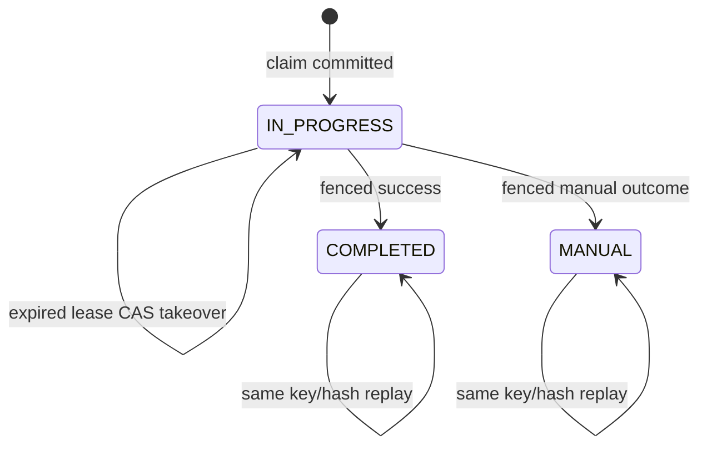

# Domain Entities - U06 Replay and Restart Safety

## Existing Durable Authorities

U06 adds no shared inbox or cross-service data owner. It verifies these existing entities as the only recovery authorities:

| Service | Durable entity | Recovery authority |
|---|---|---|
| Charge | `StoredPricingRequest` | Request hash, lease owner/fence, terminal result/manual state. |
| Booking | command receipt + `BookingOutboxEvent` | Confirm replay and one logical event per revision. |
| CMM | `ConsumedEventReceipt` + `ContainerJourney` + status outbox | Envelope dedupe, highest revision, one status fact. |
| Booking | `BookingConsumedEventReceipt` + `MovementStatusProjection` | Envelope dedupe and latest ordered status. |

Process memory and Kafka offsets are delivery mechanics, not business truth.

## Recovery State Models

### Pricing claim

Text fallback: a committed claim can be taken over only after lease expiry; only the current owner completes; terminal states replay unchanged.

### Outbox publication

Pending/retryable rows may be claimed after restart or claim expiry; published/permanent rows are terminal. Event ID and logical unique key remain unchanged across attempts.

### Consumer receipt

Receipt insertion is provisional until its transaction commits. A failed delivery has no receipt; successful applied/stale delivery has one immutable envelope receipt; duplicate envelope conflicts without a new effect.

## Verification Models

### `ResilienceScenario`

A test/harness descriptor, not a production domain table:

- scenario ID and protected invariant;
- setup business IDs and topic coordinates;
- fault point/control;
- action/replay/restart sequence;
- expected database/topic/UI assertions;
- cleanup that preserves acceptance volumes where required.

### `StateEvidenceSnapshot`

Machine-readable evidence contains service/schema version, commit, captured time, relevant business IDs, row counts, outbox statuses/event IDs, receipt IDs/dispositions, highest revisions/ordering tuples, and selected hashes. It excludes credentials and PII.

### `ReplayAudit`

Owned by the consuming service/operator control and records actor, permission decision, reason, DLT/source topic, partition/offset, envelope ID, destination, and replay time. It does not claim that replay was applied; database receipts/projections remain application truth.

## Database Constraints Under Test

- Charge unique idempotency key and `(booking_ref, amendment_seq)` plus owner-fenced completion predicate.
- Booking command receipt uniqueness and outbox unique `(event_type, booking_id, revision)`.
- CMM consumed event primary key, journey booking/container uniqueness, highest revision guard, and status logical-fact uniqueness.
- Booking consumed event primary key, projection primary key, and guarded lexicographic upsert.
- Flyway schema-history version/checksum uniqueness.

## Persistence and Retention

Receipts must outlive the seven-day DLT/replay window and normal event-redelivery horizon. Outbox rows retain terminal broker/error metadata according to service retention policy and cannot be purged before evidence/replay requirements are met. U06 may add indexes/evidence queries, but no alternative canonical snapshot.

## Source Coverage

The model implements U06 from `unit-of-work.md`, maps US-W1-006 from `unit-of-work-story-map.md`, protects durable entities required by `requirements.md`, preserves service ownership in `components.md`, exercises claim/receipt/upsert methods in `component-methods.md`, and maintains no-shared-database boundaries from `services.md`.
