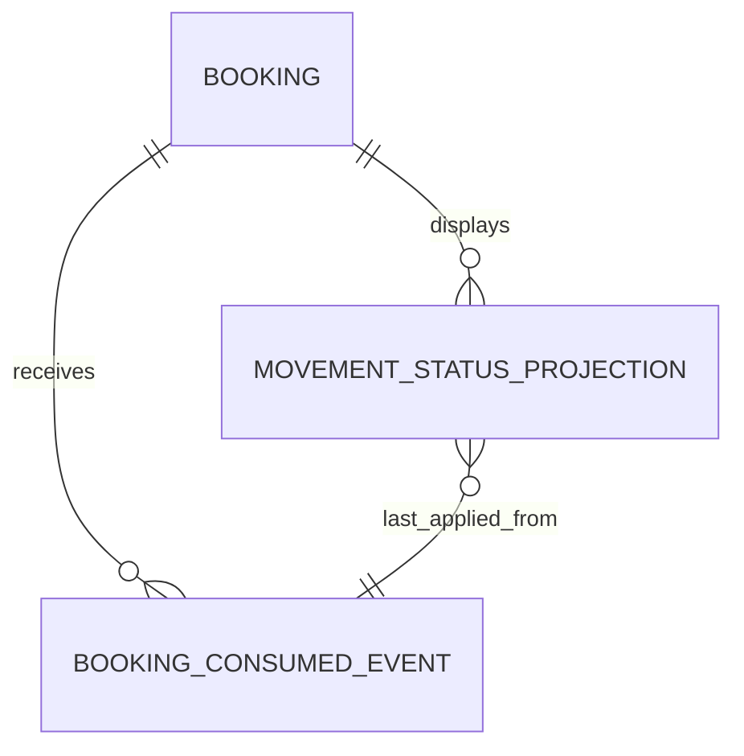

# Domain Entities - U05 Returned Status Detail

## Canonical Status Event

### `MovementStatusReceivedEvent`

Replace the current flat event/sequence model with exact envelope plus `MovementStatusData`:

| Group | Attributes |
|---|---|
| Envelope | `id`, `source`, `type`, `time`, `correlationId`, integer `dataSchemaVersion=1` |
| Identity | `bookingRef`, `containerRef`, nullable `movementId` |
| Fact | `moveCode`, `eventClassifierCode`, `occurredDateTime`, `receivedDateTime`, `derivedStatus` |
| Context | `emptyIndicatorCode`, `transshipment`, nullable `location` |

`MovementLocation` preserves nullable `unLocationCode`, `facilityCode`, and `facilityTypeCode`. Domain values are typed enums/value objects where the contract is closed; `moveCode` remains a validated string to preserve DCSA catalog compatibility.

## Booking Projection Entities

### `MovementStatusProjection`

| Attribute | Purpose |
|---|---|
| `bookingRef`, `containerRef` | Composite primary key. |
| `movementId` | Optional stable CMM movement identity. |
| `moveCode`, `classifier`, `classifierRank` | Canonical fact and deterministic ordering. |
| `occurredDateTime`, `receivedDateTime` | Business/ingestion time. |
| `derivedStatus`, `emptyIndicatorCode`, `transshipment` | Display/business state. |
| location fields | Optional canonical location context. |
| `eventId`, `source`, `eventTime`, integer `dataSchemaVersion`, `correlationId` | Envelope provenance. |
| `projectedAt` | Booking application time and latency evidence. |

The projection exposes `orderingKey()` as the fixed four-part tuple. It is a read model and is not nested in the Booking aggregate snapshot.

### `BookingConsumedEventReceipt`

Stores envelope ID primary key, event type/source/version, booking/container identity, topic/partition/offset, correlation, consumed time, and disposition `APPLIED|STALE`. Duplicate ID does not add a row. Receipt retention must cover the DLT/replay horizon and operational policy.

### `ProjectionUpsertResult`

Repository output identifies `APPLIED` or `STALE` and returns the persisted winner. This lets application audit accurately without rereading or racing another consumer.

## Persistence

Booking's additive V2 migration creates:

- `booking_movement_status` keyed by `(booking_ref, container_ref)`, with typed canonical columns and an optional JSON snapshot for deterministic upcast/inspection;
- `booking_consumed_events` keyed by `event_id`, with delivery provenance and disposition;
- indexes by booking, occurred time, and consumed time for detail/evidence queries.

The guarded `INSERT ... ON CONFLICT ... DO UPDATE ... WHERE` encodes the full ordering tuple in SQL so concurrent listener threads cannot regress state. Legacy movement values in generic Booking attributes may be migrated as non-authoritative history/audit but are never treated as canonical W1 projections.

Text fallback: a Booking owns zero or more per-container status projections and consumed-event receipts; each current projection records the envelope that last won ordering.

## API View Types

`BookingDetailView` composes Booking, route/equipment, typed pricing, confirmation/outbox summary, `JourneyProjectionView`, and collapsed audit summary. `JourneyProjectionView` is a tagged state:

- `NOT_CONFIRMED`
- `PENDING_EVENT`
- `AVAILABLE` with projection
- `DELAYED` after bounded UI observation
- `UNAVAILABLE` only for local detail-read failure

The API does not expose repository snapshots, DLT headers, raw Kafka records, or internal error messages.

## Source Coverage

The entities implement U05 from `unit-of-work.md`, map US-W1-005 in `unit-of-work-story-map.md`, carry exact event/projection requirements from `requirements.md`, preserve C02/C05 ownership in `components.md`, realize repository/event signatures in `component-methods.md`, and encode ordering/service isolation from `services.md`.
