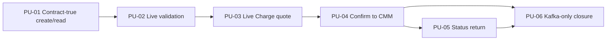

# Intent Backlog - W1-01 Booking Quote-to-Cash

## Source And Prioritization Method

This proto-Unit backlog decomposes the outcome in `ideation/intent-capture/intent-statement.md` under the viability findings in `ideation/feasibility/feasibility-assessment.md` and the binding controls in `ideation/feasibility/constraint-register.md`.

All six proto-Units are MoSCoW Must items because together they form one release-level walking skeleton. Their order is dependency-aware and risk-first. No numeric WSJF score is asserted without capacity, duration, or cost-of-delay evidence.

## Prioritized Proto-Units

| Order | ID | Proto-Unit | Vertical outcome | Dependencies | Confidence hypothesis | Exit evidence |
|---:|---|---|---|---|---|---|
| 1 | PU-01 | Contract-true booking create/read | An agent can create, persist, list, and open the thin booking through a green Booking app using typed routing/equipment and canonical identity while legacy records remain readable | W0-02 closed | If the model, migration, API, and UI move together, later integrations can extend one stable record without another shape rewrite | Legacy migration fixture; domain/repository/API/frontend tests; browser create/list/detail baseline |
| 2 | PU-02 | Live canonical validation | The same draft can be validated against live customer, location, vessel/voyage, equipment, commodity, and currency references with user-visible failure states | PU-01; W0-02 live sets | If every thin-field reference resolves live, no hidden fixture or attribute-bag dependency blocks pricing or confirmation | Consumer tests; Compose calls; accepted/rejected UI/API evidence |
| 3 | PU-03 | Live Charge quote | The validated booking obtains and persists one real USD quote from Charge, and the agent sees its amount, currency, and pricing basis | PU-02; frozen Booking/Charge contract | If the existing provider contract maps cleanly from the typed booking, commercial value is real before event cutover risk is introduced | Consumer/provider tests; persisted quote; live request/result; browser price state |
| 4 | PU-04 | Transactional confirmation to CMM | Confirming the priced booking commits Booking and outbox atomically, publishes contract-exact `booking.confirmed`, and idempotently creates one CMM journey per revision | PU-03; W0 relay; authoritative schema | If schema and consumer behavior pass before callback removal, Kafka can become authoritative without losing confirmation delivery | Schema/serde tests; rollback test; real topic record; CMM journey/dedupe rows; CMM-unavailable request test |
| 5 | PU-05 | CMM status return to Booking detail | CMM emits contract-exact `containermovement.status`; Booking atomically dedupes/projects it; the agent sees journey status on the detail page | PU-04; status schema | If projection and dedupe commit together before acknowledgement, duplicates and stale events cannot corrupt the browser-visible status | Producer/consumer tests; forced rollback; duplicate/stale tests; real topic/projection; browser populated/error states |
| 6 | PU-06 | Kafka-only resilient live closure | Both HTTP event-delivery paths/config are removed; Compose restart and redelivery preserve exactly one journey/projection; all tests, audits, and evidence are green | PU-04 and PU-05 proven | If the full stack survives cutover, replay, and restart without duplicate business state, W1 has closed the integration risk rather than hiding it | Source detector; Compose `ps`/logs; DB/topic/schema assertions; frontend proof; test reports; both audit reports; `artifacts/w1-01-live/` summary |

## Dependency Graph

Text fallback: PU-01 precedes PU-02, which precedes PU-03, which precedes PU-04, which precedes PU-05; PU-06 requires both PU-04 and PU-05 to be proven.

## Capability Trace

| Scope capability | Proto-Unit coverage |
|---|---|
| Contract-true Booking identity, routing, equipment, and compatible persistence | PU-01 |
| Booking-local create/list/detail states | PU-01, PU-02, PU-03, PU-05 |
| Live Reference Data seam | PU-02 |
| Live Charge seam and persisted quote | PU-03 |
| Atomic confirmation, outbox, exact `booking.confirmed`, CMM consumer | PU-04 |
| Exact `containermovement.status`, atomic Booking projection, dedupe/ordering | PU-05 |
| Synchronous callback removal, restart/redelivery, live evidence, quality gates | PU-06 |

No scope capability is orphaned, and no proto-Unit introduces a capability assigned to a deferred program intent.

## Backlog Policies

- A proto-Unit is complete only when its UI/API/domain/persistence/integration surfaces needed for an observable increment are green; horizontal implementation tasks are subordinate work, not separate units.
- PU-04 may retain temporary callback code only until both Kafka consumer paths are operationally proven. PU-06 removes the callbacks before release closure; steady-state dual delivery is forbidden.
- PU-06 cannot substitute mocks, host-only processes, or test-only consumers for the canonical Compose stack.
- Scope change must update the source intent, this backlog, affected constraints, and downstream traceability before implementation proceeds.
- Should/Could polish never displaces a Must proto-Unit or its evidence.
