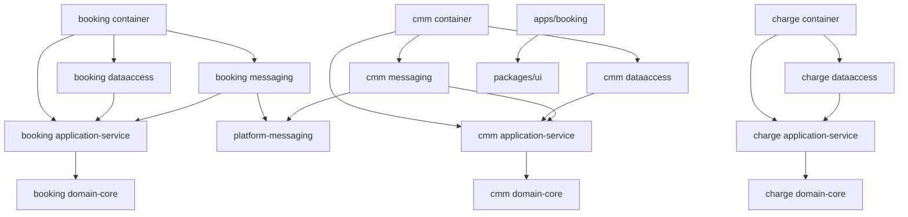

# Component Dependency - W1-01 Booking Quote-to-Cash

## Dependency Rules

Dependencies point inward: container/messaging/data-access adapters depend on application ports and domain types; application services depend on ports and domain; domain depends on no framework. `apps/booking` depends on `@erp/ui` and its BFF contract, not backend implementation modules. Service databases and mutable repositories are never shared.

## Dependency Matrix

| Consumer | Booking | Reference | Charge | Kafka/SR | CMM | `@erp/ui` |
|---|---|---|---|---|---|---|
| Booking Web/BFF | HTTP | none | none | none | none | compile-time |
| Booking application | local ports | HTTP validation | HTTP pricing | via messaging ports | none | none |
| Booking messaging | application port | none | none | producer/consumer | event contract only | none |
| Charge | none | existing validation | local repositories | existing publisher only | none | none |
| CMM application | event contract only | HTTP validation | none | via messaging ports | local repositories | none |
| CMM messaging | event contract only | none | none | consumer/producer | application port | none |

No allowed row contains Booking-to-CMM HTTP or CMM-to-Booking HTTP.

## Build-Time Module Dependencies

Text fallback: each service container assembles its application, data-access, and messaging adapters; adapters point inward to application/domain; Booking and CMM messaging both reuse platform-messaging; the web app depends on the shared UI package only.

## Runtime Data Flow

| Step | Caller to callee | Mode | Data | Transaction boundary |
|---|---|---|---|---|
| 1 | BFF to Booking | sync HTTP | create/read/command DTO | Booking command transaction where required |
| 2 | Booking to Reference | sync HTTP | canonical active reference keys | no distributed transaction |
| 3 | Booking to Charge | sync HTTP | pricing.request/result | Charge request transaction; Booking snapshot transaction |
| 4 | Booking relay to Kafka | async | canonical `booking.confirmed` | outbox lifecycle transaction |
| 5 | Kafka to CMM listener | async | canonical envelope/data | receipt + journey + status outbox transaction |
| 6 | CMM relay to Kafka | async | canonical `containermovement.status` | outbox lifecycle transaction |
| 7 | Kafka to Booking listener | async | canonical envelope/data | receipt + projection transaction |
| 8 | BFF to Booking detail | sync HTTP | composite Booking-owned view | read-only service query |

## Persistence Dependencies

| Adapter | Tables/snapshots | Constraints required |
|---|---|---|
| Booking repository | `booking_records` | booking ID PK; booking number unique |
| Booking event receipt | `booking_consumed_events` | envelope event ID PK |
| Booking movement projection | `booking_movement_status` | `(booking_ref, container_ref)` PK; ordering fields indexed |
| Booking outbox | `booking_outbox` | event ID PK; claim index; one logical event ID per confirmation/revision |
| Charge pricing request | `pricing_requests` | idempotency key unique; request hash immutable |
| CMM journey | `container_journeys` | unique `(booking_id, container_id)`; highest revision in snapshot/column |
| CMM event receipt | `container_movement_consumed_events` | envelope event ID PK |
| CMM outbox | `container_movement_outbox` | event ID PK; claim index; canonical snapshot |

Each database adds Flyway history. V1 is the checked-in current baseline; V2 contains only W1 additive columns/tables/indexes/backfills. Existing databases baseline at V1 and apply V2, while fresh databases apply both. Migration tests start from a captured W0 schema/data fixture, assert row-count/business-key preservation and checksums, restart twice, and exercise restore/forward-repair evidence; destructive reset is not used.

## Failure Propagation

| Failure | Propagation | User-visible state |
|---|---|---|
| Reference inactive | Booking records validation block | Validation failed with correction links |
| Charge 404 `NO_RATE` | Booking stores manual-pricing state | Manual pricing reason; Confirm disabled |
| Charge timeout/503 | one bounded retry, then manual/transient state | Retry pricing; no partial amount |
| Booking publish failure | outbox retry; confirmation remains committed | Confirmed, journey pending |
| CMM transaction failure | Kafka redelivery; no receipt/journey/outbox partial state | Journey pending |
| Duplicate/stale confirmation | receipt/no-op or revision no-op | Existing journey unchanged |
| CMM publish failure | status outbox retry | Journey pending in Booking |
| Booking projection failure | Kafka redelivery; no receipt-only commit | Known booking plus recoverable status error |
| Duplicate/late status | receipt and deterministic no-op/update | No regression to older displayed status |
| Permanent malformed event | publish original key/value plus cause headers to service-owned seven-day DLT | Source partition continues; Audit records event ID |

## Shared Resource Assessment

- Shared code: `platform-messaging`, contract artifacts, and `@erp/ui` are immutable dependencies with service-specific adapters.
- Shared runtime: Kafka and Schema Registry carry records but do not own business state.
- Shared database: prohibited.
- Shared synchronous client: Reference and Charge clients are Booking-owned outbound adapters.
- Consumer implementation is service-local because shared infrastructure currently provides producers/relay/registration but no generic business consumer; listeners still use the repository's Spring Kafka/Avro stack and do not duplicate publisher infrastructure.

## Upstream Trace

The dependency model resolves coupling found in `architecture.md` and `component-inventory.md`, satisfies `requirements.md` and `stories.md`, and preserves the module/deployment constraints in `team-practices.md`.

All five names resolve through the exact W1-01 Source Register in `components.md`; no prior-intent CodeKB or practice copy is an input.
