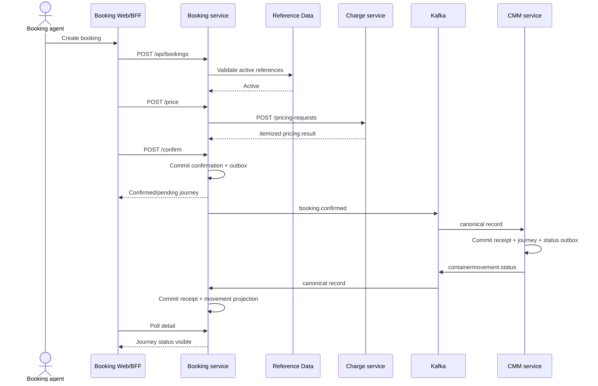

# Services - W1-01 Booking Quote-to-Cash

## Service Definitions

| Service | W1 responsibility | Data owner | Scaling/lifecycle |
|---|---|---|---|
| Booking | User-facing lifecycle, live validation, Charge orchestration, confirmation event, returned movement projection | Booking PostgreSQL | Stateless HTTP/Kafka instances over shared DB; relay and listener concurrency bounded by partitions |
| Reference Data | Active canonical party/location/voyage/equipment/commodity lookups | Reference PostgreSQL | Existing service; W1 is a synchronous consumer only |
| Charge Agreement | Authoritative pricing endpoint, active agreement/rate calculation, manual outcome | Charge PostgreSQL | Stateless HTTP instances; idempotency allows retry; p99 <=800ms local gate |
| Container Movement Management | Confirmation consumer, highest-revision journey reconciliation, status producer | CMM PostgreSQL | Kafka-driven stateless instances; booking-key ordering and DB uniqueness protect scale-out |
| Kafka/Schema Registry | At-least-once event transport and BACKWARD schema governance | Broker/registry | Existing Compose infrastructure; real broker coordinates required as evidence |
| Booking Web/BFF | Booking-local operator routes and backend mediation | No independent business database | Next.js process; horizontally stateless; polls Booking only |

## Orchestration Pattern

W1 uses mixed coordination by seam:

- Booking orchestrates synchronous validation and pricing because the user cannot confirm without immediate reference and commercial outcomes.
- Booking and CMM use Kafka choreography. Booking emits a fact and returns; CMM reacts and emits a sibling fact; Booking projects that fact.
- There is no distributed transaction, synchronous CMM callback, HTTP fallback, or browser-side service composition.
- Transactional outbox and transactional consumed-event receipt boundaries provide atomic local state. At-least-once broker delivery is expected and tested.

## Communication Contracts

| From | To | Contract | Protocol | Failure behavior |
|---|---|---|---|---|
| Booking | Reference Data | active reference lookup | HTTP | Missing/inactive blocks validation; no guessed value |
| Booking | Charge | `POST /pricing-requests` | HTTP v1 media type | One retry on timeout/503; 404 `NO_RATE` and terminal failures enter manual state |
| Booking | CMM | `booking.confirmed` | Kafka Avro | Booking remains confirmed while relay retries; no HTTP fallback |
| CMM | Booking | `containermovement.status` | Kafka Avro | Booking shows pending; bounded UI polling observes eventual projection |
| Booking Web | Booking | collection/detail/commands | Next.js BFF to HTTP | Stable route retains known state and exposes retryable error |

### Canonical Event Envelope

Both event schemas are a single registered Avro record containing exact envelope fields and a nested `data` record:

```text
id | source | type | time | correlationId | dataSchemaVersion | data
```

`booking.confirmed.data` contains `bookingId`, `bookingRevision`, `routing[]`, and `equipment[]`. `containermovement.status.data` contains `bookingRef`, `containerRef`, `movementId`, `moveCode`, `eventClassifierCode`, `occurredDateTime`, `receivedDateTime`, `derivedStatus`, `emptyIndicatorCode`, `transshipment`, and optional `location`. Service-local resources are byte-for-byte copies of the root contract schemas.

W0 live evidence at `artifacts/w0-01-live/schema-subjects.json` proves both subject names already exist with the unreleased flat candidate schemas. Because that shape is incompatible, W1 does not attempt an in-place BACKWARD registration. The atomic cutover has a governed local baseline step: prove there are no external/released consumers, export the old subject schemas/fingerprints as evidence, permanently retire only these two unreleased local subjects, then register the canonical enterprise schemas as version 1 and restore subject compatibility to BACKWARD before any W1 producer starts. A preflight fails on a legacy fingerprint. This exception is allowed only for the disposable local W1 registry; any non-local registry with the legacy subject blocks deployment and requires a new major event type/subject decision.

## End-to-End Sequence



Text fallback: the user creates, validates, prices, and confirms through Booking; Booking publishes after its local commit; CMM consumes and commits a journey plus return outbox; Booking consumes the return and its detail endpoint exposes the projection.

## Consistency and Ordering

- `booking.confirmed` is keyed by `bookingId`; CMM applies only the highest `bookingRevision` and records every envelope ID once.
- `containermovement.status` is keyed by `bookingRef + ':' + containerRef`; Booking records every envelope ID once and updates latest projection only for a newer ordering tuple.
- Outbox rows remain until broker metadata marks them published. Retry/restart never creates a second logical event for one state transition.
- Charge idempotency keys bind to a canonical request hash and immutable result.
- Database uniqueness is the final concurrency guard; pre-read checks alone are not relied upon.

Charge uses one durable state machine per `bookingId:amendmentSeq`: `IN_PROGRESS -> COMPLETED|MANUAL`. A short committed ten-second owner lease, calculation outside the claim transaction, expired-lease CAS takeover, and fenced completion prevent concurrent/orphan side effects. Booking uses a two-second timeout, one retry only for timeout/503, and a per-endpoint circuit breaker that opens after five failed operations and half-opens after 30 seconds.

## Runtime Configuration

The canonical environment is Docker Compose with PostgreSQL exposed as `${POSTGRES_HOST_PORT:-55432}:5432`; containers still use `postgres:5432`. Kafka is `kafka:9092`, Schema Registry is `schema-registry:8081`, and nginx remains host `8088`.

Kafka/local-noop publishing profiles remain as established by W0. Consumer beans are active only in the Kafka runtime profile. `NoopMessagingGuard` must reject local-noop when a live-proof profile is selected. `@EnableScheduling` and existing `ScheduledOutboxRelay` remain the only relay scheduler.

Each consumer uses initial delivery plus two retries (250ms, 1s), then a service-owned seven-day DLT (`booking.confirmed.DLT` for CMM and `containermovement.status.DLT` for Booking). Permanent contract/deserialization failures do not block the source partition. Replay preserves envelope ID and occurs only after an operator/test fixture corrects the cause.

DLT replay requires `messaging:replay` authorization. Local evidence alerts/fails if a DLT remains non-empty for five minutes or exceeds 100 records; capacity is at least 10,000 W1-sized records. Replay audit records actor, reason, original topic/partition/offset, envelope ID, and destination.

## Reliability and Observability

| Signal | Required evidence |
|---|---|
| Pricing | request count, p99 latency, timeout/retry/manual count, correlation ID |
| Booking relay | publish lag, attempts, topic/partition/offset, permanent failures |
| CMM consumer | lag, duplicate/stale revision count, applied revision, event ID |
| CMM relay | publish lag and real broker metadata |
| Booking consumer | lag, duplicate/stale status count, projection update time |
| User path | confirm response to visible returned status p95 <=5s |

Logs use identifiers/correlation only and do not include contract payload dumps with customer attributes. Health distinguishes HTTP readiness, database access, producer readiness, and listener assignment.

Performance evidence is reproducible: after 100 warm-up requests, pricing runs 1,000 measured valid-agreement requests at concurrency 10; after 10 warm-up journeys, the round trip runs 100 measured confirmations at concurrency 5 with unique booking/container keys. Nearest-rank percentiles are calculated from monotonic client timestamps; raw CSV/JSON, environment/commit, error count, and p99/p95 summaries are written under `artifacts/w1-01-live/`. Any error fails the gate rather than being dropped from the percentile set.

## Security and Deployment Boundary

Local guarded service identity is allowed only under the local profile; non-local startup fails closed. W1 records an explicit local-only waiver for Compose broker TLS/SASL/service ACLs because the current single-broker stack is plaintext and NFR-W1-007 defers full identity. W1 security acceptance therefore covers source/type/schema validation, protected local-profile configuration, noop rejection, and non-local fail-closed tests, not service-specific broker authorization. Broker authentication/ACLs, TLS, and AWS production mapping are later infrastructure/operation work. No cloud resource is required to close W1's local Compose gate.

The approved record is `WAIVER-W1-01-001` in `decisions.md`: local Compose only; intent-owner approval is captured in the AI-DLC audit; expiry is 2026-10-15 or secured broker identity delivery, whichever is earlier.

## Upstream Trace

Service topology implements `requirements.md` and `stories.md`, updates the baseline in `architecture.md` and `component-inventory.md`, and applies the deployment/testing rules in `team-practices.md`.

Paths are pinned in `components.md` under Source Register; all references in this document resolve through that W1-01 register.
