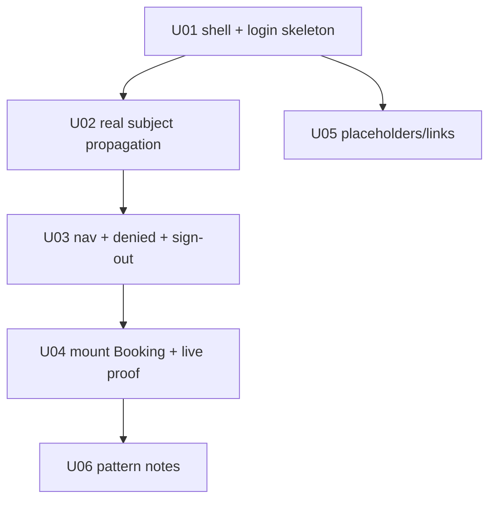

# Intent Backlog - W2-01 App Shell and Auth

## Source Context

This backlog consumes `intent-statement.md`, `feasibility-assessment.md`, and `constraint-register.md`. It translates the W2-01 source statement into proto-units for later Inception and Construction stages.

## Prioritized Proto-Units

| ID | Proto-unit | Priority | Why first/now | Definition of Done Signal |
|---|---|---|---|---|
| U01 | Shell, login, and protected route skeleton | Must | Establishes the single app entry point and proves existing auth can gate the shell. | Unauthenticated hit through Nginx redirects to login; successful login lands in shell. |
| U02 | Session -> BFF -> Booking backend subject propagation | Must | Highest feasibility risk; kills the static `local-user` path for mounted Booking calls. | Booking backend/audit evidence shows the real session subject for one call. |
| U03 | Navigation, breadcrumbs, user menu, denied path, sign-out | Must | Makes shell usable and proves authorization failure behavior. | User can navigate, see session menu, sign out, and denied user sees access-denied inside shell. |
| U04 | Mount Booking module and live acceptance proof | Must | Completes the W2-01 vertical journey and consumes preserved W1 outputs. | Booking list/detail/action runs inside shell; live Compose evidence and audits are green. |
| U05 | Non-mounted module placeholders/links | Should | Helps orientation without stealing W4-01 migration scope. | Reference-data/charge/CMM appear as placeholders or links with clear not-yet-mounted status. |
| U06 | Future module migration pattern notes | Could | Gives W4-01 a pattern without implementing it. | Evidence notes capture shell mount contract and constraints. |

## Dependency Order

<!-- Text fallback: U01 enables U02 and U05. U02 enables U03. U03 enables U04. U04 enables optional U06 pattern notes. -->

## MoSCoW Summary

Must:

- U01 shell/login/protected route skeleton.
- U02 real subject propagation.
- U03 navigation/user menu/denied/sign-out.
- U04 Booking mount and live proof.

Should:

- U05 placeholders/links for modules not yet migrated.

Could:

- U06 notes for W4-01 reuse.

Won't:

- Full multi-module shell migration.
- Full design-system buildout.
- Booking domain rewrite.
- Cloud deployment.

## Delivery Notes

- Sequence risk-first: U01 and U02 should land before investing in broader shell chrome.
- Keep W2-02 ownership intact: consume existing design primitives, do not build the foundation here.
- Keep W4-01 ownership intact: do not migrate reference-data, charge, or CMM in this intent.
- Preserve W1 waiver evidence and prove W2 independently.
- Use `intent/W2-01-app-shell-and-auth` from base `integ/main-reconciled` at `5dd6481`.
