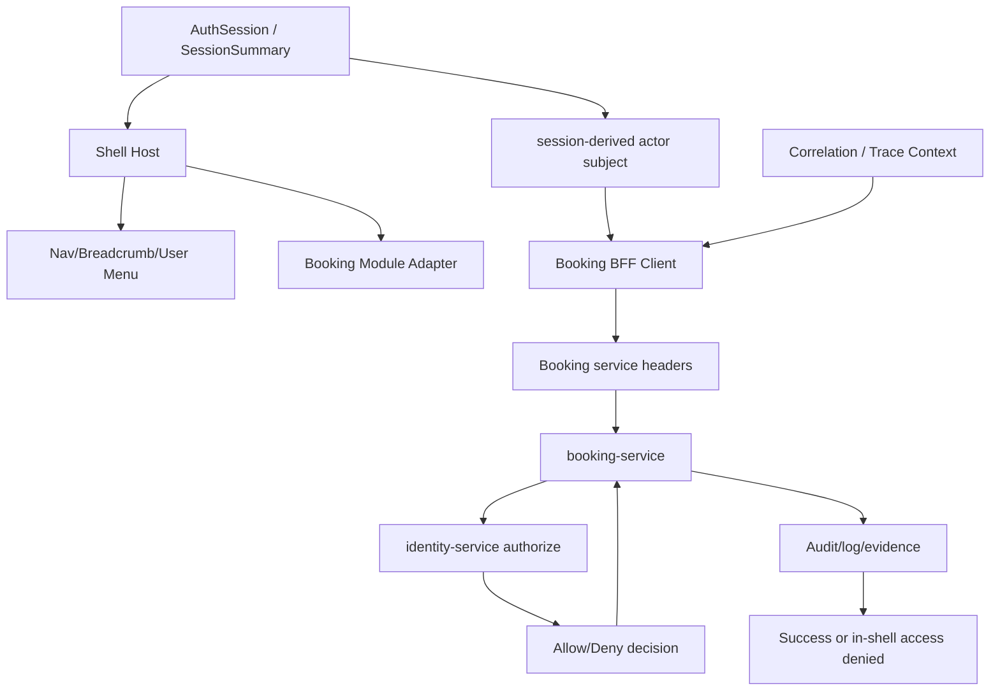

# Component Dependency - W2-01 App Shell and Auth

## Source Context

This dependency design consumes `requirements.md`, `stories.md`, `architecture.md`, `component-inventory.md`, and `team-practices.md`. It uses MCP trace results showing `serviceHeaders` fan-in from `proxyBooking`, `loadJson`, route handlers, `loadBookings`, and `loadBooking`.

## Dependency Matrix

| Component | Depends on | Dependency type | Direction | Notes |
| --- | --- | --- | --- | --- |
| Shell Host App | Auth Session Adapter | sync/server function | Shell -> auth | Reads session and redirects unauthenticated users. |
| Shell Host App | Auth Routes | HTTP/browser redirect | Shell -> auth app/Keycloak | Reuses sign-in/callback/sign-out. |
| Shell Host App | Booking Module Adapter | composition | Shell -> Booking | Mounts Booking as first business module. |
| Booking Module Adapter | Booking BFF Client | server call | Booking UI -> BFF | All calls include session actor. |
| Booking BFF Client | booking-service | HTTP | BFF -> service | Headers include actor, correlation, service token, idempotency. |
| booking-service | identity-service | HTTP/internal application service | Booking -> identity | Authorizes subject/action and records decisions. |
| booking-service | reference-data-service | existing HTTP/service dependency | Booking -> reference data | Preserved W0-02 dependency; W2-01 does not alter. |
| booking-service | charge-agreement-service | existing HTTP/service dependency | Booking -> charge | Preserved W1 dependency; not a shell migration. |
| booking-service | platform/eventing | existing async/platform dependency | Booking -> platform | Preserved W0-01 dependency; no redesign. |
| Evidence Harness | Nginx, Keycloak, shell, Booking, identity, audit tools | live runtime | test/evidence -> system | Captures W2-01 acceptance evidence. |

## Data Flow

Text fallback: Session summary feeds shell chrome and actor propagation. Booking BFF creates service headers with actor and correlation context. booking-service authorizes via identity-service and emits evidence. The shell renders success or access denied.

## Communication Patterns

| Flow | Pattern | Failure behavior |
| --- | --- | --- |
| Protected shell route | Server-side session check + redirect | Redirect to auth if no session. |
| Shell user menu session display | Server/session summary | Empty unauthenticated summary never renders protected content. |
| Booking list/detail load | Server-side BFF call | Error state with correlation id; no `local-user` retry. |
| Booking create/confirm/action | BFF POST with idempotency key | Fail closed on missing subject; success/deny evidence captured. |
| Authorization decision | Synchronous identity-service decision | Deny maps to in-shell access-denied. |
| Live proof | Scripted/manual evidence through Compose | Runtime blocker recorded honestly, not hidden as PASS. |

## Build Dependency Order

1. Auth session boundary: shell can require a real session and avoid protected-path `local-user`.
2. Shell app/routing: create `apps/shell`, add Compose/Nginx routing for `/` and `/booking*`, and redirect `/bookings*` compatibility paths.
3. Booking BFF actor propagation: `serviceHeaders` and fan-in callers accept subject.
4. Identity catalog/seed: add Booking permissions, grant `booking-desk`, seed `local.booking.user`, preserve `local.reference.admin` deny fixture.
5. Booking authorization adapter: booking-service authorization port calls identity-service `/internal/identity/authorize` with fail-closed behavior.
6. Backend authorization hardening: blank actor fails closed for all Booking API handlers except explicit local/test bypass; filter accepts deterministic subjects.
7. Mounted Booking UI: list/detail/create/action inside shell.
8. Denied path and deterministic users: `local.booking.user` allow, `local.reference.admin` deny.
9. Live evidence and preservation verification.

## Cycle and Coupling Checks

- Shell Host depends on Booking Module Adapter, but Booking domain code must not depend on Shell Host.
- `packages/auth` can be consumed by shell and auth routes; it must not import Booking.
- `apps/booking` BFF may consume session/actor helpers through a narrow contract; it must not duplicate full auth flow.
- identity-service remains independent of shell UI.
- W0-01 and W0-02 services remain dependencies of Booking, not W2-01 modification targets.

## Risk Hotspots

| Hotspot | Risk | Mitigation |
| --- | --- | --- |
| `serviceHeaders` fan-in | One hardcoded actor affects all Booking BFF calls | Change central signature and update callers in one unit. |
| `safeSessionSummary` local bypass | Protected shell could still create `local-user` | Shell wrapper must fail closed or require deterministic local fixture subject. |
| `BookingApiController.actor` fallback | Blank actor becomes `local-user` backend-side | Harden blank actor behavior for protected paths. |
| Route namespace | Nginx/app routing may conflict | Decide namespace in application design and verify through Compose. |
| Identity catalog | `booking-desk` exists but grants only reference-data read in current catalog | Add explicit Booking permissions and seed grants before live proof. |
| W1 waiver | Merge evidence could be overstated | Keep waiver explicit in evidence package and docs. |
