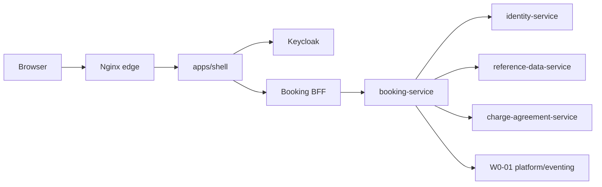
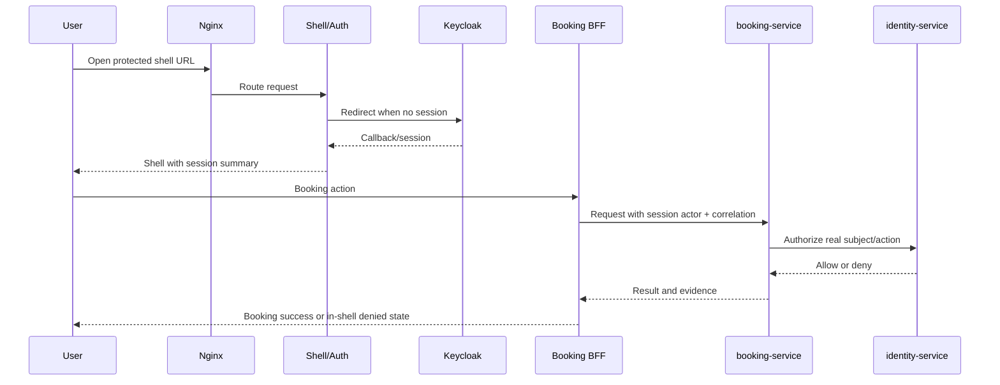

# Services - W2-01 App Shell and Auth

## Source Context

This service design consumes `requirements.md`, `stories.md`, `architecture.md`, `component-inventory.md`, and `team-practices.md`. It aligns with local/on-prem Compose and Nginx; no AWS service selection is in scope for W2-01.

## Runtime Topology

Text fallback: Browser enters through Nginx and reaches `apps/shell`. The shell reuses `apps/auth` for Keycloak login/session/sign-out. Booking requests flow through the Booking BFF to booking-service. booking-service authorizes through identity-service and continues consuming existing reference-data, charge-agreement, and platform/eventing contracts without W2-01 redesigning those services.

## Service Catalog

| Service | Existing/New | Responsibility | W2-01 design |
| --- | --- | --- | --- |
| Nginx edge | Existing | Browser edge routing for local Compose | Acceptance enters here, not direct app-only shortcuts. |
| Shell host app | New app surface | `apps/shell` authenticated shell, protected routes, mounted Booking | Reuses `apps/auth` routes and `packages/auth`; add Compose service and Nginx route. |
| Auth app/routes | Existing | Keycloak/OIDC entry, callback, session, sign-out, access denied | Reused; no parallel auth. |
| Keycloak | Existing Compose service | Local identity provider | Used for live proof. |
| Booking BFF | Existing/evolved `apps/booking` server routes | Proxy Booking calls to booking-service | Must require session-derived actor subject; legacy `/bookings*` browser paths redirect to canonical shell `/booking*`. |
| booking-service | Existing Spring service | Booking domain/API/audit | Preserve behavior, remove protected-path blank actor fallback. |
| identity-service | Existing Spring service | Roles, authorization, audit | Authorize real subjects and produce deny/allow evidence. |
| reference-data-service | Existing Spring service | Reference lookups used by Booking | Consumed only through stable existing interfaces. |
| charge-agreement-service | Existing Spring service | Pricing/charge dependency for Booking | Preserved dependency, not shell migration target. |
| platform/eventing | Existing W0-01 foundation | Events/outbox/messaging/correlation | Preserved; W2-01 does not redesign. |

## API and Contract Changes

| Contract | Current | Target |
| --- | --- | --- |
| Shell session summary | Existing `SessionSummary` from `packages/auth`/`apps/auth` | Shell uses server-derived summary for display, nav, actor propagation, and sign-out. |
| Booking BFF actor header | `serviceHeaders` sets `x-linercore-actor-id: local-user` | `serviceHeaders` requires actor subject from session and fails closed if absent. |
| Booking backend actor fallback | `BookingApiController.actor` returns `local-user` when blank | Blank actor is denied/error on protected W2-01 paths; fallback limited to explicit local/test bypass if retained. |
| Identity authorization | `/internal/identity/authorize` exists | Booking access decisions use the real subject and correlation id. |
| Evidence | Existing logs/audit and AI-DLC artifacts | W2-01 captures allow, deny, sign-out, detector 6d, and prior-work preservation evidence. |
| Shell routing | no shell app exists | `apps/shell` owns `/`, `/booking`, `/booking/new`, `/booking/[id]`; `/bookings*` redirects or is internally reused only behind the shell. |
| Identity catalog/seed | Booking role exists but Booking permissions and `local.booking.user` are incomplete | Add Booking permission actions, grant to `booking-desk`, seed `local.booking.user`; keep `local.reference.admin` as deny fixture. |

## Security and Session Flow

Text fallback: The authenticated subject flows from session summary into Booking BFF headers, then to booking-service authorization and evidence. Missing subject fails closed instead of defaulting to `local-user`.

## Platform Perspective

Although the stage includes the AWS platform-agent perspective, W2-01 targets local/on-prem Docker Compose. Platform requirements are:

- Keep topology aligned with `compose.yaml`.
- Add an `apps/shell` Compose service and Nginx routing for `/` and `/booking*`; keep `apps/auth` for auth APIs/pages and `apps/booking` for BFF/domain UI reuse during W2-01.
- Use Nginx as the browser edge in acceptance.
- Use Keycloak and identity-service for live auth/authorization.
- Preserve PostgreSQL/Kafka/Schema Registry/platform services as existing dependencies.
- Do not add AWS services, CDK, IAM, VPC, or cloud deployment as W2-01 acceptance.

## Operational Evidence

Acceptance evidence belongs under `artifacts/w2-01-live/app-shell-auth/` unless delivery planning chooses a more specific child directory. Required contents:

- Compose/Nginx/Keycloak startup evidence.
- Login to shell evidence.
- Booking allow path evidence with `local.booking.user`.
- Booking deny path evidence with `local.reference.admin`.
- Sign-out evidence.
- Detector 6d no-hardcoded-auth output.
- `aidlc-audit` output.
- W1 waiver/BLOCKED reference and prior-work preservation diff notes.
