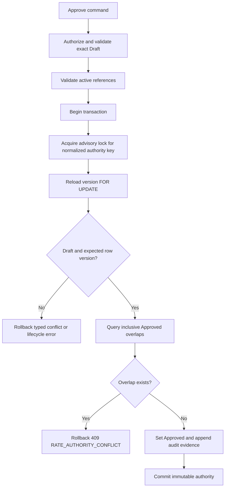

# Business Logic Model — U01 Rate Authority

## Purpose and Boundary

U01 establishes the standalone commercial rate authority used later by agreements and pricing. It owns stable Rate identity, immutable RateVersion history, Draft mutation, approval, successor creation, category-aware applicability, the full Charge V1-V4 migration-file chain, and the three Charge-owned rate page patterns. It does not resolve customer agreements, calculate a Booking price, open manual-pricing cases, alter shared UI, or claim integrated release acceptance.

All W0-01/W0-02/W1-01/W2-01/W2-02 behavior and evidence remain preservation inputs. In particular, the original W1 blocked/waived record remains explicit and untouched; neither this design nor later passing W2-03 evidence may rewrite it as a historical PASS. Manager port 8088 is not a U01 target.

The functional boundary follows `unit-of-work.md` and `unit-of-work-story-map.md`: U01 decisively covers US-01 through US-03 and contributes authorization, accessibility, responsive, migration, and acceptance seams for US-13 through US-15 and QC-01 through QC-03.

## Command Workflow

### Create a stable Rate and first Draft

1. The Charge BFF derives the authenticated subject and capabilities from the signed session, creates or propagates a correlation ID, validates the form shape, and sends no browser-supplied actor authority.
2. The service calls the existing `AuthorizationPort` shape with resource `charge-rates` and action `create`. The U01 rate-service bean is fail-closed and is separate from the baseline agreement bean; the existing allow-any-nonblank local adapter is never injected into a Rate command.
3. Boundary validation converts category, identifiers, dates, and decimal input into typed values. `LOCAL` with a destination is rejected rather than silently ignored.
4. The U01 typed reference-validation port sends field path, exact Reference Data set, requested stable ID, and optional expected code for charge code and currency. It verifies `CHARGE_CODE`/OFR-BAF-THC compatibility, `CURRENCY`/USD, active `LOCATION` origin/destination, and active `EQUIPMENT_TYPE`. A missing/inactive/mismatched record is 422; timeout, throttling, server, transport, or invalid-provider-contract failure is 503 and fails closed with no record.
5. The domain creates a stable Rate with immutable category and charge-code identity plus RateVersion 1 in Draft state. The stable ID and version ID are generated independently.
6. One database transaction inserts the Rate, Draft version, and activity evidence. The committed detail view is returned with its row version and correlation.

### Edit an existing Draft

1. Authorize resource/action `charge-rates`/`update`, load the stable Rate and exact `versionId`, and compare `expectedRowVersion`.
2. Reject missing Rate/version as 404, stale expected version as 409, and a non-Draft lifecycle as 422.
3. Re-run typed and active-reference validation for changed fields.
4. Update only mutable Draft fields, increment `rowVersion`, update attributable metadata, and append an activity row in one transaction.
5. Return the committed representation. Stable Rate ID, version ID/number, category, charge-code identity, creation evidence, and prior Approved rows never change.

### Approve a Draft

Text fallback: authorization and reference checks precede a single transaction. The repository serializes approvals for the normalized authority key, reloads the Draft, checks optimistic state and inclusive overlaps, and either commits one immutable Approved version or commits nothing.

The normalized approval key is length-prefixed to avoid delimiter ambiguity:

`rate:v1|<category>|<chargeCodeId>|<originId>|<destinationId-or-empty>|<equipmentTypeId>`

Each value is encoded as `<character-count>:<value>`. `LOCAL` always contributes an empty destination. PostgreSQL receives the canonical string through `hashtextextended(key, 0)` in `pg_advisory_xact_lock`. A hash collision may serialize unrelated approvals but cannot authorize an invalid overlap because the SQL predicate remains authoritative.

The inclusive overlap predicate is:

`existing.effective_from <= candidate.effective_to AND existing.effective_to >= candidate.effective_from`

An overlap or competing committed winner maps to HTTP 409 `RATE_AUTHORITY_CONFLICT`. Invalid fields, inactive references, incomplete applicability, or an invalid lifecycle map to 422.

### Create a successor Draft

1. Authorize resource/action `charge-rates`/`create-successor`; load the exact Approved source and stable Rate.
2. Reject a non-Approved source with 422 and reject creation while any Draft exists for the stable Rate with 409 `RATE_DRAFT_EXISTS`.
3. Allocate `versionNo = max(versionNo) + 1` under a row lock on the stable Rate.
4. Copy the source commercial values into a new Draft, apply optional supplied changes, and validate the result. Category and charge-code identity cannot change; that requires a new stable Rate.
5. Insert the new version and activity evidence. The source row remains byte-for-byte unchanged.

## Query and Presentation Workflow

### Search rates

The service accepts category, lifecycle, `asOf`, origin, destination, equipment, free-text, zero-based page, and bounded size. The only lifecycle filter values are `DRAFT`, `SCHEDULED`, `EFFECTIVE`, and `EXPIRED`; absent means `ALL`, and literal `ALL` is canonicalized to absence by the BFF. The Charge page uses one-based `page` in the browser URL and its BFF performs the explicit translation. Invalid query values return 400.

The response contains one stable Rate per row with:

- stable identity, category, charge code, and version count;
- the highest-numbered `latestVersion` regardless of lifecycle;
- an optional `effectiveApprovedVersion` applicable at the evaluated `asOf` date;
- one `selectedSummaryVersion`, chosen by the filter rules below rather than by accidental latest-row ordering;
- `hasDraft`, applicability, unit rate, window, derived presentation state, updated evidence, and detail link data.

The default order is `latest_updated_at DESC, rate_id ASC`. The evaluated date is the valid ISO `asOf` value or the service's UTC calendar date and is echoed in the page response. Pricing in U04 does not use this default; it remains strictly bound to `requestedDepartureDate`.

Filter inclusion and summary selection are exact and operate over the full version history:

| Filter | Include the stable Rate when | `selectedSummaryVersion` |
|---|---|---|
| `DRAFT` | its sole Draft exists | that Draft |
| `SCHEDULED` | any Approved version starts after `asOf` | nearest future Approved by `effectiveFrom ASC, versionNo DESC` |
| `EFFECTIVE` | any Approved version covers `asOf` inclusively | the covering Approved version |
| `EXPIRED` | any Approved version ended before `asOf` | most recently ended Approved by `effectiveTo DESC, versionNo DESC` |
| absent / `ALL` | it has any version | effective Approved; otherwise Draft; otherwise nearest Scheduled; otherwise most recently Expired; otherwise latest version |

A mixed-history Rate may match multiple lifecycle filters across separate requests, but appears at most once within a result page. A Draft successor never hides an effective Approved authority: `effectiveApprovedVersion` remains separately populated, and the unfiltered summary prefers it. `latestVersion` remains the highest version for history/navigation even when it is not the summary.

### Derive presentation state

For a version and evaluation date:

1. Draft always presents as `DRAFT` and is never eligible authority.
2. Approved with `asOf < effectiveFrom` presents as `SCHEDULED`.
3. Approved with `effectiveFrom <= asOf <= effectiveTo` presents as `EFFECTIVE`.
4. Approved with `asOf > effectiveTo` presents as `EXPIRED`.

These are read-model labels, not stored lifecycle commands. The stored lifecycle remains Draft or Approved. Derivation is evaluated independently for every version before the history-aware inclusion and selection rules above are applied.

### Rate detail

The detail query returns stable identity, latest version, all versions ordered by version number descending, per-version derived presentation at the echoed `asOf`, audit evidence, and permitted actions. A reader sees the same commercial history without mutation commands. A Pricing Analyst may edit only the sole Draft, approve it, or create a successor only from an Approved source when no Draft exists.

## Category-Aware Data Transformation

| Category | Charge code | Required applicability | Destination behavior | Approval key |
|---|---|---|---|---|
| `BASE` | `OFR` | origin, destination, equipment | Required | category + code + origin + destination + equipment |
| `SURCHARGE` | `BAF` | origin, destination, equipment | Required | category + code + origin + destination + equipment |
| `LOCAL` | `THC` | origin/POL, equipment | Rejected if supplied; persisted `NULL` | category + code + origin + empty + equipment |

The browser uses decimal text. The API parses it to `BigDecimal`, rejects negative or more-than-two-decimal values, canonicalizes to scale two, and persists `DECIMAL(18,2)`. No JavaScript or binary floating-point calculation becomes commercial authority.

## Migration Execution Model

U01 owns these ordered files for the one Charge database:

1. `V1__charge_baseline.sql` reproduces the existing `charge-agreement-schema.sql` catalog exactly.
2. `V2__versioned_rate_authority.sql` adds Rate, RateVersion, rate activity, constraints, indexes, and uniqueness required by this design.
3. `V3__versioned_agreement_authority.sql` creates the complete agreement version/link schema and deterministic legacy backfill specified in `domain-entities.md`; it marks every backfill row `LEGACY` and not W2-authority-eligible and invents no links.
4. `V4__pricing_terminal_evidence.sql` creates the complete terminal receipt/manual-case columns, checks, indexes, and deterministic dedupe backfill specified in `domain-entities.md`.

The exact-catalog Flyway adoption strategy has three branches: empty schema migrates; schema with Flyway history validates/migrates; non-empty schema without history is baselined at V1 only after exact catalog comparison. Partial or drifted catalogs abort startup. U01 migration tests prove V1-V4 order, every V3/V4 column/constraint/index, the V3 row-for-row deterministic backfill, and the V4 earliest-row canonical dedupe winner. U01 exposes no V3 agreement or V4 pricing/manual behavior. U03 and U04 consume those structures without editing applied migration files, under the repository contracts in `domain-entities.md`.

## Brownfield Authorization and Reference Adapters

U01 reuses the two established port shapes but does not overstate their baseline implementations:

- `RateAuthorizationPort` is the existing four-argument Charge `AuthorizationPort`. Non-local configuration uses a Charge-owned HTTP adapter mirroring Booking's proven `/internal/identity/authorize` client: `tokenReference=subjectId`, caller `charge-agreement-service`, nonblank correlation header, fail closed on any transport/contract failure, and accept only an `ALLOW` decision echoing the exact resource and action. Local configuration uses an explicit subject/action map, never “any nonblank subject”.
- U01 adds typed `RateReferenceValidationRequest(correlationId, checks)` and `RateReferenceCheck(fieldPath, referenceSet, requestedId, expectedCode)` records behind the Charge reference-validation port. The non-local adapter mirrors Booking's bounded HTTP pattern against `/reference-sets/{set}/records/{id}` with service ID/token, a two-second overall deadline, bounded permits, strict payload bounds, active-state checks, exact canonical ID checks, and expected-code checks. It returns field outcomes for 422 cases and a typed unavailable exception for 503 cases.
- U01 owns these service-side rate adapters, the additive Identity catalog permission entries, action enforcement, and their tests. U02 owns signed-session extraction, capability-to-command gating, correlation propagation, and BFF route forwarding. The browser owns none of subject, role, permission, or service credentials.
- The baseline agreement authorization/reference beans remain behaviorally preserved until their owning unit changes them; neither is eligible for injection into the new Rate service. This avoids turning an existing permissive adapter into claimed Rate authorization.

The exact Identity mapping is resource `charge-rates`: actions `read`, `create`, `update`, `approve`, and `create-successor`. Existing `PRICING` receives all five; existing `FINANCE_READ` receives only `read` as the Charge Reader/Auditor mapping. U01 additively introduces Identity action enum values `approve` and `create-successor`; no role, identity boundary, or shared session model is redesigned.

## Failure and Recovery Model

| Condition | Result | Persistence |
|---|---|---|
| Malformed query/body | 400 standard validation envelope | None |
| Missing/invalid authenticated subject | 401/403 through existing boundary | None; denied attempt is safely audited where supported |
| Capability denied | 403 | None |
| Rate/version missing | 404 `RATE_NOT_FOUND` / `RATE_VERSION_NOT_FOUND` | None |
| Stale expected row version | 409 `RATE_VERSION_CONFLICT` | None |
| Existing Draft on successor request | 409 `RATE_DRAFT_EXISTS` | None |
| Approved overlap/concurrent winner | 409 `RATE_AUTHORITY_CONFLICT` | None |
| Invalid category/code, money, window, applicability, reference, or lifecycle | 422 field/global semantic envelope | None |
| Reference provider unavailable | 503 `REFERENCE_DATA_UNAVAILABLE` with correlation | None; entered UI values retained |
| Unexpected persistence failure | standard 500 boundary envelope with request ID | Transaction rolls back |

No failure may partially approve, mutate an Approved row, create two Drafts, or lose the user's safe form values.

## Observable Business Scenarios

- Create one valid OFR, BAF, and POL THC Draft and round-trip stable/version identities through API, database, and UI.
- Reject LOCAL destination, missing lane destination for OFR/BAF, inactive references, negative/over-precision amounts, and reversed windows without Approved authority.
- Edit Draft with correct expected row version; reject stale and Approved edits.
- Approve boundary-window authorities and derive Scheduled/Effective/Expired for dates before, on, inside, on the last day, and after.
- Run two competing approvals for the same key/window and observe at most one Approved winner.
- Create a successor, prove prior bytes unchanged, reject a second simultaneous Draft, and display complete history.
- Exercise reader, analyst, denied, loading, empty, validation, pending, success, service-error/retry, long-content, and responsive/theme states without upgrading DS-02/DS-03 to PASS.

## Architecture Review — Iteration 1

The mandatory reviewer verdict was **NOT-READY** and remains part of the record. Its blockers were: overstated authorization/reference seams, incomplete V3/V4 schemas, ambiguous mixed-history lifecycle filtering, and conflicting 409/422 overlap classification. This revision resolves them by defining the real fail-closed adapters and ownership split, the complete applied schemas/backfills and consumer contracts, exact filter predicates/summary selection, and one canonical conflict matrix reconciled into `component-methods.md`. The advisory-lock assumption, later U03 agreement-page extension, and isolation/replacement of the hardcoded baseline workbench remain explicit implementation review points rather than hidden PASS claims.

### Architecture Review — Iteration 2

The mandatory reviewer verdict is **READY** with no blocking findings. It confirms that all four iteration-1 blockers are materially resolved and that the W1 waiver, port 8088 exclusion, Charge-only UI ownership, and unresolved DS-02/DS-03 dependencies remain honest. Nonblocking implementation controls are: route every approval writer through `approveUnderLock`; keep the typed Rate reference adapter distinct/compatible with the baseline agreement path; test exact 404 `NO_RATE` versus 422 ambiguity pairing in U04; and isolate/replace the hardcoded workbench only inside Charge-owned routes.

### Post-Review U03 Schema Correction

The READY verdict above is preserved and not rewritten. U03's detailed lifecycle/compatibility design found three omissions in the U01-owned prepared V3 physical contract before migration implementation: the V1 stable header needs an explicit LEGACY/W2 discriminator so old readers cannot expose stale W2 projections, its legacy `commodity_id` must become nullable for new W2 agreements because commodity is not a W2 input/discriminator, and attributable suspend/expire history requires an append-only `charge_agreement_activity` table rather than mutation of the frozen commercial snapshot. `domain-entities.md` now specifies all three changes completely; U03 still owns all agreement behavior and does not author or mutate an applied migration.

## Upstream Coverage

This model directly consumes `unit-of-work.md`, `unit-of-work-story-map.md`, `requirements.md`, `components.md`, `component-methods.md`, and `services.md`. It preserves their Rate/application/repository/BFF boundaries, existing deployables, exact reference authority, additive migration contract, and no-shared-redesign constraint.
