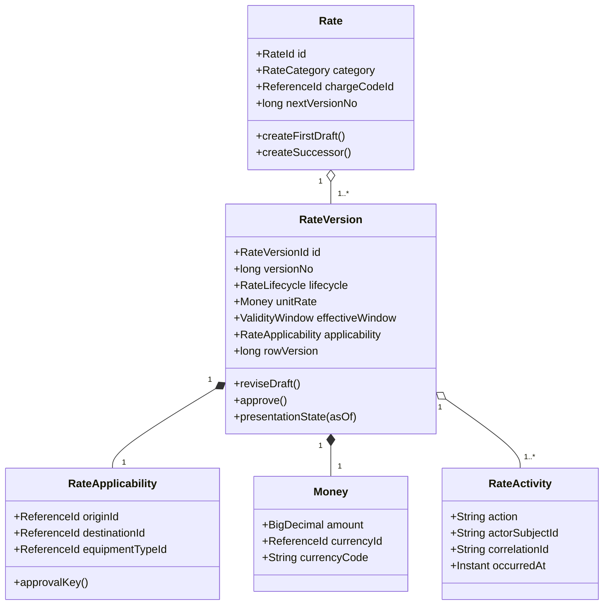
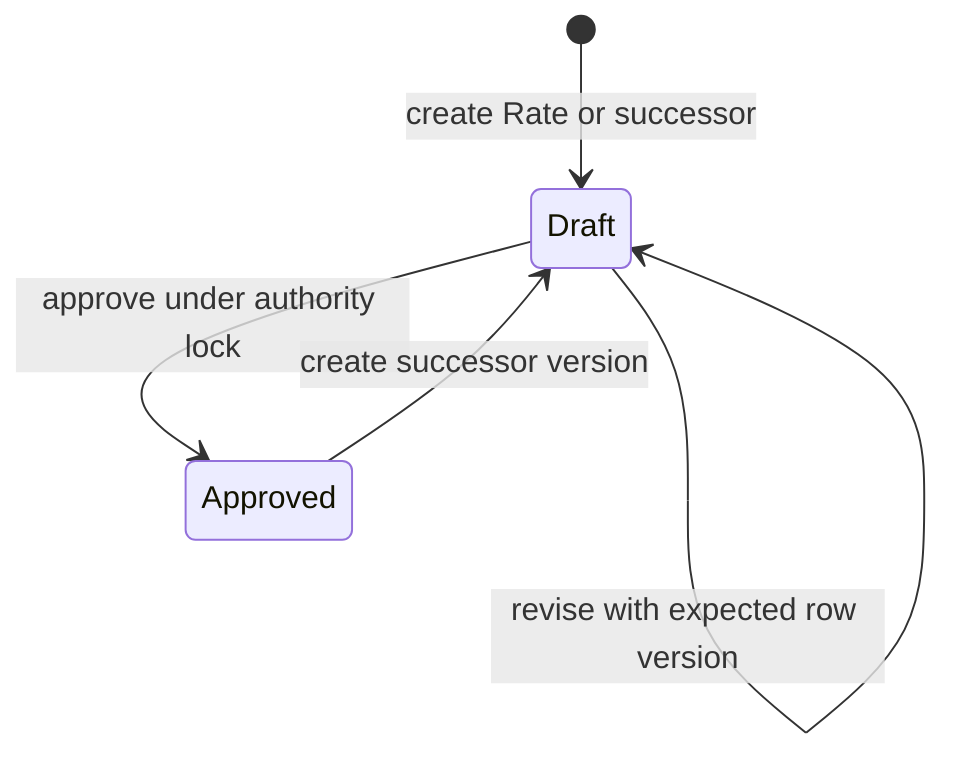

# Domain Entities — U01 Rate Authority

## Ubiquitous Language

| Term | Meaning in U01 |
|---|---|
| Rate | Stable identity for one immutable category/charge-code authority history |
| RateVersion | Exact numbered commercial values and applicability for a Rate |
| Draft | The sole editable version for a stable Rate; never pricing authority |
| Approved | Immutable stored lifecycle eligible according to its inclusive window |
| Scheduled / Effective / Expired | Read-only presentation derived for an evaluated `asOf` date |
| Applicability | BASE/BAF lane plus equipment, or LOCAL/POL origin plus equipment |
| Authority key | Category-specific normalized identity used to serialize and reject Approved overlap |
| Successor | New Draft version copied from an Approved source without mutating it |

OFR, BAF, THC, USD, locations, and equipment retain their W0-02/reference-service meanings. U01 introduces no alternative DCSA or master-data name.

## Entities & Aggregates



Text fallback: one stable Rate owns one or more immutable-identity RateVersions. Each version contains one applicability value and one Money value and has attributable activities. Only the sole Draft version may change.

### Entity Definitions

### Rate aggregate root

| Attribute | Type | Rule |
|---|---|---|
| `id` | `RateId` | Stable opaque ID, maximum 64 characters, never reused |
| `category` | enum `BASE`, `SURCHARGE`, `LOCAL` | Immutable for the stable Rate |
| `chargeCodeId` | `ReferenceId` | Immutable active W0-02 identity |
| `chargeCode` | `OFR`, `BAF`, `THC` | Auditable code snapshot paired to category; reference service remains authority |
| `createdBy`, `createdAt`, `correlationId` | audit values | Set once |
| `nextVersionNo` | positive integer | Allocated under stable-Rate row lock |

The Rate aggregate enforces category/code identity, ordered version creation, and at most one Draft. It does not store a mutable “current price.” Query projections select latest/effective versions from history.

### RateVersion entity

| Attribute | Type | Mutability |
|---|---|---|
| `id` | `RateVersionId` | Immutable |
| `rateId` | `RateId` | Immutable |
| `versionNo` | positive long | Immutable and unique within Rate |
| `lifecycle` | `DRAFT` or `APPROVED` | One-way Draft to Approved |
| `basis` | `PER_CONTAINER` | Immutable after approval |
| `currencyId`, `currencyCode` | active reference + `USD` | Immutable after approval |
| `unitRate` | `BigDecimal(18,2)` | Draft editable; non-negative |
| `effectiveFrom`, `effectiveTo` | `LocalDate` | Draft editable; inclusive |
| `applicability` | `RateApplicability` | Draft editable |
| `rowVersion` | non-negative long | Increments on Draft update/approval |
| `sourceVersionId` | optional RateVersionId | Set on successor, immutable |
| creation/update/approval evidence | actor, time, correlation | Append/transition evidence |

No deleted/superseded lifecycle is required. An older Approved version remains Approved and its `SCHEDULED`, `EFFECTIVE`, or `EXPIRED` presentation is derived for a date. A Draft successor is visible through history without changing the prior version.

### RateApplicability value object

| Attribute | BASE/SURCHARGE | LOCAL |
|---|---|---|
| `originLocationId` | Required | Required POL/origin |
| `destinationLocationId` | Required | Must be absent/NULL |
| `equipmentTypeId` | Required | Required |

Construction rejects blank identifiers and LOCAL destination. The canonical approval key includes stable reference IDs with empty destination only for LOCAL. Later consumers match inclusive date plus exact category-specific applicability; U01 itself exposes candidate query capability but performs no three-line pricing resolution.

### Money value object

Money stores the active currency reference identity, auditable `USD` code, and exact decimal amount. Construction rejects negative values and scale greater than two, then canonicalizes to scale two. Equality is currency identity/code plus exact scaled amount.

### RateActivity entity

Activity actions are `RATE_CREATED`, `RATE_DRAFT_UPDATED`, `RATE_SUCCESSOR_CREATED`, and `RATE_VERSION_APPROVED`. Each row references stable Rate and exact version and records actor, timestamp, correlation, optional safe reason, and resulting row version. Commercial amounts stay in the authoritative version record and are not copied into logs or metric labels.

## Field-Level Schema (canonical names)

| Field | Type / value object | Canonical name (source) | Standard | Notes |
|---|---|---|---|---|
| Stable Rate identity | `RateId` | `rateId` (`component-methods.md` rate API) | LinerCore W2-03 | Opaque, immutable |
| Exact version identity | `RateVersionId` | `versionId` (`component-methods.md`) | LinerCore W2-03 | Opaque, immutable |
| Version number | positive long | `versionNo` (`requirements.md` FR-102) | LinerCore W2-03 | Monotonic per Rate |
| Category | `RateCategory` | `category` (rate administration API) | W2-03 | BASE, SURCHARGE, LOCAL |
| Charge-code identity | `ReferenceId` | `chargeCodeId` (`requirements.md` FR-001/FR-102) | W0-02 reference data | Paired with auditable `chargeCode` OFR/BAF/THC |
| Basis | enum | `basis` (`requirements.md` FR-102) | pricing.v1 vocabulary | PER_CONTAINER |
| Currency identity/code | `ReferenceId` + `CurrencyCode` | `currencyId`, `currency` | W0-02 / pricing.v1 | USD only in slice |
| Unit rate | `BigDecimal` | `unitRate` (`components.md` additive pricing provenance) | pricing.v1 additive field | JSON number at boundary, DECIMAL(18,2) in DB |
| Origin | `ReferenceId` | `originLocationId` | W0-02 location | Required all categories |
| Destination | optional `ReferenceId` | `destinationLocationId` | W0-02 location | Required BASE/SURCHARGE; absent LOCAL |
| Equipment type | `ReferenceId` | `equipmentTypeId` | W0-02 equipment | Required |
| Effective window | `ValidityWindow` | `effectiveFrom`, `effectiveTo` | W2-03 | Inclusive ISO dates |
| Stored lifecycle | `RateLifecycle` | `lifecycle` | W2-03 | DRAFT or APPROVED |
| Derived presentation | `RatePresentationState` | `presentationState`, `evaluatedAsOf` | W2-03 UI read model | DRAFT/SCHEDULED/EFFECTIVE/EXPIRED |
| Optimistic version | non-negative long | `rowVersion` | existing expected-version convention | Required on mutation |
| Source version | optional `RateVersionId` | `sourceVersionId` | W2-03 successor evidence | Set only on successor |
| Audit identity | actor/time/correlation | `createdBy`, `createdAt`, `updatedBy`, `updatedAt`, `approvedBy`, `approvedAt`, `correlationId` | W2-01/W2-03 | Browser actor is never authoritative |

## Contract Fidelity Check

- `component-methods.md` names `rateId`, `versionId`, `expectedVersion`, category, unit rate, window, and applicability. This model preserves those shapes and makes the optimistic token canonically `rowVersion` in read/write DTOs.
- `requirements.md` FR-102 requires stable/version identity, category/code, basis, USD, unit rate, dates, applicability, lifecycle, and audit metadata; every field is represented above.
- `components.md` requires additive line provenance `sourceRateVersionId`; U01's canonical version ID is exactly the value later exposed under that name by U04. U01 does not publish pricing-line fields.
- No current published rate-administration contract exists on the baseline, so there is no renamed or removed legacy rate field. Agreement/pricing v1 contracts remain untouched by U01.
- Database snake_case names map mechanically to the canonical camelCase API fields; no to-many history is flattened or hidden in an attributes map.

Target divergence for U01's new Rate contract is zero. pricing.v1 evolution remains U04-owned.

## Invariants & Validation

- Stable Rate category/code identity and every Approved version are immutable.
- One stable Rate has at most one Draft; version numbers are unique and monotonic.
- Money is non-negative USD at scale two with PER_CONTAINER basis.
- Windows are inclusive and ordered.
- BASE/SURCHARGE require destination; LOCAL forbids it.
- Save and approval validate active references; approval additionally serializes the authority key and rejects inclusive overlap.
- Mutation requires service-side authorization, exact identity, and expected row version.
- Activity evidence commits atomically with its mutation, and sensitive commercial values stay out of logs/metric labels.

## Read Models

### RateListItem

- stable Rate ID, category, charge-code identity/label;
- `latestVersion`: highest version ID/number, lifecycle, derived presentation, unit rate, window, and applicability;
- `selectedSummaryVersion`: the exact history-filter winner used to render the row;
- optional `effectiveApprovedVersion`: the Approved version covering `evaluatedAsOf`, independent of latest/selected;
- `hasDraft`, `versionCount`, `updatedAt`, `evaluatedAsOf`;
- permitted action booleans derived server-side from capability and state.

The lifecycle filter is existential across history and returns a stable Rate once. `DRAFT` selects its sole Draft; `SCHEDULED` selects the nearest future Approved; `EFFECTIVE` selects the covering Approved; `EXPIRED` selects the most recently ended Approved. Without a filter, selection prefers effective Approved, then Draft, nearest Scheduled, most recently Expired, then latest. This makes mixed Approved-plus-Draft histories unambiguous.

### RateDetailView

- stable Rate identity and immutable category/code;
- every `RateVersionView` ordered descending by version number;
- exact source-version link for successors;
- derived presentation per version at echoed `evaluatedAsOf`;
- attributable activity list and server-derived permitted actions.

### RatePage

- items, zero-based service page, size, total count, `hasMore`, canonical filters, deterministic sort, and `evaluatedAsOf`.
- The BFF maps this to a one-based browser URL without changing service semantics.

## Persistence Mapping

### `charge_rates`

Stable aggregate columns: `rate_id`, immutable category/code identity and snapshot, `next_version_no`, creation actor/time/correlation, and a stable-row version used when allocating successors.

### `charge_rate_versions`

Structured authoritative columns mirror RateVersion attributes. Required constraints include unique `(rate_id, version_no)`, one Draft per Rate, category-aware destination nullability, allowed lifecycle/basis/currency/code values, amount scale/non-negative checks, and valid windows. `snapshot` may be retained only as an auditable/compatibility representation; structured columns and typed repository mapping remain authoritative.

### `charge_rate_activity`

Append-only evidence keyed by generated activity identity with foreign keys to Rate and RateVersion. Activity insertion is in the same transaction as its mutation.

Indexes support stable list order, category/status/applicability filters, Rate history, and Approved overlap lookup. No table contains Booking-owned state, agreement link behavior, or copied reference master data.

## Lifecycle / State



Text fallback: a new Rate or successor creates a Draft. A Draft can be revised and can transition once to Approved. An Approved version never changes; it may be the source for a new Draft version owned by the same stable Rate.

## Prepared-Schema Entities Outside U01 Behavior

U01 permanently authors and applies V3 and V4, so their physical contracts are complete here even though their behavior remains U03/U04-owned. U01 has no agreement-version or terminal-pricing controller/page/repository. After application, downstream units must treat these migrations as immutable.

### V3 `charge_agreements` compatibility-header alterations

V3 first applies two exact changes to the V1 table:

- add `authority_model VARCHAR(16) NOT NULL DEFAULT 'LEGACY'` with named check `ck_charge_agreements_authority_model` restricting `LEGACY|W2_VERSIONED`; every row present at migration therefore remains LEGACY without changing any existing value;
- `ALTER COLUMN commodity_id DROP NOT NULL`, leaving every existing commodity unchanged while allowing a new W2 stable header to omit the deferred legacy projection; and
- add `idx_charge_agreements_authority_model(authority_model, agreement_number, id)` so legacy and W2 readers can be separated deterministically.

New U03 W2 headers explicitly insert `authority_model='W2_VERSIONED'`. Legacy handlers read/write only LEGACY headers; W2 handlers use the stable ID/number from the W2 header and all commercial authority from the version/link tables. No reader may infer authority model from stale status or nullable commodity.

### V3 `charge_agreement_versions`

| Column | PostgreSQL type | Null/default | Key/check semantics |
|---|---|---|---|
| `agreement_version_id` | `VARCHAR(64)` | NOT NULL | Primary key |
| `agreement_id` | `VARCHAR(64)` | NOT NULL | FK to `charge_agreements(id)` `ON DELETE RESTRICT` |
| `version_no` | `BIGINT` | NOT NULL | Unique with `agreement_id`; positive for `W2_VERSIONED`; legacy preserves its source value |
| `authority_model` | `VARCHAR(16)` | NOT NULL | `LEGACY` or `W2_VERSIONED` |
| `w2_authority_eligible` | `BOOLEAN` | NOT NULL DEFAULT `FALSE` | False for LEGACY, true for W2_VERSIONED; lifecycle still controls current eligibility |
| `customer_id` | `VARCHAR(64)` | NOT NULL | Exact Reference Data identity |
| `trade_lane_id` | `VARCHAR(64)` | NOT NULL | Exact Reference Data identity |
| `origin_location_id` | `VARCHAR(64)` | nullable | Required for W2_VERSIONED; NULL for legacy backfill |
| `destination_location_id` | `VARCHAR(64)` | nullable | Required for W2_VERSIONED; NULL for legacy backfill |
| `equipment_type_id` | `VARCHAR(64)` | nullable | Required for W2_VERSIONED; NULL for legacy backfill |
| `commodity_id` | `VARCHAR(64)` | nullable | Copied for legacy readability; never a W2 approval/resolution discriminator |
| `valid_from` | `DATE` | NOT NULL | Inclusive lower date |
| `valid_to` | `DATE` | NOT NULL | Inclusive upper date; check `valid_to >= valid_from` |
| `lifecycle` | `VARCHAR(32)` | NOT NULL | `LEGACY`, `DRAFT`, `APPROVED`, `SUSPENDED`, or `EXPIRED` |
| `legacy_status` | `VARCHAR(32)` | nullable | Original baseline status; required only for LEGACY |
| `row_version` | `BIGINT` | NOT NULL DEFAULT `0` | Check `>= 0` |
| `source_version_id` | `VARCHAR(64)` | nullable | Self FK to `agreement_version_id` `ON DELETE RESTRICT` |
| `created_by` | `VARCHAR(128)` | NOT NULL | Actor or deterministic `legacy-migration` fallback |
| `created_at` | `TIMESTAMP` | NOT NULL | Source time or deterministic epoch fallback |
| `updated_by` | `VARCHAR(128)` | nullable | Last Draft actor |
| `updated_at` | `TIMESTAMP` | nullable | Last Draft time |
| `approved_by` | `VARCHAR(128)` | nullable | Required for new Approved/Suspended/Expired history |
| `approved_at` | `TIMESTAMP` | nullable | Required with `approved_by` |
| `correlation_id` | `VARCHAR(128)` | nullable | Required by new U03 command contract, nullable for legacy |
| `snapshot` | `TEXT` | NOT NULL | Canonical commercial representation; replaceable only with an optimistic Draft update and frozen from approval onward; structured columns are authoritative |

Named constraints are: primary key `pk_charge_agreement_versions`; unique `uq_charge_agreement_versions_number(agreement_id, version_no)`; foreign keys `fk_cav_agreement` and `fk_cav_source`; checks for allowed model/lifecycle, ordered dates, nonnegative row version, and this model shape:

```text
LEGACY       => lifecycle=LEGACY, w2_authority_eligible=false,
                legacy_status is not null, origin/destination/equipment are null
W2_VERSIONED => lifecycle in (DRAFT, APPROVED, SUSPENDED, EXPIRED),
                w2_authority_eligible=true, legacy_status is null,
                origin/destination/equipment are not null, version_no > 0
```

V3 creates partial unique index `uq_cav_one_draft_per_agreement` on `agreement_id WHERE authority_model='W2_VERSIONED' AND lifecycle='DRAFT'`; lookup index `idx_cav_detail(agreement_id, version_no DESC)`; approval candidate index `idx_cav_w2_authority(customer_id, trade_lane_id, origin_location_id, destination_location_id, equipment_type_id, valid_from, valid_to) WHERE authority_model='W2_VERSIONED' AND lifecycle='APPROVED'`; list index `idx_cav_customer_lifecycle_updated(customer_id, lifecycle, updated_at DESC, agreement_id)`; and source index `idx_cav_source(source_version_id) WHERE source_version_id IS NOT NULL`.

### V3 `charge_agreement_rate_links`

| Column | PostgreSQL type | Null/default | Key/check semantics |
|---|---|---|---|
| `agreement_version_id` | `VARCHAR(64)` | NOT NULL | FK to V3 version `ON DELETE RESTRICT` |
| `rate_category` | `VARCHAR(16)` | NOT NULL | `BASE`, `SURCHARGE`, or `LOCAL` |
| `rate_version_id` | `VARCHAR(64)` | NOT NULL | FK to V2 `charge_rate_versions(version_id)` `ON DELETE RESTRICT` |
| `linked_by` | `VARCHAR(128)` | NOT NULL | Attributable actor |
| `linked_at` | `TIMESTAMP` | NOT NULL | Attributable time |
| `correlation_id` | `VARCHAR(128)` | NOT NULL | Command correlation |

The primary key is `pk_charge_agreement_rate_links(agreement_version_id, rate_category)`. `uq_carl_version_rate(agreement_version_id, rate_version_id)` prevents one exact RateVersion filling two categories. `ck_carl_category` restricts the category. Index `idx_carl_rate_version(rate_version_id, agreement_version_id)` supports provenance/reverse lookup. V3 does not invent link rows during legacy backfill.

### V3 `charge_agreement_activity`

| Column | PostgreSQL type | Null/default | Key/check semantics |
|---|---|---|---|
| `activity_id` | `VARCHAR(64)` | NOT NULL | Primary key |
| `agreement_id` | `VARCHAR(64)` | NOT NULL | FK to `charge_agreements(id)` `ON DELETE RESTRICT` |
| `agreement_version_id` | `VARCHAR(64)` | NOT NULL | FK to `charge_agreement_versions(agreement_version_id)` `ON DELETE RESTRICT` |
| `action` | `VARCHAR(32)` | NOT NULL | `CREATED`, `DRAFT_UPDATED`, `SUCCESSOR_CREATED`, `APPROVED`, `SUSPENDED`, or `EXPIRED` |
| `actor_subject_id` | `VARCHAR(128)` | NOT NULL | Session/service-derived subject |
| `occurred_at` | `TIMESTAMP` | NOT NULL | Server UTC command time |
| `reason` | `VARCHAR(512)` | nullable | Required and nonblank for every action except `CREATED` |
| `correlation_id` | `VARCHAR(128)` | NOT NULL | End-to-end command correlation |
| `resulting_row_version` | `BIGINT` | NOT NULL | Nonnegative optimistic version after the mutation |

Named constraints are primary key `pk_charge_agreement_activity`; foreign keys `fk_caa_agreement` and `fk_caa_version`; checks `ck_caa_action`, `ck_caa_reason` (only `CREATED` may omit a reason), and `ck_caa_resulting_version`. Index `idx_caa_version_time(agreement_version_id, occurred_at, activity_id)` supplies deterministic history order and `idx_caa_correlation(correlation_id)` supplies trace lookup. Rows are append-only; no repository update/delete method exists. Lifecycle transitions update only the structured lifecycle/row version and append activity/outbox evidence; they never rewrite the frozen commercial snapshot or rate links.

### V3 deterministic backfill and U03 contract

For every pre-migration `charge_agreements` row, all of which V3 has marked `authority_model='LEGACY'`, V3 inserts exactly one version:

- `agreement_version_id = 'av-' || md5(id || ':' || version::text)` and `version_no = version`;
- `authority_model='LEGACY'`, `w2_authority_eligible=false`, `lifecycle='LEGACY'`, `legacy_status=status`;
- customer, trade lane, commodity, validity, actors/times, and snapshot copy exactly; missing actor becomes `legacy-migration`, missing time becomes `1970-01-01 00:00:00`, and missing snapshot becomes `{}`;
- origin, destination, equipment, approval, source, and correlation remain NULL;
- no link is inferred from `charge_agreement_terms` and no legacy row can win W2 resolution.

The migration aborts if any existing `(id, version)` would collide on the deterministic ID or if the post-insert count does not equal the pre-migration agreement count. Rerun safety uses the primary key without updating a previously inserted version.

U03's repository must dual-read LEGACY rows for history only; create W2 stable header, version, three links, activity, and outbox evidence in one transaction; mutate only the sole W2 Draft with `row_version`; approve only after exact active references, exactly one BASE/SURCHARGE/LOCAL link, linked RateVersion/category compatibility, and the agreement authority lock/overlap check; append activity for every mutation; and never treat `commodity_id` or LEGACY as a uniqueness/resolution discriminator.

### V4 `pricing_requests` additions

| Column | PostgreSQL type | Null/default | Constraint |
|---|---|---|---|
| `terminal_http_status` | `INTEGER` | nullable | If present, 100 through 599 |
| `terminal_schema_version` | `VARCHAR(64)` | nullable | Exact `pricing.v1`; non-null marks a W2 terminal receipt |
| `terminal_pricing_request_id` | `VARCHAR(128)` | nullable | Unique when present; exact provider request identity |
| `manual_case_id` | `VARCHAR(64)` | nullable | FK to `manual_pricing_cases(case_id)` `ON DELETE RESTRICT` added after manual-case alteration |

V4 adds unique partial index `uq_pricing_requests_terminal_request(terminal_pricing_request_id) WHERE terminal_pricing_request_id IS NOT NULL` and index `idx_pricing_requests_manual_case(manual_case_id) WHERE manual_case_id IS NOT NULL`. Check `ck_pricing_requests_terminal_shape` permits untouched legacy rows when `terminal_schema_version IS NULL`; otherwise it requires `terminal_schema_version='pricing.v1'` plus non-null `terminal_http_status`, `terminal_pricing_request_id`, `terminal_code`, and `completed_at`. Its two W2 terminal branches are exact:

```text
PRICED => status=COMPLETED, terminal_code=PRICED,
          terminal_http_status=200, manual_case_id is null
MANUAL => status=MANUAL, terminal_code is nonblank and not PRICED,
          terminal_http_status in (404, 422), manual_case_id is not null
```

For manual results, `terminal_code` retains the domain reason (`NO_RATE` or the specific ambiguity reason); HTTP 422's published envelope code remains `PRICING_VALIDATION`. `MANUAL_PRICING_REQUIRED` is Booking's downstream projection and is deliberately not stored as the Charge terminal code.

Existing `response_snapshot`, `terminal_code`, `correlation_id`, `completed_at`, idempotency key, booking/amendment uniqueness, hash, lease, and status columns remain unchanged. V4 adds no second receipt table and does not rewrite historical response snapshots.

### V4 `manual_pricing_cases` additions

| Column | PostgreSQL type | Null/default | Constraint |
|---|---|---|---|
| `status` | `VARCHAR(32)` | NOT NULL DEFAULT `OPEN` | Check exactly `OPEN`; W2-03 has no resolution workflow |
| `booking_ref` | `VARCHAR(128)` | nullable | Legacy may remain NULL; U04 requires it for new rows |
| `amendment_seq` | `INTEGER` | nullable | Check NULL or `>= 0`; U04 requires it for new rows |
| `request_hash` | `VARCHAR(64)` | nullable | Check NULL or 64 lowercase hex characters; U04 requires it for new rows |
| `dedupe_key` | `VARCHAR(512)` | temporarily nullable, then NOT NULL | Unique canonical/legacy key after backfill |

V4 retains all baseline columns: `case_id` primary key, `pricing_request_id`, `reason_code`, nullable `correlation_id`/`opened_at`, and non-null `snapshot`. It adds unique constraint `uq_manual_pricing_cases_dedupe(dedupe_key)`, index `idx_manual_cases_status_opened(status, opened_at, case_id)`, index `idx_manual_cases_booking(booking_ref, amendment_seq, opened_at) WHERE booking_ref IS NOT NULL`, and index `idx_manual_cases_request_reason(pricing_request_id, reason_code, opened_at, case_id)`.

### V4 deterministic dedupe backfill and U04 contract

Backfill runs before `dedupe_key` becomes NOT NULL/unique:

1. Set every existing row to `legacy:` plus its exact `case_id`.
2. Partition by exact `(pricing_request_id, reason_code)` and rank `opened_at ASC NULLS LAST, case_id ASC`.
3. Set only rank 1 to the canonical length-prefixed key `manual:v1|<len>:<pricingRequestId>|<len>:<reasonCode>`; all later duplicates keep their unique legacy key.
4. Assert that every row has a key and that key counts equal row counts, then apply NOT NULL and uniqueness.

This retains every duplicate while making the earliest existing case the deterministic `createOrGetOpen` winner. Legacy booking/amendment/hash values are not parsed from opaque snapshots and therefore remain NULL.

U04's terminal repository must complete a claimed `pricing_requests` row atomically: set status/response/domain terminal reason/correlation/completion plus all four terminal additions. For manual outcomes it first performs `createOrGetOpen` by the canonical request+reason key, inserting new rows only with `OPEN`, booking, amendment, request hash, correlation, time, and snapshot; it then stores that case ID in the same receipt transaction. A replay returns the same earliest case. A W2 Charge MANUAL receipt without a referenced OPEN case, or a PRICED receipt with a case, violates the terminal-shape check; Booking alone projects a returned manual terminal as `MANUAL_PRICING_REQUIRED`.

## Open Questions

1. Are any canonical Rate field names or type shapes unresolved?
   - A. No. Names above follow the approved W2-03 requirements/application design and the new administration contract. **(Selected)**
   - B. Some names need a later domain decision.
   - X. Other.
   - `[Answer]: A — no unresolved canonical Rate field or type ambiguity.`

## Upstream Coverage

This entity model consumes `unit-of-work.md`, `unit-of-work-story-map.md`, `requirements.md`, `components.md`, `component-methods.md`, and `services.md`. It preserves the existing Charge ports-and-adapters boundary, PostgreSQL ownership, stable W0-02 references, and additive migration strategy defined by those sources.
