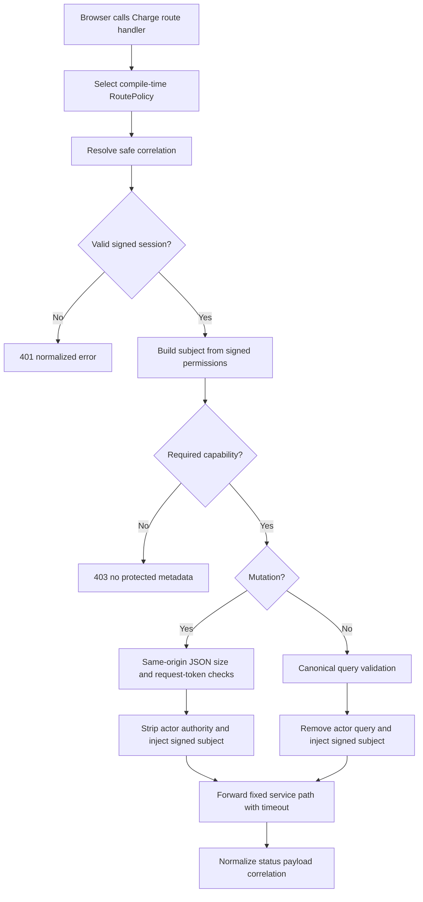

# Business Logic Model — U02 Charge Domain Routing and BFF

## Purpose and Boundary

U02 makes the existing Charge application safely reachable at `/charge-agreements` and supplies the authenticated browser-for-frontend seam consumed by U01, U03, and U04 pages. It owns Next base-path configuration, exact nginx mounting, Charge-app health wiring, session-derived subject/capability checks, request context, safe command forwarding, normalized errors, and stable App Router route states. It does not own Rate/Agreement/manual-case business rules, redesign the shared shell/navigation/design system, introduce RTK, or touch manager port 8088.

The unit decisively covers US-13 and the route-state portion of US-14, supports US-01 and US-12, and supplies U06 with deep-link/proxy/preservation evidence. The original W1 blocked/waived record remains explicit and is never rewritten as PASS. Docker/live acceptance remains pending U06.

## Stable Edge Mount

`apps/charge-agreements/next.config.mjs` sets `basePath: "/charge-agreements"`. Next emits page, asset, and route-handler URLs with that prefix. U02 does not add an asset prefix, custom router, shell frame, or navigation item.

Nginx adds only these locations before the existing catch-all:

```nginx
location = /charge-agreements {
  return 308 /charge-agreements/;
}

location ^~ /charge-agreements/ {
  proxy_pass http://apps-charge-agreements:3000;
  proxy_set_header Host $http_host;
  proxy_set_header X-Forwarded-Host $http_host;
  proxy_set_header X-Forwarded-Proto $scheme;
  proxy_set_header X-Correlation-Id $request_id;
}
```

The `proxy_pass` has no URI suffix, so the complete base-path URI is preserved. Existing `/auth/`, `/reference-data/`, exact/prefix `/booking` and `/bookings`, `/health`, and `/` locations remain byte-behaviorally protected. Nginx still binds from `${NGINX_HOST_PORT:-8088}`; the isolated Wave A env continues to set 18088, while U02 never starts/stops/targets the manager 8088 project.

Compose adds `AUTH_SESSION_SECRET`, Reference Data URL/token needed by Charge-local selectors, and a healthcheck at `http://127.0.0.1:3000/charge-agreements/api/health` to `apps-charge-agreements`. Nginx retains its existing dependency entry. No new service, network, volume, port, or deployment topology is introduced.

## Page Authentication Workflow

1. The Charge server page reconstructs the signed `lc_session` through `@erp/auth`; no client component decodes or receives the cookie.
2. For a missing/invalid/expired session, sanitize the requested path through shared `safeReturnUrl`, additionally require the path to equal/start with `/charge-agreements`, cap it at 2048 characters, and redirect to `/auth/sign-in?returnUrl=<encoded>`.
3. Build a local `AuthenticatedSubject` from the signed session only: subject ID/type/display and `session.permissions.map(parsePermission)`. Browser roles or capability fields are ignored.
4. Evaluate the exact page read capability. Authenticated denial renders the Charge-local denied composition with generic resource/action guidance and correlation, but no protected record metadata.
5. Authorized pages call their domain-owned loader through a compile-time route policy and render the resulting view model. Domain pages remain owned by U01/U03/U04.

## BFF Request Workflow



Text fallback: a route handler chooses a fixed policy, resolves correlation, authenticates and authorizes the signed session, validates reads or mutations, removes browser actor authority, forwards only the fixed backend operation with a timeout, and returns one normalized response.

### Route policy and capability registry

Every handler passes a literal `ChargeRoutePolicy` containing route ID, allowed method, backend path builder, required capability, access class, body mode, idempotency mode, backend `Accept`/mutation `Content-Type`, maximum response size, and timeout. Browser input may fill validated identifiers/query fields only. Media values are compile-time policy constants, never copied from browser headers.

| Surface | Resource | Actions | Disclosure rule |
|---|---|---|---|
| Rates | `charge-rates` | `read`, `create`, `update`, `approve`, `create-successor` | `PRICING` all; `FINANCE_READ` read only, per U01 |
| Agreements | `charge-agreements` | `read`, `create`, `update`, `approve`, `create-successor`, `suspend`, `expire` | U03 keeps Identity/service mapping aligned; read-only persona receives only read |
| Manual evidence | `charge-manual-cases` | `read` | Explicit Pricing capability only; Charge read never implies access |
| Health | none | public GET | service/status only |

U02 owns BFF enforcement and the policy registry. U01/U03/U04 own service-side action enforcement and Identity catalog entries for their domains. Both boundaries must allow; BFF permission never substitutes for service authorization.

### Safe mutation preparation

Browser mutation policies enforce same-origin from `Origin` against forwarded host/protocol, inbound `Content-Type: application/json`, a 32 KiB request-body limit, JSON parsing, and an exact allowed-field schema. They reject unknown authority fields (`actor`, `actorSubjectId`, `subject`, `roles`, `permissions`, `capabilities`, service headers/tokens). Compatibility forwarding for an explicit LEGACY Agreement policy reconstructs its DTO and inserts the signed subject into `actorSubjectId`; GET compatibility removes any browser `actor` and supplies the signed subject. W2 Agreement policies never use that compatibility transform: they send the exact vendor media and `X-LinerCore-Actor-Id` to the U03 controller, which independently authorizes it. New Rate/U04 controllers likewise receive the trusted header.

The browser supplies `X-LinerCore-Client-Request-Id` as a UUID created once per deliberate submit attempt. The BFF derives an opaque key from length-prefixed subject, route ID, stable target/new marker, expected row version/new marker, and client UUID, then forwards `Idempotency-Key` only when the route policy opts in. Retries of the same attempt derive the same key; a new deliberate submit receives a new UUID. U02 does not claim persistent replay where a service endpoint has no persisted receipt; optimistic versions, unique constraints, and disabled duplicate submit remain its actual protection.

### Correlation and service forwarding

Safe inbound `X-Correlation-Id` values matching `^[A-Za-z0-9][A-Za-z0-9._:-]{0,127}$` are propagated; absent/invalid values are replaced by `createCorrelationId()`. The selected ID is sent to Charge/Reference Data, returned as response header `X-Correlation-Id`, and included in error envelopes. It is never used as authorization.

Charge service calls use `CHARGE_AGREEMENT_SERVICE_URL`, `cache: no-store`, a bounded 2500 ms BFF deadline, fixed method/path, and server-created headers. The default compile-time policy media is `Accept: application/json` and backend mutation `Content-Type: application/json`. Every U03 Agreement administration policy overrides both with `application/vnd.linercore.charge-agreement-v2+json`; this override is owned by U02's policy registry and is not browser-selectable. Explicit LEGACY compatibility policies retain JSON but are not used by the Charge Agreement pages. Reference option calls use the existing Reference Data service identity/token convention, bounded query/response sizes, and return labels only; command validation remains service-side.

## Error Normalization and Recovery

The BFF accepts JSON only up to 512 KiB from backend responses. It preserves allowed statuses 400, 401, 403, 404, 409, 413, 415, 422, 429, 500, and 503. A safe provider envelope becomes:

```text
{ code, message, fields: [{ path, code, message }], correlationId, retryAfterSeconds? }
```

Unknown/malformed/HTML/oversized payloads use `CHARGE_REQUEST_FAILED`; abort/transport failure uses 503 `CHARGE_SERVICE_UNAVAILABLE`; timeout may include safe retry guidance. Raw exception text, stack, SQL names, response HTML, tokens, cookie content, roles, amounts, and customer payloads are never copied to the error or logs. A provider error never becomes HTTP 200 fallback data; the current module-info skeleton fallback is removed from authoritative domain BFF paths.

Page behavior is deterministic:

| Condition | BFF | Page |
|---|---|---|
| No session | 401 `CHARGE_AUTH_REQUIRED` | safe redirect to Auth sign-in |
| Authenticated, no capability | 403 `CHARGE_ACCESS_DENIED` | denied composition, no protected metadata |
| Missing authorized record | 404 typed error | Charge not-found page with safe list return |
| Validation/conflict | preserve 400/409/422 | field/global recovery owned by domain page |
| Timeout/unavailable | 503 | route error or inline recoverable state with retry |
| Unexpected render error | not applicable | `error.tsx` with reset and correlation/request reference |

## Route-State Workflow

- `loading.tsx` renders stable-size shapes matching the current domain page hierarchy; no spinner-only layout, random widths, content flash, or motion requirement.
- `error.tsx` is the minimal client boundary needed for `reset()`. On mount it focuses a labelled alert; Retry retains route/query context. It shows a safe request/correlation reference when available.
- `not-found.tsx` states that the authorized Charge record/page was not found and offers a base-path-safe return to the relevant list or Charge landing. It does not expose internal IDs beyond the route already visible to the user.
- Authenticated denied renders a server-decided Charge-local panel. Focus starts at its heading, the reason is generic, and manual-case counts/IDs/reasons/Booking references/correlations are absent.

All states use existing `@erp/ui` primitives/tokens and the current LinerCore shell contract. They preserve visible focus, status text beyond color, 44 px actions, `aria-live`/`role=alert` where appropriate, reduced motion, 320 px reflow, and light/dark tokens. U02 adds no shared component or global CSS abstraction.

## Observable Scenarios

- `/charge-agreements` returns 308 to `/charge-agreements/`; direct list/detail deep links and reloads return page HTML, and emitted `/_next` assets carry the base path.
- `/charge-agreements/api/health` is 200 minimal JSON both directly in the container and through nginx.
- An absent session page redirects with a sanitized return URL; the equivalent BFF call returns 401 JSON.
- A signed Pricing session reaches an allowed Rate command with exact subject/correlation; browser actor/capability/service headers are discarded.
- A read-only session can inspect rate/agreement pages but receives 403 for mutation; it receives no manual-case count or metadata.
- Cross-origin, non-JSON, oversized, malformed, invalid request-token, invalid query, timeout, malformed provider response, and backend typed errors remain distinct and safe.
- Browser back/forward restores domain-owned URL state under the base path; error reset and not-found return preserve safe context.
- Proxy regression tests prove unchanged behavior for `/`, `/auth`, `/reference-data`, `/booking`, and `/bookings`; isolated configuration remains 18088 and no command targets 8088.

## Upstream Coverage

This model directly consumes `unit-of-work.md`, `unit-of-work-story-map.md`, `requirements.md`, `components.md`, `component-methods.md`, and `services.md`. It implements their selected basePath/path-preserving proxy, signed-session BFF, normalized error, URL-state, health, port-isolation, and no-shared-redesign contracts while leaving domain behavior with U01/U03/U04.

## Architecture Review — Iteration 1

The mandatory reviewer verdict is **READY** with no blocking findings. It confirms the base-path/nginx contract, authenticated BFF boundary, Charge-local accessible route states, port 8088 exclusion, shared-design preservation, unresolved DS-01/DS-02/DS-03 dependencies, and historical W1 waiver are represented honestly. Nonblocking implementation controls are: retain U01/U03/U04 service-side Identity authorization; remove legacy browser actor authority without spreading the original request body; authorize protected record lookups before `notFound()`; require a page/domain capability before reference-selector lookups; claim replay protection only where a downstream service persists the derived key; and test top-level unknown routes separately from protected-record not-found paths.
