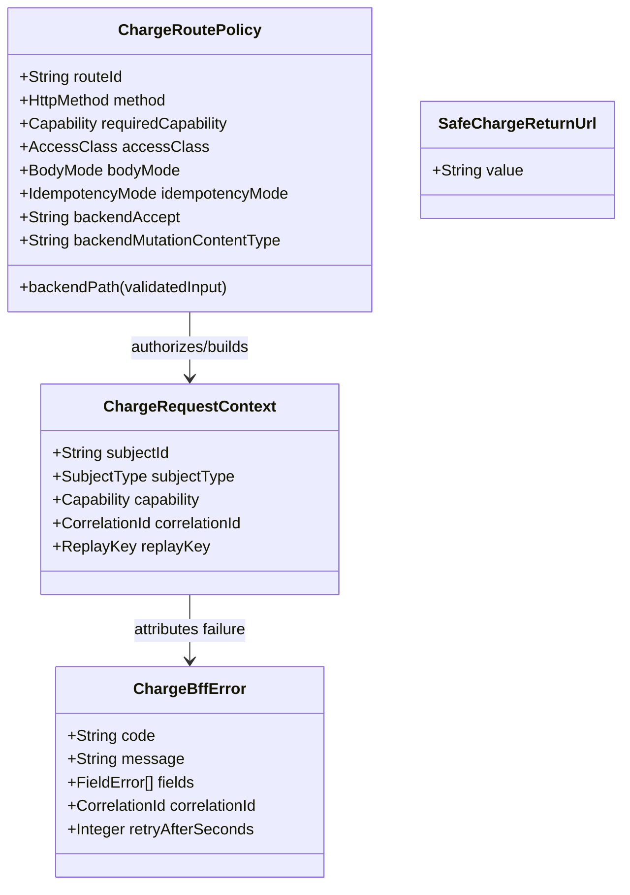
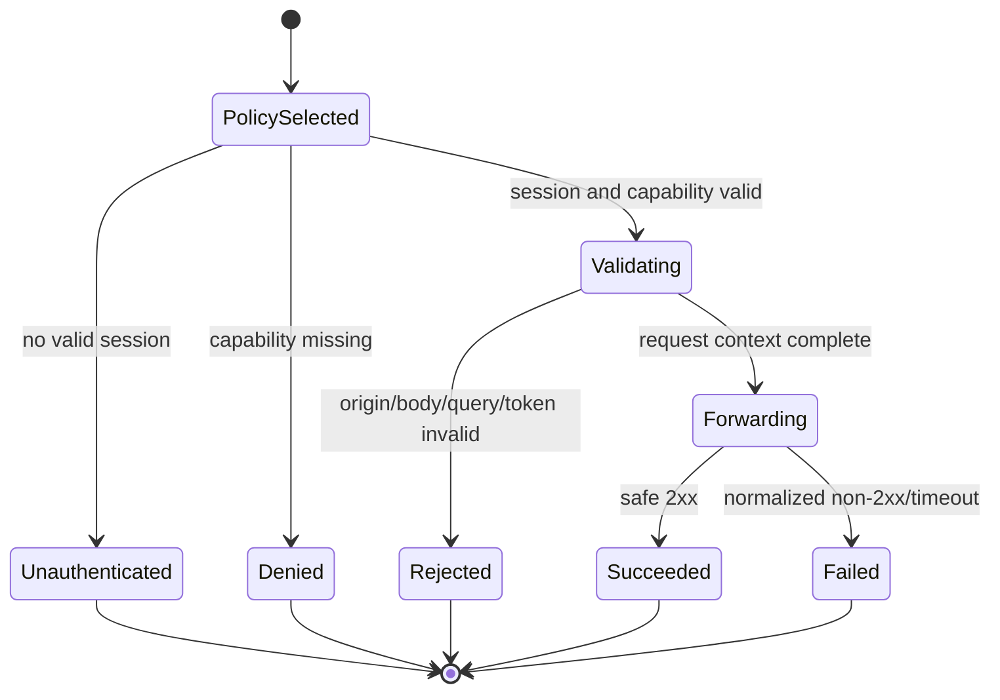

# Domain Entities — U02 Charge Domain Routing and BFF

## Ubiquitous Language

| Term | Meaning in U02 |
|---|---|
| Base path | Stable public Charge prefix `/charge-agreements` understood by Next and nginx |
| Route policy | Compile-time description of one browser/BFF operation and its fixed backend mapping |
| Request context | Signed subject, exact capability, correlation, and optional derived replay key for one call |
| Signed session | Existing `lc_session` decoded server-side through `@erp/auth` |
| Capability | Exact resource/action/scope parsed from signed session permissions |
| Safe return URL | Same-origin path additionally constrained to the Charge base path |
| Client request token | Browser UUID identifying one deliberate submit attempt; not authority |
| Derived replay key | Opaque subject/operation-scoped idempotency value forwarded only to opted-in service endpoints |
| Normalized error | Bounded safe BFF envelope preserving meaningful status/code without provider leakage |
| Protected metadata | Commercial/manual evidence that must not be disclosed before exact authorization |

U02 introduces no commercial synonym, master-data name, shell concept, role model, or new published pricing vocabulary.

## Entities & Aggregates

Text fallback: a compile-time RoutePolicy validates and authorizes one signed RequestContext. Failures produce one safe error attributed by its correlation. Safe return URLs govern page authentication redirects independently.

### ChargeRoutePolicy

| Attribute | Type | Rule |
|---|---|---|
| `routeId` | bounded string enum | Stable test/audit identifier, never browser supplied |
| `method` | `GET`, `POST`, or `PUT` | Exact handler/backend method |
| `requiredCapability` | resource/action/optional scope | Exact signed-session decision; absent only for health |
| `accessClass` | `PUBLIC_HEALTH`, `COMMERCIAL`, `MANUAL_EVIDENCE` | Controls disclosure and logging |
| `bodyMode` | `NONE`, `JSON`, `AGREEMENT_ACTOR_COMPAT` | Selects exact parser/actor reconstruction |
| `idempotencyMode` | `NONE`, `FORWARD_DERIVED` | Never forwards browser key unchanged |
| `backendAccept` | closed media enum | JSON default or exact U03 Agreement vendor media; compile-time only |
| `backendMutationContentType` | closed media enum/none | JSON default or exact U03 Agreement vendor media for mutations; never browser supplied |
| `maxResponseBytes` | positive integer | 512 KiB for JSON domain responses |
| `timeoutMs` | positive integer | 2500 for Charge/Reference BFF calls |
| `backendPath` | function of typed inputs | Same configured origin; no arbitrary URL |

Policies are immutable module constants. A generic catch-all that accepts a browser-selected backend path is invalid.

### ChargeRequestContext

| Attribute | Type | Source/mutability |
|---|---|---|
| `subjectId` | nonblank string <=128 | Signed session only, immutable |
| `subjectType` | `user` | Signed session; browser Charge pages reject service sessions |
| `displayName` | safe display string | Signed session; UI-only, never service authority |
| `capability` | exact resource/action/scope | Selected policy after signed permission evaluation |
| `correlationId` | `CorrelationId` | Valid inbound/nginx or minted UUID |
| `clientRequestId` | optional UUID | Browser submit attempt; validation input only |
| `replayKey` | optional opaque value | Server-derived, never accepted directly |

No full cookie, token, permission list, role list, customer payload, or commercial amount enters the context/log model.

### Value objects

- `CorrelationId`: 1-128 characters, `^[A-Za-z0-9][A-Za-z0-9._:-]{0,127}$`; invalid input is replaced with UUID.
- `SafeChargeReturnUrl`: at most 2048 characters, same-origin path from `safeReturnUrl`, no controls/backslash/network path, equal to or below `/charge-agreements`; fallback `/charge-agreements/`.
- `ClientRequestId`: canonical UUID text.
- `ReplayKey`: `charge-ui:v1:` plus lowercase SHA-256 hex over unambiguous length-prefixed subject, route, target/new marker, expected version/new marker, and client UUID.
- `FieldError`: `{ path, code, message }` with bounded safe strings; unknown backend field shapes become one global safe error.

### ChargeBffError

`code` is a bounded machine string, `message` is safe operator text, `fields` is a bounded list, `correlationId` is always present, and optional `retryAfterSeconds` is an integer 1-300. The type cannot carry stack, raw response, HTML, SQL constraint, token, cookie, actor permissions, amount, or customer payload.

## Field-Level Schema (canonical names)

| Field | Type | Canonical source | Notes |
|---|---|---|---|
| Public prefix | `BasePath` | Application Design `basePath` | `/charge-agreements` exactly |
| Route identifier | enum string | U02 local | Test/audit only |
| Subject identity | string | `AuthSession.subjectId` | Signed cookie only |
| Subject type | `SubjectType` | `AuthSession.subjectType` | Page flow requires user |
| Permissions | string[] to Capability[] | `AuthSession.permissions`, `parsePermission` | Never accepted from JSON/header |
| Resource/action/scope | `Capability` | `@erp/auth` | Exact authorization tuple |
| Correlation | bounded string | `X-Correlation-Id` / `createCorrelationId` | Echoed header/envelope |
| Client request token | UUID | `X-LinerCore-Client-Request-Id` | One deliberate submit attempt |
| Idempotency | opaque hash | `Idempotency-Key` backend header | Derived/forwarded only for opted-in policy |
| Actor backend header | string | `X-LinerCore-Actor-Id` | Reconstructed from session |
| Error code/message | bounded string | provider or U02 safe code | Non-2xx remains non-2xx |
| Error fields | `FieldError[]` | normalized provider field errors | Bounded; persistent labels consume paths |
| Retry guidance | optional integer | safe `Retry-After` | 1-300 only |
| Return URL | `SafeChargeReturnUrl` | current page path/query | Auth redirect only |

## Contract Fidelity Check

- `component-methods.md` requires signed-session list/get/create/update/approve/successor/suspend/expire/manual BFF methods, stable URL query state, correlation/idempotency, and normalized field/global errors. RoutePolicy and RequestContext represent each without renaming a domain DTO.
- U01's exact `charge-rates` resource/action vocabulary is consumed unchanged. U02 does not invent a role-based shortcut.
- Existing agreement compatibility still needs body/query actor fields; U02 reconstructs them from the signed session rather than changing or trusting their browser shape. U03 may later remove this compatibility path behind the same BFF contract.
- `@erp/auth` remains the signed cookie/capability authority; no duplicate auth package or cookie format is introduced.
- Nginx and Compose fields retain existing service/container names and port defaults. The additive base path does not rename published `/auth`, `/reference-data`, `/booking(s)`, or shell paths.
- U02 exposes no pricing.v1 or commercial persistence field, so target contract divergence for domain payloads is zero.

## Invariants & Validation

- A policy is compile-time fixed and every protected policy has exactly one capability.
- Both BFF and service authorize; either denial stops the operation.
- Signed session is the sole human actor/capability source.
- Browser service/actor/capability headers and body fields are stripped/rejected before reconstruction.
- Manual evidence is authorized before any existence lookup or count query.
- Correlation is safe, present, consistent across downstream/header/error, and not authority.
- Return URL cannot escape the Charge base path.
- Mutation validation completes before a backend call.
- Backend host/path cannot be selected by browser input.
- Error response is bounded, safe, and preserves failure status.
- Replay forwarding is scoped/opaque and never overclaimed as persistent idempotency.
- U02 stores no commercial state and changes no shared UI owner.

## Lifecycle / State

Text fallback: a fixed policy is selected, authentication and authorization decide whether validation may begin, valid input is forwarded once, and the call ends as safe success or normalized failure. No state is persisted by U02.

## Persistence and Ownership

U02 has no database table, distributed cache, local commercial cache, Redux/RTK store, or replay ledger. Route/query/form state remains URL/component-local. Service-owned units persist commercial authority and any supported idempotency receipt. U02 owns only code/configuration inside the Charge app, nginx mount, and Compose health/environment wiring; Charge-specific design notes remain in `design-system/linercore/pages/charge-and-agreements.md`.

## Open Questions

1. Are any request-context or route-policy shapes unresolved?
   - A. No; authentication, capability, correlation, replay forwarding, error, and return URL contracts are complete. **(Selected)**
   - B. A later unit must redefine the BFF core.
   - X. Other.
   - `[Answer]: A — later domain units supply DTO/path policies but do not redefine the U02 core.`

## Upstream Coverage

This model consumes `unit-of-work.md`, `unit-of-work-story-map.md`, `requirements.md`, `components.md`, `component-methods.md`, and `services.md`. It preserves existing Auth, Charge service, proxy, Compose, shared UI, and URL conventions while making the new Charge boundary typed and fail-closed.
