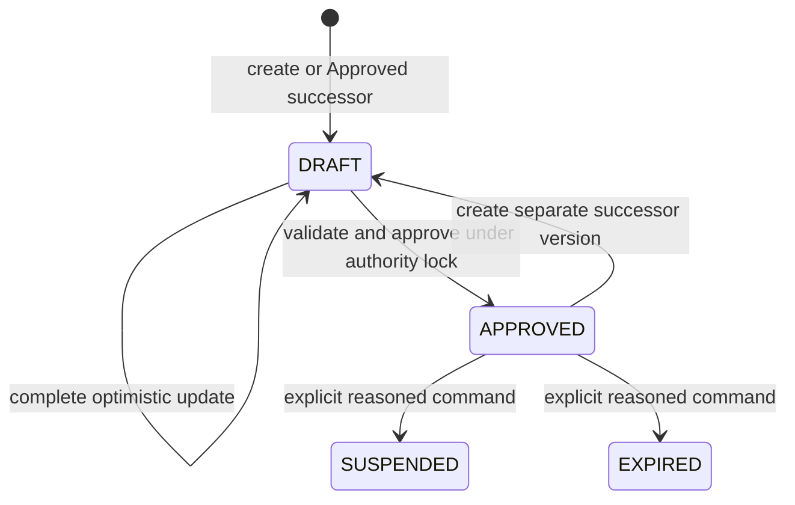

# Domain Entities — U03 Agreement Authority

## Ubiquitous Language

- **Agreement:** stable commercial identity and immutable agreement number that owns version history.
- **AgreementVersion:** one numbered commercial authority candidate with exact match fields, window, lifecycle, source, links, and provenance.
- **RateLink:** exact immutable relationship from one AgreementVersion/category to one U01 RateVersion.
- **W2 authority:** a `W2_VERSIONED` AgreementVersion; LEGACY history is never an authority candidate.
- **Draft:** the sole editable W2 version for a stable Agreement.
- **Approved authority:** a fully validated Approved W2 version eligible for new agreement-first resolution while its window matches.
- **Activity:** append-only attributable mutation evidence, separate from the frozen commercial snapshot.

## Entities & Aggregates

`Agreement` is the aggregate root:

- `agreementId: AgreementId` — generated stable ID, immutable;
- `agreementNumber: AgreementNumber` — required human identity, immutable but not a new uniqueness authority;
- `versions: List<AgreementVersion>` — ordered by immutable `versionNo`;
- invariant: at most one W2 Draft.

Its physical stable header has `authorityModel: LEGACY|W2_VERSIONED`. The model is assigned explicitly at creation/backfill and is the only legal reader discriminator; lifecycle/status and commodity nullability cannot substitute for it.

`AgreementVersion` contains:

- immutable identity/order: `agreementVersionId`, `agreementId`, positive `versionNo`, `authorityModel`, nullable `sourceVersionId`;
- match/window: `customerId`, `tradeLaneId`, `originLocationId`, `destinationLocationId`, `equipmentTypeId`, nullable legacy `commodityId`, `validity`;
- state/concurrency: `lifecycle`, `rowVersion`, `w2AuthorityEligible`;
- exact `Map<RateCategory, AgreementRateLink>` with three entries for W2;
- creation/update/approval metadata and frozen-after-approval commercial snapshot.

`AgreementActivity` belongs to one exact version and records action, subject, UTC time, optional/required reason, correlation, and resulting row version. It has no domain method that updates/deletes an existing row.

`AgreementLifecycleEvent` maps one committed mutation to the existing outbox/event contract. It retains the 1.0.0 envelope and adds nullable version identity/number, authority model, source version, and lifecycle action in schema 1.1.0; it contains no commercial/match/rate payload.

## Field-Level Schema (canonical names)

| Domain field | Type/shape | Validation |
|---|---|---|
| `agreementId` | string, 1–64 | generated; canonical external stable identity |
| `agreementNumber` | trimmed string, 1–64 | immutable after stable creation |
| stable `authorityModel` | `LEGACY|W2_VERSIONED` | existing/backfilled headers LEGACY; new U03 headers W2_VERSIONED |
| `agreementVersionId` | string, 1–64 | generated; immutable exact authority identity |
| `versionNo` | long | positive, allocated under stable-header lock |
| `rowVersion` | long | nonnegative; exact expected value on every mutation |
| `authorityModel` | `LEGACY|W2_VERSIONED` | new writes are W2_VERSIONED only |
| `lifecycle` | `LEGACY|DRAFT|APPROVED|SUSPENDED|EXPIRED` | model-compatible state matrix |
| `customerId` | Reference ID | active `PARTY_CUSTOMER` |
| `tradeLaneId` | Reference ID | active `TRADE_LANE` |
| `originLocationId` | Reference ID | active `LOCATION`, required W2 |
| `destinationLocationId` | Reference ID | active `LOCATION`, required W2 and distinct from origin |
| `equipmentTypeId` | Reference ID | active `EQUIPMENT_TYPE` |
| `commodityId` | nullable Reference ID | LEGACY readability only; absent on new W2 writes |
| `validFrom`, `validTo` | ISO LocalDate | inclusive and `validTo >= validFrom` |
| `sourceVersionId` | nullable exact version ID | required on successor, whose source is Approved same Agreement |
| `links` | three category-keyed IDs | distinct exact Approved compatible U01 RateVersions |
| `reason` | trimmed string up to 512 | required for update/successor/approve/suspend/expire |
| `correlationId` | safe string up to 128 | U02/service generated; required new writes |

HTTP DTOs never expose `actorSubjectId` as accepted input. Create carries stable number, five references, dates, three link IDs, and optional creation reason. Update carries exact version ID, expected row version, complete commercial replacement, exactly three links, and required reason. Approval/lifecycle DTOs carry exact version ID, expected row version, and required reason.

## Contract Fidelity Check

- FR-201 fields map one-to-one to stable/version identity, W2 match key, inclusive validity, lifecycle, and audit fields.
- FR-202's exact OFR/BAF/POL THC identities map to primary-keyed category links; no copied price or dynamic pointer exists.
- FR-203's active references, coverage, compatibility, complete set, overlap, and atomicity are enforced before the lifecycle update.
- FR-204 preserves commercial snapshot/link bytes from approval; successors receive new identities and copied initial values.
- FR-205 retains explicit suspend/expire paths and historical attribution while removing lifecycle state from future candidate queries.
- Existing default-media admin and lifecycle event contracts remain additive: legacy and W2 adapters are selected explicitly, and W2 event fields are nullable additions with defaults.
- The U01-owned V3 tables/constraints are consumed unchanged during U03 behavior; the pre-implementation prepared-schema correction adds only the required nullable legacy header projection and activity table before any migration is applied.

## Invariants & Validation

1. New W2 stable header, v1 Draft, three links, CREATED activity, and outbox event commit atomically.
2. `uq_cav_one_draft_per_agreement` is the final database guard for one Draft; application conflict handling remains deterministic.
3. Each W2 version has exactly one BASE, SURCHARGE, and LOCAL row; `uq_carl_version_rate` forbids reusing one RateVersion across categories.
4. RateVersion category, OFR/BAF/THC code, Approved lifecycle, coverage, and applicability are reloaded from structured U01 columns for every create/update/approval.
5. Agreement overlap equality is customer, trade lane, origin, destination, equipment plus inclusive date intersection. Commodity and stable agreement ID are excluded.
6. Draft updates replace all commercial fields/links, increment row version once, and update snapshot. Approved/Suspended/Expired fields, snapshot, and links reject writes.
7. Suspend/expire update lifecycle/row version only and append activity/outbox evidence.
8. Version allocation locks the stable header and computes the greatest version number across all rows plus one, so a deterministic LEGACY number can never collide with a new W2 number.
9. Legacy repository methods require stable-header `authority_model=LEGACY`; W2 methods require `W2_VERSIONED`. Cross-model fallback is forbidden.
10. Direct persistence errors are translated to typed domain conflicts; they never leak SQL/schema details.

## Lifecycle / State

Text fallback: a new Agreement or Approved source creates a distinct Draft. Draft can be updated or Approved. An Approved version can seed a separate Draft, or transition explicitly to Suspended/Expired. Suspended and Expired have no outgoing transition in W2-03. LEGACY is history-only and outside this state machine.

## Persistence and Ownership

- `charge_agreements` remains the stable/legacy compatibility header. V3 adds required `authority_model` with LEGACY default/check/index. For W2 its canonical fields are ID, immutable agreement number, and W2 discriminator. At W2 creation only, required V1 projection columns copy the first Draft customer/lane/window, use NULL commodity, `DRAFT`, version 1, creation provenance, and a stable-header snapshot. U03 never updates or reads those projection fields as W2 authority; all W2 commands/queries use the version/link tables. Legacy readers filter LEGACY and therefore cannot expose the stale projection.
- `charge_agreement_versions` is structured W2 authority and LEGACY history exactly as specified by U01 V3. Draft snapshot may change optimistically; approval freezes it.
- `charge_agreement_rate_links` stores exact category-to-U01-version identity. Draft replacement uses delete/insert within one transaction; Approved links have no update/delete path.
- `charge_agreement_activity` is the U01-owned V3 append-only provenance table added by the post-review schema correction.
- Existing Charge outbox tables carry additive agreement lifecycle events. JDBC production wiring requires transactionally stored outbox; direct/noop publishing is test/local compatibility only and cannot substantiate live acceptance.
- Existing event types/subjects/topic remain. The 1.1.0 snapshot adds nullable `agreementVersionId`, `agreementVersionNo`, `authorityModel`, `sourceAgreementVersionId`, and `lifecycleAction`; existing `agreementVersion` carries resulting row version. The dedupe key includes exact stable/version/row-version/event identities.
- `AgreementAdminReadRepository` dual-reads W2 and LEGACY into a discriminated view; LEGACY has empty W2 links/capabilities and is explicitly noneligible. `W2AgreementRepository` exposes `create`, `updateDraft`, `createSuccessorUnderHeaderLock`, `approveUnderLock`, `transitionLifecycle`, and `findApprovedCandidates`, all guarded by W2 header model. It does not expose generic `save`.
- `LegacyAgreementRepository` retains default-media behavior only for LEGACY headers and mirrors post-V3 legacy mutations into noneligible deterministic LEGACY history. It cannot call W2 approval/candidate methods.
- U03 never changes V3 after application, never reads another service database, and never duplicates Reference Data.

## Open Questions

1. Must a persisted W2 Draft always contain all three exact links?
   - A. Yes; create/update is a complete atomic Draft replacement. **(Selected by recorded timeout default)**
   - B. No; partial Drafts may persist.
2. Can Suspended/Expired seed a successor?
   - A. No; only an exact Approved version can. **(Selected by recorded timeout default)**
   - B. Yes.
3. Does successor approval implicitly retire overlap?
   - A. No; overlap is 409 and lifecycle transitions stay explicit. **(Selected by recorded timeout default)**
   - B. Yes; approval replaces prior authority.

No field-name, identity, reference-set, lifecycle, link, window, or concurrency ambiguity remains after these selections.

## Upstream Coverage

This entity model consumes `unit-of-work.md`, `unit-of-work-story-map.md`, `requirements.md`, `components.md`, `component-methods.md`, and `services.md`. It binds the U03 Agreement/AgreementVersion/RateLink/activity model to the U01 V3 physical contract, U01 RateVersion authority, U02 signed BFF boundary, and future U04 agreement-first candidate port without taking over pricing or Booking state.
