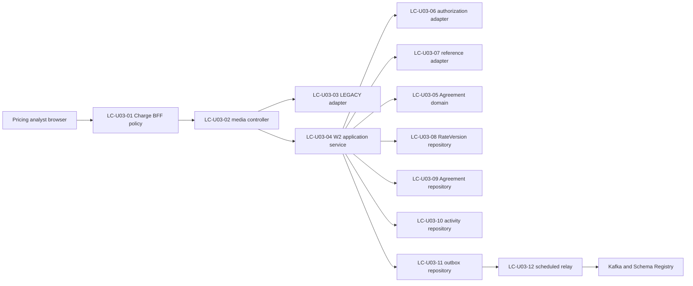

# Logical Components - U03 Agreement Authority

## Component inventory

| ID | Logical component | Boundary and responsibility | Failure domain |
| --- | --- | --- | --- |
| LC-U03-01 | Charge Agreement BFF policies | signed session, exact capability, fixed W2 vendor media, correlation, safe error mapping | Charge app process; no service/database authority |
| LC-U03-02 | media-negotiating Agreement controller | choose LEGACY or W2 adapter once; validate grammar; map typed outcomes | Charge service HTTP adapter |
| LC-U03-03 | legacy Agreement adapter | preserve default-media LEGACY search/detail/mutations; ignore actor authority; exclude W2 headers | compatibility boundary only |
| LC-U03-04 | W2 Agreement application service | orchestrate exact action, validation, transaction, and committed view | Charge application boundary |
| LC-U03-05 | Agreement domain model | stable/version identity, Draft/successor/approval/terminal invariants, immutable snapshot | framework-free in-process domain |
| LC-U03-06 | authorization adapter | exact `charge-agreements` action, fail closed, trusted subject/service context | Identity dependency bulkhead |
| LC-U03-07 | typed reference adapter | five exact active stable-ID checks with bounded fan-out/deadline | Reference Data dependency bulkhead |
| LC-U03-08 | RateVersion validation repository | one set read for exact three Approved compatible version links | Charge database/read boundary |
| LC-U03-09 | versioned Agreement repository | stable/version/link/history queries; header/advisory/optimistic locks; bounded projections | Charge database/write boundary |
| LC-U03-10 | activity repository | append one attributable immutable activity per committed command | same Charge transaction |
| LC-U03-11 | transactional outbox repository | enqueue immutable event in command transaction; short claim/mark transactions | same Charge database, separate relay lifecycle |
| LC-U03-12 | U03 bounded outbox relay | reserved `w2agr-` plus five-type eligibility, five-second poll, 50-row claims, ten-way publish, typed retry/permanent classification, eight-attempt exhaustion | Charge-local opt-in; legacy/other producers remain on existing relay |
| LC-U03-13 | migration/readiness guard | exact Flyway catalog, datasource/outbox/non-local config readiness | service startup/readiness boundary |
| LC-U03-14 | telemetry/evidence adapters | low-cardinality metrics, redacted logs, raw performance/recovery evidence | diagnostic only; cannot alter decisions |

No component is a new deployable. LC-U03-01 stays inside
`apps/charge-agreements`; LC-U03-02 through LC-U03-14 extend the existing
`charge-agreement-service`, Charge PostgreSQL, and platform-messaging library.

## Interaction and transaction boundaries

Text fallback: the signed-session BFF selects the W2 media policy; the
controller selects exactly one adapter. The W2 service authorizes and validates,
then coordinates the domain and Charge repositories. Agreement, activity, and
outbox enqueue commit together. A later scheduled relay publishes the committed
outbox through Kafka/Schema Registry.

The command transaction includes LC-U03-05, LC-U03-08 post-lock checks,
LC-U03-09, LC-U03-10, and LC-U03-11 enqueue. Broker calls are outside it. Legacy
and W2 repositories share the datasource but are separated by explicit
`authority_model` predicates and adapter contracts.

## Failure-domain and blast-radius mapping

| Failed component | Blast radius | Containment |
| --- | --- | --- |
| Charge BFF/session | Charge administration request only | 401/403/503; no browser-to-service bypass |
| Identity adapter | protected Agreement operation | fail closed; bounded permits/deadline; no cache |
| Reference Data adapter | mutation requiring master validation | typed 503/422; no write; reads remain independently available after authorization |
| Charge database/Flyway | all Charge Agreement commands/reads | readiness false; no partial transaction; manager/other service databases unaffected |
| same authority-key lock | contenders for that exact key | one winner; other keys proceed |
| relay or Kafka/registry | lifecycle-event freshness | commercial commit remains durable; bounded backlog/retry |
| LEGACY adapter defect | default-media compatibility | W2 vendor adapter remains isolated; no runtime fallthrough |
| W2 adapter defect | W2 administration | LEGACY is not used as stale fallback |
| telemetry/evidence sink | diagnostic completeness | never fail open or mutate commercial authority; release evidence remains blocked |

## Shared resources and isolation

- The Charge Hikari pool is shared across U01/U03/U04 concerns with maximum ten
  local connections. U03 adds no second datasource; relay publication does not
  hold a connection while awaiting Kafka.
- PostgreSQL is the only authority for multi-instance correctness. In-process
  semaphores bound remote dependency fan-out but never serialize commercial keys.
- Identity and Reference Data remain separate services and databases. Charge
  stores stable IDs only and performs no cross-database SQL.
- Kafka topics/schema subjects and five lifecycle event types remain unchanged;
  Avro 1.1.0 additions are nullable/default-null and preserve 1.0.0 consumers.
- `packages/ui`, the shared shell/navigation, Booking, manager port 8088, and
  cloud infrastructure are outside this unit's modification boundary.

## Infrastructure handoff

Infrastructure Design must map these logical needs onto the existing Compose
services only: Charge app/service health, Charge PostgreSQL/Flyway, Identity and
Reference endpoints, Kafka/Schema Registry, nginx isolated mount, datasource
pool values, relay batch/poll/retry configuration, and evidence volume paths.
It must not invent AWS accounts, regions, managed services, production HA, or
cost estimates for this feature.

## Upstream trace

This inventory consumes `performance-requirements.md`,
`security-requirements.md`, `scalability-requirements.md`,
`reliability-requirements.md`, `tech-stack-decisions.md`, and
`business-logic-model.md`. It bridges their concrete application, dependency,
database, relay, health, and evidence patterns to the next Infrastructure Design
stage while preserving U01, U02, U04, U06, Booking, and shared-UI ownership.
