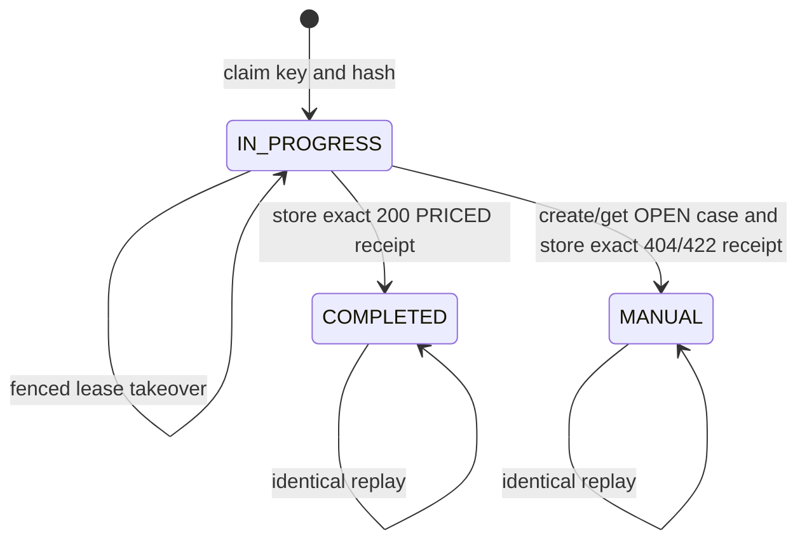

# Business Rules — U04 Pricing Provider and Manual Cases

## Rule Catalog

| ID | Rule |
|---|---|
| PRC-001 | `POST /pricing-requests` with `application/vnd.api.v1+json` is the sole W2 booking-time pricing authority; quote/legacy endpoints gain no W2 behavior. |
| PRC-002 | A trusted service subject must pass existing `charge-agreement:price` authorization before authority reads or receipt mutation; the actor header has no default. |
| PRC-003 | `Idempotency-Key` is exactly `bookingRef:amendmentSeq`; one key maps to one canonical body hash. |
| PRC-004 | Identical terminal requests replay the stored status/body/correlation/time/case exactly; changed bodies conflict and live claims retain retry guidance. |
| PRC-005 | Only `requestedDepartureDate` selects authority. Retained `effectiveDate` must equal it and no clock fallback is allowed. |
| PRC-006 | Agreement candidate matching uses W2 Approved lifecycle plus customer, trade lane, POL, POD, equipment, and inclusive date; commodity is never a W2 discriminator. |
| PRC-007 | Exactly one agreement wins before tariff. Multiple agreements are terminal ambiguity and zero agreements alone permits tariff fallback. |
| PRC-008 | Agreement pricing uses only the selected version's exact three immutable links; it never substitutes standalone successors or legacy terms. |
| PRC-009 | Tariff requires exactly one effective Approved BASE/OFR, SURCHARGE/BAF, and POL LOCAL/THC. Any missing category makes the whole result `NO_RATE`; any multi-match makes the whole result category-specific ambiguity. |
| PRC-010 | OFR/BAF match origin, destination, equipment; POL THC matches origin and equipment and ignores destination. No specificity/latest/price tie-break exists. |
| PRC-011 | Every successful W2 price has exactly three lines ordered BASE/OFR, SURCHARGE/BAF, LOCAL/THC. |
| PRC-012 | All three sources are USD `PER_CONTAINER`; each amount is `unitRate × equipmentQuantity`, independently rounded to scale two `HALF_UP`; total is the sum of rounded lines. |
| PRC-013 | A W2 200 emits the complete enriched result and line set. Partial enrichment, a non-USD source, a missing line, or a mismatched source is not a degraded success. |
| PRC-014 | Agreement `pricingRef` is the exact AgreementVersion ID. Tariff reference is the specified 24-hex SHA-256 fingerprint over ordered source IDs. |
| PRC-015 | `pricedAt` is first successful terminal completion in UTC and never changes on replay. |
| PRC-016 | Missing authority returns HTTP/code 404 `NO_RATE`; ambiguity returns HTTP 422/code `PRICING_VALIDATION` plus the exact domain reason. Neither returns a total. |
| PRC-017 | Charge creates cases only for `NO_RATE` and four authority ambiguity reasons. Caller validation, denial, conflict, in-progress, timeout, unavailable, and circuit-open do not create Charge cases. |
| PRC-018 | A new Charge manual case is always OPEN and unique by canonical pricing-request/reason key. W2-03 exposes no case lifecycle mutation. |
| PRC-019 | Manual case creation/get and fenced MANUAL receipt completion commit in one Charge-datasource transaction. PRICED completion has no case. |
| PRC-020 | Charge terminal codes are `PRICED`, `NO_RATE`, or a specific ambiguity reason. `MANUAL_PRICING_REQUIRED` belongs only to Booking's downstream projection. |
| PRC-021 | Manual evidence list/detail authorize exact `charge-manual-cases:read` before count or lookup and expose no commercial money or workflow controls. |
| PRC-022 | Retained OpenAPI required properties, enums, numeric JSON types, and media type do not change; new response/error properties are optional for legacy validation. |
| PRC-023 | Correlation propagates unchanged through calculation, terminal snapshot, case, response, logs, and Booking. `local-correlation` is forbidden. |
| PRC-024 | No U04 behavior writes migration files, rate/agreement authority, Booking persistence, shared navigation, shared tokens, or `packages/ui`. |
| PRC-025 | Tariff classification queries all three sets: any ambiguity wins in BASE→SURCHARGE→LOCAL order; only when none is ambiguous can any missing category yield `NO_RATE`. |
| PRC-026 | A canonical backfilled legacy manual-case winner is reused unchanged; incomplete historical evidence is presented honestly and never duplicated or synthesized. |

## Resolution Matrix

| Agreement candidates | Tariff category candidates | Outcome | Case |
|---:|---|---|---|
| 1 | not queried | 200 AGREEMENT, exact linked versions | none |
| >1 | not queried | 422 `PRICING_VALIDATION` / `AMBIGUOUS_AGREEMENT_AUTHORITY` | one OPEN |
| 0 | exactly 1 BASE + 1 SURCHARGE + 1 LOCAL | 200 TARIFF | none |
| 0 | zero in one or more categories | 404 `NO_RATE` | one OPEN keyed to `NO_RATE` |
| 0 | >1 BASE | 422 / `AMBIGUOUS_BASE_RATE` | one OPEN |
| 0 | >1 SURCHARGE | 422 / `AMBIGUOUS_SURCHARGE_RATE` | one OPEN |
| 0 | >1 LOCAL | 422 / `AMBIGUOUS_LOCAL_RATE` | one OPEN |
| 0 | one or more zero categories and one or more >1 categories | 422 ambiguity for first ambiguous BASE→SURCHARGE→LOCAL | one OPEN |

All three sets are queried before classification. If one or more tariff categories are ambiguous, fixed evaluation order BASE, SURCHARGE, LOCAL chooses the first domain reason even when another category is missing. Only with no ambiguity does any missing category yield `NO_RATE`. This ordering is deterministic evidence only; it never produces a partial selection or calculation.

## HTTP and Receipt Matrix

| Condition | HTTP / public code | Receipt/case behavior |
|---|---|---|
| W2 price | 200 provider result | `COMPLETED`, `PRICED`, exact snapshot, no case |
| No complete authority | 404 `NO_RATE` | `MANUAL`, domain `NO_RATE`, exact error snapshot, one OPEN case |
| Runtime ambiguity | 422 `PRICING_VALIDATION` | `MANUAL`, exact ambiguity domain reason, exact error snapshot, one OPEN case |
| Malformed/key/date/reference validation | 400/422 existing envelope | rejected before claim; no Charge case/terminal receipt |
| Denied | 403 | authorization first; no receipt/case/candidate disclosure |
| Same key, different body | 409 `IDEMPOTENCY_CONFLICT` | existing receipt unchanged |
| Same key/hash, live owner | 409 `PRICING_IN_PROGRESS` + `Retry-After` | claim unchanged |
| Required dependency/storage unavailable | 503 `PRICING_UNAVAILABLE` | no manual case; incomplete claim may be recovered after lease |
| Same key/hash, terminal | stored status/body | no re-resolution, time change, or duplicate case |

## Contract Compatibility

The request schema remains byte-compatible in field names and required lists. Result additions are optional in OpenAPI but all-or-none from a W2 provider: result `total`, `currency`, `requestedDepartureDate`, `pricingRequestId`, `correlationId`, `pricedAt`, optional `agreementVersionId`; line `rateCategory`, `basis`, `quantity`, `unitRate`, `sourceRateVersionId`. Existing `amount` and new `unitRate` remain JSON numbers backed by `BigDecimal`, not strings.

The Error schema retains required `code`, `message`, `correlationId` and adds optional `reasonCode`, `pricingRequestId`, `manualCaseId`. Ambiguity's specific reason never becomes a new top-level public `code`; old consumers can keep treating it as `PRICING_VALIDATION`. Provider and Booking consumer fixtures use the same success, no-rate, ambiguity, conflict, and in-progress examples.

## Invariants & Validation

1. No success can contain fewer or more than three lines, mixed currencies, duplicate categories/source IDs, or a total unequal to the sum of rounded lines.
2. No agreement ambiguity can reach the tariff repository.
3. No partial tariff candidate set reaches calculation.
4. A fenced owner alone may complete a receipt; a loser reloads and replays a terminal winner or returns in-progress. Replay reads stored status/body and derives content type by status because V4 stores no arbitrary headers.
5. A W2 MANUAL receipt always references one OPEN case; a W2 PRICED receipt never references a case, matching U01 V4 checks.
6. The canonical manual dedupe key is calculated from the exact terminal request ID and exact domain reason, not from correlation or time. An existing backfilled winner is returned unchanged even when W2 evidence columns are NULL.
7. The response snapshot is serialized once from the public DTO and stored before return; replay reads it rather than reconstructing domain objects.
8. Manual search is stable at equal timestamps by case ID and never performs an unauthorized count.
9. Service/controller adapters translate typed outcomes; the domain never depends on Spring/JDBC/JSON.
10. Logs and metric labels never contain party/customer identifiers or money.

## Lifecycle / State

Text fallback: one request is claimed. An expired claim can gain one new fenced owner. It terminates once as priced or manual and thereafter only replays. The associated manual case has one state, OPEN, and no transition in W2-03.

## Open Questions

1. Manual detail route shape?
   - A. Same route with `?case=`. **(Selected by recorded timeout default)**
   - B. Nested route.
2. Stored ambiguity taxonomy?
   - A. Agreement/base/surcharge/local reasons. **(Selected by recorded timeout default)**
   - B. One generic reason.
3. Replay timestamp?
   - A. First terminal completion. **(Selected by recorded timeout default)**
   - B. Replay time.

## Upstream Coverage

These rules consume `unit-of-work.md`, `unit-of-work-story-map.md`, `requirements.md`, `components.md`, `component-methods.md`, and `services.md`. They trace to FR-301–FR-307, FR-401–FR-407, FR-604, NFR-002–NFR-005/NFR-009/NFR-010, with U05 reserved for Booking persistence/projection and U06 reserved for live acceptance.
