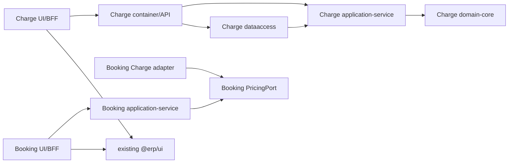
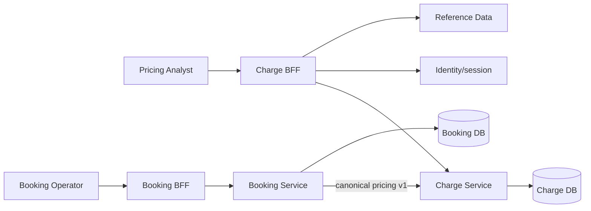

# Component Dependency - W2-03 Charge Tariffs & Agreements

## Dependency Rules

1. Charge owns commercial authority and calculation; Booking consumes its API through the existing pricing port only.
2. Domain modules remain pure and have no Spring, persistence, HTTP, messaging, frontend, or clock-global dependency.
3. Service-owned repositories are reached through ports; no cross-database reads or writes.
4. Reference and identity values cross boundaries as stable IDs/subjects; Charge does not copy master-data authority.
5. Frontends call their own authenticated BFF routes; no browser-to-service or browser-supplied actor authority.
6. W2-03 composes existing `@erp/ui`; it does not modify `packages/ui`, shell/navigation, typography, or palette.
7. The canonical pricing v1 contract is additive and bilateral. Booking must not reconstruct line amounts or version provenance.
8. No new generic pricing service, workflow engine, cloud resource, event topology, or shared Redux/RTK store is introduced.

## Dependency Matrix

| Component | May depend on | Must not depend on |
| --- | --- | --- |
| Charge `domain-core` | Java standard library, domain value types | Spring/JPA/Jackson, repositories, Booking, reference client, system date. |
| Charge `application-service` | domain, declared ports, injected clock/IDs | Container/controllers, JDBC/JPA implementation, Booking internals. |
| Charge `dataaccess` | domain/application ports, persistence libraries | UI, Booking DB/schema, reference DB. |
| Charge `container` | application service, adapters, Spring Web/security/actuator | UI source, Booking internals. |
| Pricing OpenAPI/published language | Stable provider types and examples; additive optional enriched fields | Database entities, UI models; changing existing numeric/category/date wire types. |
| Booking domain/application | Booking domain, PricingPort, snapshot codec port | Charge domain/entities/tables. |
| Booking Charge adapter | PricingPort, generated/typed pricing contract client | Charge database or legacy non-authoritative quote path. |
| Charge app | Next.js, existing `@erp/ui`, Charge-local BFF/view models | Direct service DB, `packages/ui` source modifications, shell forks. |
| Booking pricing region | Existing Booking BFF/view models and `@erp/ui` | Charge administration/private data. |

## Build-Time Module Dependencies

Text fallback: Charge adapters/container depend inward on its application/domain. Booking depends on a local PricingPort and an outward Charge adapter, not Charge internals. Both UIs consume existing shared UI through their own BFFs.

## Runtime Data Flow

Text fallback: the analyst manages Charge through its BFF; the Booking operator prices through Booking; Booking alone calls Charge's canonical endpoint; each service persists only in its own database.

## Persistence Dependencies and Constraints

| Data/constraint | Owner | Mechanism |
| --- | --- | --- |
| Rate stable/version identity and immutable approved fields | Charge | Additive Flyway tables, state-guarded updates, audit columns. |
| Category matching key/window overlap | Charge | `pg_advisory_xact_lock(hashtextextended(normalizedKey,0))` plus inclusive overlap query/update in one transaction. |
| Agreement stable/version identity and exact three links | Charge | `charge_agreement_versions`; link PK `(agreement_version_id, rate_category)` plus FK and category/compatibility validation. |
| Agreement overlap | Charge | Same advisory-lock pattern using the W2 customer/lane/origin/destination/equipment key; legacy commodity stays readable but is ignored for W2 matching. |
| Pricing receipt replay/conflict | Charge | Unique idempotency key + canonical body hash + terminal response. |
| OPEN manual case deduplication | Charge | Unique request identity/reason while OPEN/terminal receipt association. |
| Typed pricing history | Booking | `booking_pricing_snapshots` PK `(booking_id, pricing_request_id)`, schema version, immutable JSON/text snapshot, amendment index. |
| Legacy snapshot compatibility | Booking | Codec dual-read; no destructive row rewrite. |

Charge migration order is fixed: V1 exact current catalog; V2 rate authority tables; V3 agreement version/link tables plus deterministic legacy `av-` + `md5(id:version)` history rows marked non-W2-authority; V4 receipt/manual-case terminal evidence and dedupe. A custom exact-catalog strategy baselines only an unmodified current schema and otherwise fails startup. Booking's next migration adds the typed snapshot table. Migrations must restart cleanly and document forward repair/restore; SQL init is disabled after Charge Flyway adoption.

## Failure Propagation

| Dependency failure | Propagation rule | Forbidden behavior |
| --- | --- | --- |
| Reference/identity unavailable during mutation | Typed upstream 503/denied; no partial commit | Accept unknown references or browser actor. |
| First Charge timeout/503 | Booking retries once with identical key/body | New key/body, Charge OPEN case, or snapshot. |
| Retry exhausted/circuit open | Booking persists `MANUAL_PRICING_REQUIRED` evidence with timeout/unavailable/circuit reason and circuit metadata | Charge OPEN case, `NO_RATE`, price, or automatic confirmation. |
| No complete authority | 404 `NO_RATE`, one OPEN case, Booking manual state | Zero/partial total. |
| Residual ambiguity | 422 `PRICING_VALIDATION`, one OPEN case, Booking manual state | Fall through to tariff or relabel as no-rate. |
| Booking persistence failure after Charge success | Retry identical request and replay Charge receipt; Booking idempotent append | Recalculate with a changed key or duplicate snapshot. |
| Shared UI DS-01/02/03 gap | Named dependency/block in evidence | Claim shared conformance or patch shared owner files. |

## Shared Resource Assessment

| Resource | Owner | W2-03 use/change |
| --- | --- | --- |
| `packages/ui` and tokens | W2-02 | Consume unchanged. Charge-local focus wrapper only for DS-01. |
| `PlatformShell`/navigation/ribbon metadata | W2-02 | Consume; DS-03 remains integration dependency. No fork/CSS suppression. |
| Async Combobox behavior | W2-02 | Consume where compliant; DS-02 remains named dependency. |
| `pricing.v1.yaml` | Charge provider + Booking consumer bilateral ownership | Additive synchronized change with provider/consumer evidence. |
| Identity/reference services | W0-01/W0-02 | Consume and regression-test; no ownership change. |
| Booking service/UI | W1-01 plus W2-03 minimum seam | Extend pricing adapter/snapshot/region only; keep original W1 blocked/waived record explicit. |
| Wave A Compose wrapper/project | Program baseline | Acceptance only through wrapper and `linercore-wave-a`; manager port 8088 untouched. |
| Nginx edge config | Runtime integration | Add exact redirect/path-preserving `/charge-agreements/` route and Charge healthcheck on Wave A 18088; regression-test all pre-existing locations. |

## Change and Impact Paths

- Rate schema/domain changes affect Charge admin endpoints, agreement link validation, resolver, provider examples/tests, and Charge pages.
- Pricing contract changes affect Charge provider DTO/controller, Booking client/adapter/snapshot, Booking BFF/UI, Pact/contract tests, and live evidence.
- Booking pricing-input changes affect amendment fingerprint, idempotency key, reprice availability, history selector, and confirmation guard.
- No dependency path reaches shared UI source, shared shell source, unrelated services, or manager-demo runtime.

## Upstream Trace

Dependency rules enforce FR-001-FR-004, FR-401-FR-407, FR-501-FR-507, FR-601-FR-606, FR-701-FR-703, NFR-002-NFR-005, and NFR-009-NFR-010. Live/UI proof obligations for the dependency paths are FR-704-FR-706 and QC-02-QC-03.
