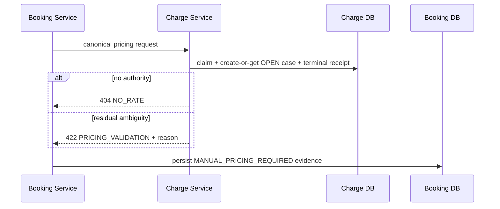

# Services - W2-03 Charge Tariffs & Agreements

## Service Definitions

| Service/application | W2-03 responsibility | Explicit non-responsibility |
| --- | --- | --- |
| `charge-agreement-service` | Rate and agreement version authority, deterministic pricing, idempotent terminal receipts, OPEN manual cases, commercial audit, REST provider. | Booking state, master-data creation, manual quote/resolution workflow, generic pricing rules engine. |
| `booking-service` | Explicit first-price/reprice orchestration through existing port, typed immutable pricing history, safe manual/failure projection. | Charge calculation, Charge DB reads, rate/agreement administration. |
| `apps-charge-agreements` | Charge-owned administration/evidence pages and authenticated BFF. | Shared shell/navigation/design-system ownership. |
| `apps-booking` | Minimum existing pricing-region extension for lines/history/reprice/manual evidence. | Charge administration. |
| `identity-service` | Existing subjects/capabilities and service identity. | Commercial data. |
| `reference-data-service` | Existing active stable identities and labels. | Rate/agreement lifecycle. |
| PostgreSQL | Separate service-owned schemas/databases and transactional constraints. | Cross-service joins/shared ownership. |

No new deployable service, workflow engine, cache, event topic, AWS resource, account, region, or IaC stack is introduced. AWS guidance is applied only as portable reliability/security/observability review. The canonical runtime remains `scripts/wave-a-compose.mjs` with Compose project `linercore-wave-a`; an additive nginx mount exposes Charge at isolated port 18088.

## Orchestration Pattern

Booking synchronously invokes Charge through the existing `PricingPort`/`ChargePricingPortAdapter`. Charge performs an all-or-nothing local transaction. Booking then appends the authoritative result or persists typed manual/failure evidence in its own transaction. This is deliberate two-service orchestration without distributed transactions:

1. Booking derives request and key `bookingRef:amendmentSeq`.
2. Charge claims that key against a canonical body hash.
3. Charge commits one terminal priced receipt or one manual/error receipt plus at most one OPEN case.
4. A lost response is safe because Booking retries the identical request and Charge replays it.
5. Booking appends one snapshot per pricing request identity; its own idempotency receipt prevents duplicates.
6. Timeout/503 receives at most one Resilience4j retry with the identical body/key. Exhaustion or an open circuit persists Booking-local outage evidence and projects `MANUAL_PRICING_REQUIRED`; it never creates a Charge OPEN rate case.

## Communication Contracts

| Source | Target | Pattern | Contract/purpose |
| --- | --- | --- | --- |
| Browser | Charge BFF | HTTPS/HTTP local | Stable App Router pages and session-authenticated commands. |
| Charge BFF | Charge service | REST | Rate/agreement CRUD/version/lifecycle and manual evidence queries. |
| Charge BFF | Reference Data | Existing REST | Selector labels/active-ID assistance; Charge service still validates commands. |
| Charge BFF | Identity/session seam | Existing | Human subject/capability; never browser-supplied actor authority. |
| Booking BFF | Booking service | Existing REST | Explicit `POST /api/bookings/{id}/price` for first price/Reprice. |
| Booking service | Charge service | Authenticated REST | Canonical `POST /pricing-requests` using existing media type. |
| Charge/Booking | own PostgreSQL DB | JDBC/Flyway | Service-owned persistence only. |

`contracts/openapi/pricing.v1.yaml` is the bilateral source. Provider and consumer tests share the same additive success/failure examples. New fields are optional in the schema for legacy-consumer validation but are an all-or-none enriched set on W2-03 successes. Existing numeric `amount`, legacy `FREIGHT/SURCHARGE/LOCAL` category, and both required date inputs remain; OFR adds `rateCategory=BASE`, and resolution explicitly uses requested departure while equal-valued deprecated `effectiveDate` is retained. The provider includes authoritative lines and total, while Booking no longer reconstructs them.

## End-to-End Sequences

### Known agreement or tariff price

```mermaid
sequenceDiagram
  participant U as Operator
  participant BUI as Booking UI/BFF
  participant B as Booking Service
  participant C as Charge Service
  participant CDB as Charge DB
  participant BDB as Booking DB
  U->>BUI: Price or Reprice
  BUI->>B: POST /api/bookings/{id}/price
  B->>C: POST /pricing-requests
  C->>CDB: claim key; resolve; persist terminal receipt
  C-->>B: 3 lines + total + source versions
  B->>BDB: append immutable typed snapshot
  B-->>BUI: Booking with current/prior pricing
  BUI-->>U: itemised breakdown and provenance
```

Text fallback: the operator invokes explicit pricing through Booking; Booking calls Charge; Charge atomically resolves and records the result; Booking appends the exact itemisation; the UI renders it.

### No rate or ambiguity



Text fallback: Charge persists/replays one OPEN case and returns a distinct no-rate or ambiguity error; Booking safely projects the manual state with no total.

## Consistency, Concurrency, and Ordering

- Database exclusion/unique constraints plus transaction locking back application overlap checks; concurrent approvals cannot create two usable authorities.
- Pricing receipt key plus canonical body hash supplies replay/conflict semantics. In-progress claims retain existing retry guidance.
- Manual cases use a unique terminal request identity/reason key.
- Booking snapshots carry request ID, amendment sequence/revision, pricing timestamp and correlation; appends are idempotent and ordered.
- Agreement-first is strict: ambiguous agreement authority never falls through to tariff.
- Successful lines are deterministically ordered BASE/OFR, SURCHARGE/BAF, LOCAL/THC.

## Failure Propagation

| Provider condition | Service behavior | Retry/manual policy |
| --- | --- | --- |
| `NO_RATE` | Charge terminal 404 + OPEN case; Booking manual projection | Terminal for identical request; reprice only after input/authority change. |
| `PRICING_VALIDATION` ambiguity | Charge terminal 422 + OPEN case; Booking manual projection | Terminal for identical request; not relabeled no-rate. |
| Bad/malformed request | 400/422 without fabricated price | Correct request; no silent retry. |
| Denied | 403, audited, no mutation | Permission correction required. |
| Idempotency body conflict | 409 | New valid amendment/key required. |
| In progress | Existing contract retry guidance | Bounded retry. |
| First timeout/503 | Same key/body retried once | No snapshot/case while retry is in flight. |
| Timeout/503 after retry | Booking-local `MANUAL_PRICING_REQUIRED` outage evidence | No Charge OPEN case, no price/snapshot, later explicit Reprice allowed. |
| Circuit open | Skip provider call and persist reason/next-probe evidence | No Charge OPEN case; one half-open probe after policy interval. |

## Runtime Configuration

- Reuse existing Charge/Booking service URLs, credentials/service subjects, DBs, correlation propagation, and client timeout conventions.
- Add `basePath: /charge-agreements` to the Charge app; add nginx exact redirect plus a path-preserving `/charge-agreements/` proxy to `apps-charge-agreements:3000`; healthcheck `/charge-agreements/api/health`. Existing shell/navigation and other nginx locations are regression-protected.
- Add Resilience4j at the Booking Charge adapter only. Composition is `CircuitBreaker(Retry(two-second HTTP operation))`: Retry makes at most two raw calls total for timeout/503 with the identical key/body, then the outer breaker records exactly one operation result. A count window of 5, minimum 5 and 100% threshold opens only after five consecutive post-retry failed operations; wait 30 seconds; permit one half-open probe; failed probe reopens/restarts the timer and success closes. 4xx/domain outcomes do not count as breaker failures.
- Adopt Charge Flyway with exact current-catalog baseline verification, followed by versioned-authority and terminal-evidence migrations; Booking adds the typed-snapshot table migration.
- Do not target manager port 8088 or a manager Compose project. Run `npm run demo:guard` before and after acceptance.
- Use `scripts/wave-a-compose.mjs` exclusively for the isolated `linercore-wave-a` acceptance stack.
- The wrapper's checked-in Wave A env maps nginx to 18088. Port 8088 remains reserved for the manager project and is never an acceptance target.
- The local p99 <=800 ms proof uses at least 100 post-warm-up samples and records host, concurrency, sample count, and raw timings; it is not a production SLO.

## Reliability and Observability

- Health/readiness follow current service conventions and include migration readiness without leaking records.
- Logs carry correlation/request/booking refs, outcome, safe authority identifiers, and elapsed time; no commercial amount/customer payload in logs.
- Metrics: pricing latency histogram, terminal outcome counter, basis counter, manual-fallback counter, idempotency replay/conflict counter.
- Restart/fault tests prove terminal receipt/manual-case durability and Booking snapshot deduplication.
- Alerts/cloud dashboards are outside this slice; acceptance captures local logs/metrics and correlation evidence.

## Security and Deployment Boundary

Human operations use signed-session subjects and least privilege. Booking-to-Charge retains the existing authenticated service boundary. Non-local bypass and missing-secret behavior fail closed. No browser calls backend services directly. Postgres credentials remain service-specific. Neither service exposes master/reference mutation.

The current Compose deployment is the only approved topology. Portable Well-Architected checks support least privilege, idempotency, recovery, observability, and cost avoidance; they do not authorize AWS infrastructure.

## Upstream Trace

| Service concern | Requirements | Stories/constraints |
| --- | --- | --- |
| Commercial authority/provider | FR-101-FR-407 | US-01-US-07, US-10-US-13 |
| Booking orchestration/history | FR-501-FR-507 | US-06-US-11 |
| Human/BFF surfaces | FR-002-FR-004, FR-601-FR-606 | US-01-US-05, US-08-US-10, US-12-US-15 |
| Runtime/preservation | FR-701-FR-706, NFR-001-NFR-010 | QC-01-QC-03 |
