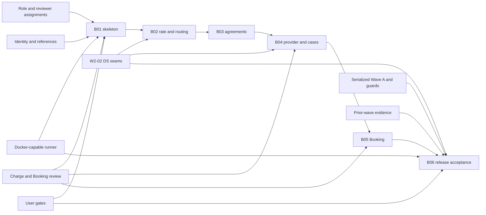

# External Dependency Map - W2-03 Charge Tariffs & Agreements

## Dependency Policy

Dependencies are drawn from `requirements.md`, `stories.md`, refined `mockups.md`, Application Design `components.md`, `unit-of-work.md`, `unit-of-work-dependency.md`, `unit-of-work-story-map.md`, and `team-practices.md`. Unknown owners/lead times remain unknown; this plan does not invent readiness, people, dates, cloud services or vendor commitments. A dependency blocks only the named gate/Bolt, not unrelated safe work.

## Gated Dependency Register

| ID | Dependency | Accountable owner role | Lead time / readiness | Blocks | Mitigation/workaround | Exit evidence |
| --- | --- | --- | --- | --- | --- | --- |
| ED-01 | System/human role assignments, capacity and independent review hats | Delivery lead + Product/value | Unknown; role plan exists, roster/capacity absent | Schedule commitment; any Bolt gate lacking review independence | Use engine-assigned AI roles for artifact/code work; WIP one; do not promise dates; pause gate if independence missing | Named or system-assigned owner matrix for active Bolt and reviewers. |
| ED-02 | Docker-capable runner/participant | Release-review/operations | Unavailable in current sandbox; lead time unknown | B01 live skeleton gate and all B06 live/guard/audit acceptance | Implement/test non-Docker-safe work; reserve authorized runner; never downgrade live obligation | Successful Docker access plus recorded runner/environment identity. |
| ED-03 | Serialized `linercore-wave-a` window and manager-demo safety | Release review | Must be reserved; no duration assumed | B01/B06 live sessions | Use wrapper only, env port 18088, pre/post guard; abort on guard failure | Both guard outputs, project/port manifest, no manager mutation. |
| ED-04 | W2-02 shared UI seams DS-01/DS-02/DS-03 | W2-02/shared UI owner; W2-03 Charge UX consult | DS-01 local wrapper permitted; DS-02/03 integration readiness unknown | Corresponding B02/B04/B06 accessibility/ribbon cells | Implement only permitted Charge-local DS-01; no shared CSS/fork; retain blocked evidence | Integrated shared seam tests or explicit unresolved blocking report. |
| ED-05 | Identity/session/service authorization availability | W0-01/identity owner + Charge/Booking security hats | Existing contract; live readiness verified at run time | B01/B02/B04/B05 live/auth tests and B06 | Unit/component security tests; fail closed; no browser actor authority | Allowed/denied/spoofed/service-identity live evidence. |
| ED-06 | Active stable reference identities and seeds | W0-02/reference owner + Charge domain | Existing OFR/BAF/THC/USD/customer/lane/location/equipment records expected; live seed readiness verified at run time | B01-B04 live/domain scenarios and B06 | Validate IDs through service; no duplicate master data; deterministic acceptance seed manifest | Reference API/seed IDs linked to commercial rows. |
| ED-07 | Bilateral Charge-provider and Booking-consumer review | Charge and Booking domain owners + architect/quality | Role-based; availability unknown | B01 contract slice, B04 completion, B05 completion | Synchronized OpenAPI/example/provider/Pact change set; stop on red | Explicit provider and consumer review records plus executable green evidence. |
| ED-08 | Legacy pricing/date/snapshot fixtures | Booking/Charge contract and data hats | Repository artifacts exist; completeness verified during B04/B05 | B04 v1 compatibility and B05 legacy decode; B06 regression | Add exact old fixtures without rewriting history; equal-date and partial-enrichment tests | Old/new provider and snapshot fixtures green. |
| ED-09 | Protected prior-wave evidence | Program/release-review owner | Existing; immutable governance input | B06 release completion | Read-only diff and regression; new proof stored separately | Evidence manifest shows W0/W1/W2 preservation and unchanged W1 waiver. |
| ED-10 | User approval gates | User | Interactive; no lead time assumed | B01 skeleton, Inception phase, B06 final release | Present exact evidence/options; no silent approval | AI-DLC audit record with exact selection. |

## Internal Critical Inputs (Not External Services)

| Input | Owner | Consuming Bolts | Rule |
| --- | --- | --- | --- |
| Charge V1-V4 migration chain | U01 data/migration owner | B01-B04/B06 | One authoring owner; later Units consume schema only. |
| Canonical pricing v1 | U04 Charge provider with bilateral review | B01/B04/B05/B06 | One endpoint/media type; additive compatibility; no alternate authority. |
| Booking typed snapshot codec/table | U05 Booking owner | B01/B05/B06 | Append-only, legacy dual-read, provider truth. |
| Charge page record | Charge UX owner | B02-B04/B06 | Charge-specific additions only; master/shared UI unchanged. |
| Evidence manifest | B06 release review | B06 | Links API/DB/UI/log/command results; no unobserved PASS. |

## Dependency-to-Bolt View

| Bolt | Required before gate | May remain pending after gate |
| --- | --- | --- |
| B01 | ED-01 role assignment, ED-05/06 test/live identities, ED-07 bilateral review; ED-02/03 required for live skeleton acceptance | ED-04 DS-02/03, full B06 evidence. |
| B02 | ED-01; ED-04 decisions for changed UI; ED-05/06 test identities | Docker live matrix may wait, but no live claim. |
| B03 | ED-01, ED-05/06, U01/U02 internal inputs | ED-02/03 full live acceptance. |
| B04 | ED-01, ED-04 for manual page, ED-05/06, ED-07, ED-08 | B06 full browser/performance/audits. |
| B05 | ED-01, ED-05, ED-07, ED-08 | B06 full cross-service live matrix. |
| B06 | ED-01-ED-10 as applicable; especially Docker/Wave A/shared UI/preserved evidence/user gate | Nothing required by W2-03 release may be silently deferred. |

## External Dependency Flow

Text fallback: role, Docker, service/reference and bilateral gates feed B01; W2-02 dependencies feed affected UI Bolts; Docker, Wave A safety, preserved history, shared UI and the user gate all feed final B06 acceptance.

## Escalation and Change Control

- If ED-02 remains unavailable, B01 cannot pass its live skeleton gate and B06 cannot start release acceptance; report the blocker rather than simulating Docker evidence.
- If ED-04 requires shared source changes, request W2-02 owner coordination or a scope decision; W2-03 does not self-authorize them.
- If ED-05/06 contracts require changes, use producer/consumer review and preserve W0 ownership.
- If ED-07 is unavailable, contract-bearing Bolts remain open even when local tests pass.
- If ED-09 detects historical mutation, restore governance truth before proceeding; never reinterpret the W1 waiver.
- Any production/cloud/vendor dependency is outside this local vertical slice and requires a new approved intent.

## Upstream Sources

- `requirements.md`
- `stories.md`
- refined `mockups.md`
- Application Design `components.md`
- `unit-of-work.md`
- `unit-of-work-dependency.md`
- `unit-of-work-story-map.md`
- `team-practices.md`

