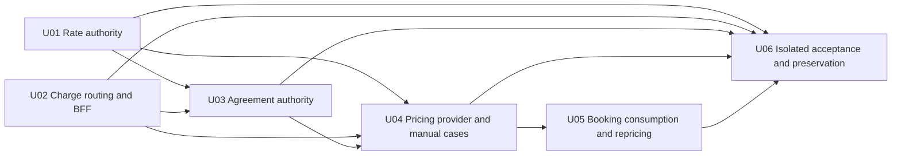

# Unit Dependency DAG - W2-03 Charge Tariffs & Agreements

## Topology Contract

This DAG mirrors the approved capability units in `unit-of-work.md` and the boundaries in Application Design `components.md`, `component-methods.md`, `services.md`, `component-dependency.md`, and `decisions.md`. Edges mean “the source unit depends directly on the named unit.” They express technical prerequisites only. This artifact does not select an economic build order, preferred topological ordering, Bolt sequence, or critical path; Delivery Planning owns those judgments using `requirements.md` and `stories.md` priorities.

## Machine-Readable Direct Edges

```yaml
units:
  - name: U01-rate-authority
    depends_on: []
  - name: U02-charge-domain-routing-bff
    depends_on: []
  - name: U03-agreement-authority
    depends_on: [U01-rate-authority, U02-charge-domain-routing-bff]
  - name: U04-pricing-provider-manual-cases
    depends_on: [U01-rate-authority, U02-charge-domain-routing-bff, U03-agreement-authority]
  - name: U05-booking-consumption-repricing
    depends_on: [U04-pricing-provider-manual-cases]
  - name: U06-isolated-acceptance-preservation
    depends_on: [U01-rate-authority, U02-charge-domain-routing-bff, U03-agreement-authority, U04-pricing-provider-manual-cases, U05-booking-consumption-repricing]
```

## Prose Edge Register

| Unit | Directly depends on | Why the dependency is direct |
| --- | --- | --- |
| U01 Rate Authority | none | Versioned rates can be proven through service/component/UI tests against existing reference/identity seams. |
| U02 Charge Domain Routing/BFF | none | Base path, nginx route, session/BFF and route-state foundation can be tested independently with existing health/module seams. |
| U03 Agreement Authority | U01, U02 | Agreements consume U01's exact approved rates and U01-owned V3 prepared schema, then render/command through stable Charge BFF/routes. |
| U04 Pricing Provider/Manual Cases | U01, U02, U03 | Provider consumes U01-owned V4 prepared schema, standalone rates and U03 agreements; manual evidence page uses stable Charge routes/BFF. |
| U05 Booking Consumption/Repricing | U04 | Booking consumes the canonical enriched provider/error contract and manual semantics implemented by Charge. |
| U06 Acceptance/Preservation | U01-U05 | Live proof/regression/audits observe all capability, routing, contract, Booking and failure surfaces together. |

## DAG Visualization



Text fallback: U01 and U02 are independent. U03 consumes both. U04 directly consumes U01, U02 and U03. U05 consumes U04. U06 consumes every capability unit for integrated acceptance.

## Integration Points Between Units

| Producer unit | Consumer unit | Integration point | Compatibility/verification rule |
| --- | --- | --- | --- |
| U01 | U03 | U01-owned V3 prepared schema plus `RateRepository`/approved version identities | Downstream consumes without migration rewrite; only Approved compatible links. |
| U01 | U04 | U01-owned V4 prepared schema plus approved rate candidate/Money types | Downstream consumes without migration rewrite; tariff requires exactly one OFR/BAF/THC. |
| U02 | U03/U04 | Charge base path, authenticated BFF helpers, reference lookup, route-state/error conventions | Session-derived actor, correlation, denied behavior, no shared shell/UI source changes. |
| U03 | U04 | Approved agreement-version query and exact rate links | Agreement-first, zero-only fallback, immutable attribution. |
| U04 | U05 | `pricing.v1.yaml`, examples, provider/Pact verification, standard errors | Existing v1 types retained; enriched success all-or-none; failure meanings preserved. |
| U04 | U06 | Charge APIs/DB/manual evidence/correlation | Known/tariff/no-rate/ambiguity scenario fixtures and terminal receipt/case evidence. |
| U05 | U06 | Booking API/DB/BFF/UI snapshot and manual/outage evidence | Field-for-field itemisation, append-only history, no fabricated total. |
| U02 | U06 | Nginx 18088 route and demo guard boundary | Deep-link/assets/BFF/reload tests; port 8088 untouched. |

## Mechanically Independent Sets

The DAG has one antichain at its source: `{U01-rate-authority, U02-charge-domain-routing-bff}`. The absence of an edge means neither is a technical prerequisite of the other; it is not a recommendation to start, sequence, staff, or run them concurrently. Delivery Planning decides how to interpret this mechanically available parallelism using economic criteria.

No downstream independence claim is recorded at unit level. Component relationships inside a unit are implementation details for that unit's later Construction pass and are not sequencing decisions in this stage.

## Cycle and Ownership Verification

- Every YAML unit name appears exactly once and every dependency is declared.
- No unit depends on itself.
- Edges flow from independent Charge authority/routing capabilities into agreement/provider/consumer/acceptance; no downstream edge points back.
- No unit introduces a new deployable or shared database.
- U02 owns only Charge domain routing/BFF integration, not shared shell/navigation/design-system source.
- U06 observes previous units and does not become a product runtime dependency.

## Upstream Sources

- Application Design: `components.md`, `component-methods.md`, `services.md`, `component-dependency.md`, `decisions.md`
- Requirements Analysis: `requirements.md`
- User Stories: `stories.md`
