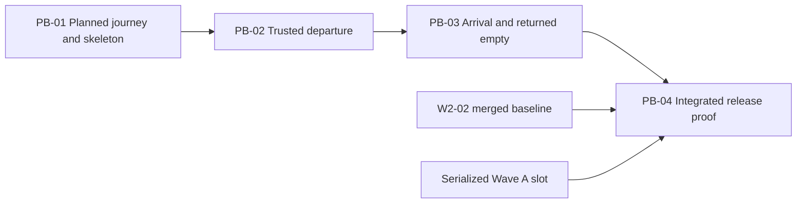

# Prioritized Intent Backlog - W2-04 Container Journey and Track-Trace

## Prioritization method

This proto-backlog decomposes the vertical outcome in `intent-statement.md`
while honoring `feasibility-assessment.md` and `constraint-register.md`. All
four items are Must Have; priority expresses risk and dependency order, not a
license to ship an incomplete subset.

The ordering uses a risk-first walking skeleton and ordinal value/risk/size
rationale. Numeric WSJF or RICE would fabricate reach, duration, staffing, or
cost inputs that the initiative has not supplied. Each proto-item carries the
domain, persistence, contract, UI, and evidence needed to demonstrate its user
outcome; these are not separate horizontal backlog items.

## Ordered proto-backlog

### PB-01 - Open the planned journey and prove the bidirectional skeleton

**Outcome:** From one real confirmed booking, the equipment-control clerk can
open one Container Movement journey, see expected POL LOAD and POD DISC, record
the first legal GTOT, and customer service can observe the resulting status on
Booking.

- **Value:** First trustworthy view of plan plus actual progress.
- **Risk reduced:** Existing seam adoption, additive data evolution, DCSA-to-wire
  mapping, atomic state/outbox, Booking projection, and minimal UI mount.
- **Dependencies:** W0/W1 foundations and frozen contracts.
- **Included proof:** Real broker/database/broker/Booking path, denied access,
  one invalid out-of-sequence attempt, and focused UI/API/contract tests.
- **Relative size:** Medium; it crosses the full path but enables every later
  item.
- **Priority:** 1 - walking skeleton and highest multiplier.

### PB-02 - Complete departure with trusted duplicate/sequence handling

**Outcome:** The clerk records GTOT then LOAD against the plan, sees Allocated,
Gated-out, and In-transit progression, and can recover from actionable duplicate
or sequence validation without losing entered data.

- **Value:** Departure operations can distinguish plan, actual movement, and
  invalid input.
- **Risk reduced:** Aggregate lifecycle invariants, idempotency, occurrence
  ordering, audit observability, and repeated status projection.
- **Dependencies:** PB-01.
- **Included proof:** Legal departure, exact duplicate, sequence violation,
  unchanged-state/outbox/Booking assertions, and list/detail/timeline states.
- **Relative size:** Medium.
- **Priority:** 2 - deepens the highest-integrity domain behavior.

### PB-03 - Complete discharge and returned-empty lifecycle

**Outcome:** The clerk records DISC and GTIN, sees Discharged then
Returned-empty, and customer service sees the same final progression on Booking.

- **Value:** Completes the thin operational lifecycle rather than stopping at a
  departure demo.
- **Risk reduced:** Arrival/empty semantics, expected-versus-actual completion,
  repeated event publication, final projection, and restart durability.
- **Dependencies:** PB-02.
- **Included proof:** Full GTOT -> LOAD -> DISC -> GTIN sequence, replay/stale
  handling, expected milestone reconciliation, and completed timeline/Booking
  view.
- **Relative size:** Small to medium because it reuses the proven path while
  adding final-state rules.
- **Priority:** 3 - completes business value after the risk-first core.

### PB-04 - Synchronize the operational experience and earn release evidence

**Outcome:** Equipment control and customer service use the W2-02-aligned shared
shell, and the release reviewer can reproduce the complete live journey and its
rejections without disturbing the manager demo.

- **Value:** Makes the full slice accessible, supportable, and releasable.
- **Risk reduced:** Shared UI drift, responsive/accessibility gaps, concurrent
  acceptance contamination, and false-PASS evidence.
- **Dependencies:** PB-03, W2-02 merged to integration, serialized Wave A stack
  slot.
- **Included proof:** All required UI states and viewport/theme evidence,
  pre/post demo guards, isolated Compose manifest, broker-to-database-to-Booking
  capture, both audits, and unchanged W1 history.
- **Relative size:** Medium due integration synchronization and evidence breadth.
- **Priority:** 4 - final dependency-bound release outcome, not a separate test
  layer.

## Dependency map

Text fallback: PB-01 enables PB-02, which enables PB-03, which enables PB-04.
PB-04 also waits for the W2-02 merged baseline and the serialized Wave A
acceptance slot.

## Backlog-wide Definition of Done

An item is not complete because one layer or test suite passes. Its named user
outcome must be observable through the real owned seams, with migrations,
contracts, domain rules, UI, authorization, rejection behavior, and evidence
appropriate to that increment. Final intent completion additionally requires all
eight success criteria in `scope-document.md`.

## Won't Have backlog

EDI ingestion, public DCSA APIs, multi-leg/transshipment, fleet/depot/M&R,
D&D, predictive ETA, shared-shell or `packages/ui` redesign, public cloud
topology, and vendor procurement remain outside PB-01 through PB-04. They are
not hidden prerequisites or stretch goals.
