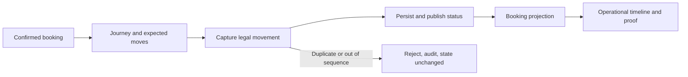

# Scope Document - W2-04 Container Journey and Track-Trace

## Scope decision

The minimum valuable release is the complete thin journey approved in
[`intent-statement.md`](../intent-capture/intent-statement.md), subject to the
proceed conditions in [`feasibility-assessment.md`](../feasibility/feasibility-assessment.md)
and the binding [`constraint-register.md`](../feasibility/constraint-register.md).
It begins with one real confirmed booking and ends with one trustworthy,
observable container lifecycle in Container Movement and Booking.

This is thin by variation, not by layer. One booking, one assigned container,
one leg, two expected milestones, four DCSA equipment-event codes, ACT only,
and two roles are enough. The event seams, persistence, rejection behavior,
Booking projection, operational UI, and live acceptance stay together because
removing any of them would make the outcome untrustworthy or unobservable.

## Primary value stream

Text fallback: Booking confirmation creates or reconciles the journey and its
expected moves. The clerk captures the next legal movement. Acceptance commits
state and publication; Booking consumes the status; both operational views show
the result. Duplicate or out-of-sequence input is rejected, audited, and leaves
the journey and Booking projection unchanged.

## In scope

### Journey initiation and planning

- Consume the established Schema-Registry-valid `booking.confirmed` event.
- Authorize and idempotently create or reconcile one journey for the assigned
  ISO 6346 equipment reference.
- Validate stable routing/reference identifiers.
- Derive and persist expected LOAD at POL and DISC at POD for one leg.

### DCSA movement capture and lifecycle

- Represent equipment event code, ACT classifier, laden/empty indicator,
  UN/LOCODE, equipment reference, occurrence time, actor, source, and
  correlation in explicit domain language.
- Accept only the thin GTOT -> LOAD -> DISC -> GTIN sequence.
- Transition Allocated -> Gated-out -> In-transit -> Discharged ->
  Returned-empty.
- Reject duplicates and out-of-sequence moves with stable, actionable responses,
  audit evidence, preserved user input, and no incorrect state change.

### Publication and Booking consumption

- Commit each accepted movement, lifecycle state, audit record, and outgoing
  status through the established transactional/outbox boundary.
- Publish the producer-owned `containermovement.status` contract without
  renaming its `moveCode` wire field or changing its envelope meaning.
- Consume, match, deduplicate, classify stale/applied outcomes, persist, and
  render the status in Booking.

### Container Movement-owned experience

- Compose only the canonical Container Movement list, detail, timeline, and
  manual-capture form inside the shared authenticated shell.
- Show expected and actual moves together, with code plus readable label,
  occurrence/location/provenance detail, current lifecycle state, and a
  collapsed audit surface.
- Provide populated, loading, empty, error/retry, denied, validation, success,
  keyboard-focus, light/dark, and 375/768/1024/1440 evidence.
- Record page-specific additions only in
  `design-system/linercore/pages/container-movement.md`.

### Live acceptance

- Run the isolated `linercore-wave-a` project through
  `scripts/wave-a-compose.mjs`, with one serialized stack controller.
- Run `npm run demo:guard` before and after to protect the manager demo at port
  8088.
- Prove broker -> Container Movement database -> status broker -> Booking
  database -> Booking UI, plus duplicate and sequence rejection.
- Run targeted quality/contract checks, Playwright, `aidlc-audit`, and
  `erp-fidelity-audit` with DCSA detected at the real code seams.

## Out of scope - Won't Have in W2-04

| Capability | Owning future boundary |
|---|---|
| Terminal, depot, partner, or carrier EDI ingestion | P2-05 |
| Public customer DCSA Track & Trace / Open Host API | P2-02 |
| Multi-leg or transshipment routing | P2-04 |
| Broad fleet ownership, lease, condition, or registry behavior | P3-03 where applicable |
| Depot stock/inventory | Separate depot/inventory intent |
| Maintenance and repair workflows | M&R owner |
| D&D calculation or classification | D&D owner |
| Shared shell, tokens, primitives, navigation, authentication, typography, or palette redesign | W2-02 / shared UI owners |
| Predictive ETA, IoT/reefer telemetry, public tracking portal, or suite procurement | Future approved intent |

These items cannot enter through implementation convenience. A request is
routed to its owner or handled through an approved scope change.

## MoSCoW boundary

**Must Have:** every in-scope capability and live-evidence condition above. They
form one usable and verifiable vertical slice.

**Should Have:** none beyond the approved slice. Useful refinements must first
show that they are required to satisfy an existing Must.

**Could Have:** none in this intent. Capacity is reserved for correctness,
integration, accessibility, and evidence rather than adjacent features.

**Won't Have:** every capability in the explicit exclusion table.

## Dependencies and sequencing constraints

The work uses the common W0/W1 foundations and preserves the separate verified
W1 PASS, historical waiver, and original BLOCKED evidence. It may progress on
owned backend and page composition while W2-02 proceeds, but final visual/live
acceptance waits for W2-02 to merge and for W2-04 to synchronize with
integration. W2-03 is parallel and disjoint. Only one Wave A session may hold
the live acceptance stack.

Within those constraints, delivery is risk-first and walking-skeleton-first:
prove both real event seams and state integrity early, then deepen the lifecycle,
complete the operational experience, synchronize, and run final acceptance.
Numeric WSJF/RICE is not used because no defensible reach, cost, duration, or
staffing inputs were supplied.

## Measurable success criteria

1. One confirmed booking with one assigned container creates or reconciles
   exactly one persisted journey and exactly two expected moves: POL LOAD and
   POD DISC.
2. GTOT, LOAD, DISC, and GTIN ACT movements are accepted only in legal order and
   produce the five stated lifecycle states.
3. A repeated movement and at least one out-of-sequence movement return stable
   outcomes, create audit evidence, and do not advance journey state, create an
   incorrect outbox event, or advance Booking.
4. Every accepted movement yields a schema-valid `containermovement.status` and
   one applied Booking projection; replay is observed as duplicate/stale rather
   than a second progression.
5. Container Movement and Booking render the same current progression, and the
   Container Movement timeline distinguishes expected from actual milestones.
6. All required UI states, keyboard behavior, themes, and four viewport widths
   have Playwright evidence after W2-02 synchronization.
7. Demo guards pass before and after isolated live acceptance; targeted tests,
   contract gates, `aidlc-audit`, and `erp-fidelity-audit` are green.
8. The historical W1 waiver and BLOCKED manifest remain unchanged and are never
   presented as a real PASS.

No unsupported completion date, budget, capacity, throughput, or external
market-size target is part of this scope.
