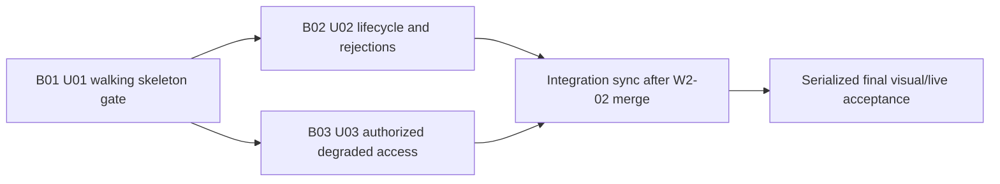

# Bolt Plan - W2-04 Container Journey & Track-Trace

## Source Alignment

The plan sequences the behaviors in `requirements.md` and `stories.md`, uses
the interaction states in refined `mockups.md`, preserves the boundaries in
application `components.md`, and implements the units in `unit-of-work.md`.
Hard ordering comes only from `unit-of-work-dependency.md`; coverage comes from
`unit-of-work-story-map.md`; branch, walking-skeleton, and acceptance rules come
from `team-practices.md`.

## Sequencing Contract

Use hybrid walking-skeleton-first, then risk/value sequencing. B01 is the first
gated Bolt because both other units depend on U01 and PB-01 is the affirmed
walking skeleton. After B01 approval, B02 and B03 implementation may execute
concurrently because the DAG contains no edge between them. Their isolated live
Compose checks are serialized under one stack controller.

Text fallback: B01 completes and is approved first. B02 and B03 may then run in
parallel. Both must complete before W2-04 synchronizes the post-W2-02 integration
baseline and enters one serialized final acceptance gate.

## B01 - PB-01 Journey-to-Booking Walking Skeleton

**Unit:** U01 PB-01 Journey-to-Booking Walking Skeleton.

**Walking skeleton:** Yes. It crosses ordered Flyway migration, real
`booking.confirmed`, CMM domain/database/API/UI, GTOT status outbox/Kafka,
Booking receipt/projection/UI, Identity authorization, contracts, and one exact
`OUT_OF_SEQUENCE_MOVEMENT` response.

**Definition of Done:** The complete U01 live DoD in `unit-of-work.md` passes,
including existing-W1 upgrade/backfill/restart/forward-repair, valid/replayed/
invalid intake, seq-0/seq-1 status, Booking display within 30 seconds, and
unchanged-state rejection evidence. Fast Java/frontend, contract, migration,
and focused Playwright checks pass alongside the code. A separate user gate
accepts B01 before dependent Bolt work is considered complete.

**Confidence hypothesis:** If B01 ships, the real contract and transaction
spine works without placeholder publishers, direct database shortcuts, cached
authorization, or shell/UI ownership violations, and later lifecycle/access
increments can safely evolve it.

**Expected demo:** Confirm one real booking, inspect the Allocated plan, capture
GTOT, observe CMM Gated-out and Booking latest progress, then submit DISC and
observe exact rejection with stable accepted-state hashes/counts.

## B02 - Ordered Lifecycle and Observable Rejections

**Unit:** U02 Ordered Lifecycle and Observable Rejections.

**Walking skeleton:** No; it extends the accepted B01 spine.

**Definition of Done:** The complete U02 live DoD passes: LOAD/DISC/GTIN reach
Returned-empty with sequence 2-4; capture validation, pending/success,
duplicate, and out-of-sequence UI/API states are explicit; outbox restart and
stale-worker fencing avoid double publication; Booking receipts classify
applied, duplicate, stale, legacy-0, and unassigned/invalid outcomes and show
pending/applied/retry/degraded presentation. Tests and evidence travel with the
production behavior.

**Confidence hypothesis:** If B02 ships, CMM and Booking remain ordered,
idempotent, contract-true, and operator-actionable across the complete thin
lifecycle, invalid input, manual conflicts, and transport redelivery.

**Expected demo:** Continue the B01 journey through LOAD/DISC/GTIN, compare
broker/database/UI sequences, exercise validation and both 409 codes, restart
publication/consumption, and inspect Booking disposition receipts.

## B03 - Authorized Degraded Journey Access

**Unit:** U03 Authorized Degraded Journey Access.

**Walking skeleton:** No; it consumes the real U01 persisted journey and
protected routes but does not depend on U02 lifecycle depth.

**Definition of Done:** The complete U03 live DoD passes: Equipment Control and
Customer Service read the journey; read-only direct/deep-link capture returns
403 `CMM_AUTHORIZATION_DENIED` with no mutation; Identity outage fails fresh
read/capture closed; after fresh Identity authorization, Reference Data outage
allows an explicitly degraded persisted read and disables capture. Required CMM
loading/empty/not-found/error/denied/degraded states are accessible in the
shared shell.

**Confidence hypothesis:** If B03 ships, least privilege and dependency failure
semantics remain safe and useful without cached authorization, request-actor
fallbacks, or mutation when capture validation authority is unavailable.

**Expected demo:** Compare Equipment Control and Customer Service, prove a
denied direct capture leaves DB/broker/Booking unchanged, stop Identity and
observe fail-closed routes, restore Identity/stop Reference Data and observe
last-known persisted read with capture disabled.

## Parallelism and Live-stack Control

- W2-02, W2-03, and W2-04 AI-DLC sessions may remain concurrent at program level.
- Within W2-04, B01 is gated first; B02 and B03 implementation may then run concurrently.
- Only one session at a time may control `linercore-wave-a`; every Bolt live check and final gate reserves the slot explicitly.
- No command targets or disturbs the manager demo on port 8088.
- W2-02 merges first. Before W2-04 final visual/live acceptance, synchronize with the integration baseline and resolve conflicts without overwriting merged work.
- W2-03 remains informed about timing; it is not a W2-04 code or acceptance prerequisite.

## Post-Bolt Intent Exit Gate

After all Bolt DoDs and B01's explicit gate, run the global UI viewport/theme/
keyboard/a11y matrix and full broker-to-CMM-database-to-CMM-UI-to-status-broker-
to-Booking-database/UI scenario on isolated `linercore-wave-a` through
`scripts/wave-a-compose.mjs`. Run `npm run demo:guard` before and after,
`aidlc-audit`, and `erp-fidelity-audit`. Preserve W1 BLOCKED/waiver history and
later PASS as distinct records. This gate is not a fourth test-only Bolt.

## Branch and Merge Protocol

- Work remains on `intent/W2-04-container-journey-track-trace`, preserving the common Wave A baseline and prior merged intents.
- Fast checks and non-conflicting code work may proceed before W2-02 lands.
- W2-02 must merge first; W2-04 then synchronizes the designated integration branch before final visual/live acceptance.
- Contract and Booking changes require their bounded owners' co-review; only Container Movement page composition is owned here.
- Merge readiness requires the post-Bolt Exit Gate, not merely completed code or unit tests.

