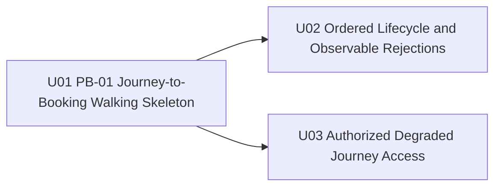

# Unit Dependency Topology - W2-04 Container Journey & Track-Trace

## Source Alignment

This topology mirrors the boundaries in `components.md`, contracts in
`component-methods.md`, flows in `services.md`, verified architecture edges in
`component-dependency.md`, and ADR constraints in `decisions.md`. It preserves
the complete FR/NFR coverage in `requirements.md` and US-01 through US-09 in
`stories.md`. `unit-of-work.md` is the authoritative unit definition; this file
describes dependency geometry only.

## Dependency DAG



Text fallback: U02 and U03 each depend on U01 and have no dependency on each
other. U01 has no unit dependency. The graph is acyclic.

```yaml
units:
  - name: U01-pb01-journey-to-booking-walking-skeleton
    depends_on: []
  - name: U02-ordered-lifecycle-and-observable-rejections
    depends_on: [U01-pb01-journey-to-booking-walking-skeleton]
  - name: U03-authorized-degraded-journey-access
    depends_on: [U01-pb01-journey-to-booking-walking-skeleton]
```

### Direct Edge Rationale

| Dependent | Depends on | Hard prerequisite only |
| --- | --- | --- |
| U02 | U01 | Remaining LOAD/DISC/GTIN and duplicate recovery require the same persisted journey, typed capture result, status contract, Booking ordering projection, and operator surfaces first exercised by PB-01. |
| U03 | U01 | Authorization/degraded access requires one real persisted journey and protected list/detail/capture seams, but it does not require the completed four-event lifecycle. |

No edge represents business priority, team availability, merge preference, or
a proposed implementation sequence.

## Integration Points

| Integration point | Units | Contract/mechanism | Dependency implication |
| --- | --- | --- | --- |
| Booking -> CMM journey intake | U01 | Real `booking.confirmed` on `booking.events`, Schema Registry Avro/AsyncAPI/Pact | U01 establishes and proves the contract-true journey identity and one-leg plan used later. |
| CMM internal atomic write | U01-U03 | Journey snapshot + request/attempt/movement or rejection/audit + outbox in one CMM transaction | U02 extends U01's established schema; U03 proves denied/degraded attempts do not mutate it. |
| CMM -> Booking status | U01-U02 | `containermovement.status` through fenced outbox/Kafka and Booking receipt/projection | U01 establishes seq 0/1; U02 completes 2-4 and recovery/dispositions. |
| CMM web -> CMM API | U01-U03 | Authenticated REST list/detail/capture and explicit 409 results | Each unit exposes and proves its added operational behavior. |
| Booking projection -> Booking UI | U01-U02 | Booking-owned database/read API/detail component | U01 shows GTOT; U02 completes ordered statuses and dispositions. |
| Identity and Reference Data | U01, U03 | Existing service APIs and exact entitlement keys | U01 proves positive authorization; U03 proves least-privilege/down-state behavior. |

## Parallel Development Opportunities

U02 and U03 are mutually independent after U01: lifecycle/publication depth and
authorization/degraded access share the walking-skeleton seam but neither
requires the other's behavior. Inside a unit,
contract-owner and consumer-owner work may proceed concurrently behind the
same versioned contract, and CMM UI composition may proceed alongside CMM
backend work against the agreed REST types. These are implementation work
streams, not additional units and not permission to merge or accept a layer in
isolation. Delivery Planning may choose any economic batching consistent with
the hard edges above.

## Topology Verification

- Every unit is declared exactly once in the YAML mirror.
- Every dependency target is declared.
- There are no self-dependencies or cycles.
- Every edge is a hard prerequisite, not an implementation-order preference.
- Every cross-module edge names a real contract and preserves provider/consumer ownership.
