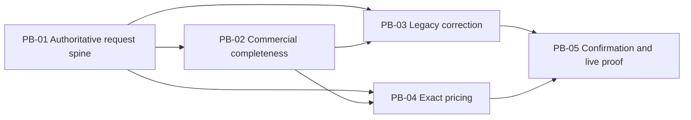

# Prioritized Intent Backlog — W3-04 Booking Request Completeness

## Purpose and Inputs

This is a proto-Unit backlog for later refinement in User Stories, Application Design, and Units Generation. It is governed by `intent-statement.md`, the Conditional GO in `feasibility-assessment.md`, and the release conditions in `constraint-register.md`. It does not authorize layer-only units or implementation before later gates.

Sequencing heuristic: **risk-first within dependency order**. Priority combines user value, time criticality, risk reduction, and job size qualitatively; dependency validity overrides a superficially higher score.

## Backlog Summary

| Order | ID | Vertical increment | MoSCoW | Value | Risk reduction | Relative size | Depends on |
|---:|---|---|---|---|---|---|---|
| 1 | PB-01 | Authoritative request spine | Must | High | Very high | M | Closed W0-02/W1-01/W2-02 |
| 2 | PB-02 | Commercial request completeness | Must | Very high | High | M | PB-01 |
| 3 | PB-03 | Legacy incomplete-to-corrected journey | Must | High | Very high | M | PB-01, PB-02 |
| 4 | PB-04 | Exact quantity/date-aware pricing journey | Must | Very high | High | M | PB-01, PB-02 |
| 5 | PB-05 | Compatible confirmation and live operational proof | Must | Very high | Very high | L | PB-01–PB-04 |

Optional-field capture is included in PB-02 and is not a separate “nice-to-have” unit. Accessibility, responsive behavior, error recovery, tests, contracts, observability, and live evidence travel with every increment and converge in PB-05; they are not horizontal backlog items.

## PB-01 — Authoritative Request Spine

**Outcome:** A booking user creates and reopens one FCL-dry draft with canonical POL/POD, POL-local requested departure, a selected voyage showing authoritative carrier number/ETD/ETA/cargo cutoff/documentation deadline, and one equipment type × positive quantity with no physical identifier.

**Vertical path:** shared-shell UI → BFF/API → Booking domain → versioned persistence → live Reference Data OHS/contribution → reopened Booking detail.

**Scope**

- Replace quantity-one/physical-ID creation invariant with request semantics while preserving later assignment compatibility.
- Add authoritative Shared Platform voyage cutoff/deadline fields across typed model, validation, OHS/event fixtures, and seeds.
- Persist requested-versus-derived schedule provenance and display read-only derived facts.
- Include loading, denied, invalid/stale/degraded reference, save retry, success, keyboard/focus, and responsive behavior relevant to this path.

**Confidence hypothesis:** If PB-01 works live, the two highest feasibility uncertainties—schedule authority and no-ID equipment quantity—are resolved before broader field and contract investment.

**Exit evidence:** Create/reopen quantity >1 with no ID; derived schedule matches live voyage; stale/degraded voyage behavior preserves input; no new infrastructure service.

## PB-02 — Commercial Request Completeness

**Outcome:** The user completes, validates, saves, and reopens the full approved party/customer and cargo baseline, with optional values preserved but non-blocking.

**Vertical path:** shared-shell commercial form/detail → BFF/API → typed Booking model/completeness rules → versioned persistence → live party/commodity validation → correction/success states.

**Scope**

- Booking customer/party, customer booking reference, required shipper, optional consignee/notify party.
- Cargo description, canonical commodity, package count/type, gross weight/unit, optional volume/unit.
- One frozen mapping/validation dictionary across all representations.
- Invalid/stale canonical references block confirmation while preserving entered values.
- PII-linked data minimization, masking, authorization, and audit evidence.

**Confidence hypothesis:** If PB-02 works live, the request is commercially usable and its owned/reference facts remain coherent end to end.

**Exit evidence:** Full required/optional round-trip; optional blank values do not block; required missing/invalid facts do block; no PII leakage in errors/log evidence.

## PB-03 — Legacy Incomplete-to-Corrected Journey

**Outcome:** A pre-W3-04 record reopens without invented data, shows exactly what is incomplete, preserves authoritative legacy facts, accepts corrections through the same governed request experience, and becomes confirmable only when complete.

**Vertical path:** old snapshot read → versioned codec/upcast → domain completeness classification → API/detail correction UI → save/reload → migration ledger and operational diagnostics.

**Scope**

- Next snapshot version and additive/rolling-compatible schema behavior.
- Restartable/idempotent authoritative upcast, unknown-attribute preservation, explicit incomplete reasons.
- Correction actions, concurrent conflict handling, and confirmation blocking.
- Representative migration corpus and rollback/retry/telemetry evidence.

**Confidence hypothesis:** If PB-03 works, W3-04 can ship without corrupting, hiding, or fabricating existing bookings.

**Exit evidence:** Representative W1 records classify deterministically, preserve data, correct successfully, and record migration outcomes without sensitive payloads.

## PB-04 — Exact Quantity/Date-Aware Pricing Journey

**Outcome:** The user prices the complete request and sees an itemised quote based on the exact selected party, commodity, ports, equipment type, requested date, and quantity.

**Vertical path:** Booking price action → BFF/API → completeness/authorization → exact `pricing.request` → live Charge provider → persisted pricing basis → Booking detail/retry states.

**Scope**

- Typed mapping and repricing triggers; no generic-attribute-only or guessed defaults.
- Existing pricing error matrix: bad request, validation/commodity ineligible, no rate, timeout/unavailable, manual fallback policy.
- Idempotency, duplicate action protection, retry/circuit behavior, input preservation, and correlation tracing.
- Quantity-scaled itemised response and stored pricing basis.

**Confidence hypothesis:** If PB-04 works, commercial completeness produces trustworthy money rather than merely more form fields.

**Exit evidence:** Pact/provider and live captured request match; quantity >1 scales charges; each failure maps to approved user recovery without losing input.

## PB-05 — Compatible Confirmation and Live Operational Proof

**Outcome:** The user confirms a complete priced request, CMM consumes the compatible full routing/equipment state without a fabricated identifier, and Booking detail shows the final request, schedule snapshot, pricing basis, status, and recovery history.

**Vertical path:** confirm action → server revalidation/completeness/conflict/idempotency → Booking state/persistence/outbox → Kafka/Avro `booking.confirmed` → live CMM consumption → shared-shell operational record and program audits.

**Scope**

- Confirmation snapshot, duplicate-submit and optimistic-conflict behavior.
- BACKWARD schema/serde and optional `equipmentId`; no party/cargo widening.
- Full negative/degraded/success matrix across the complete journey.
- Keyboard/focus/live regions, reduced motion, and breakpoint evidence at 375/390/768/1024/1440.
- Same-run live Compose manifest, contract/accessibility gates, `aidlc-audit`, and `erp-fidelity-audit`.

**Confidence hypothesis:** If PB-05 passes, W3-04 has delivered a trustworthy vertical capability rather than disconnected layer changes.

**Exit evidence:** Complete live create → reload → invalidate/correct → price → confirm → event consume/detail path; all required audits green.

## Dependency Graph

Text fallback: PB-01 enables PB-02; PB-01 and PB-02 enable both PB-03 and PB-04; PB-03 and PB-04 jointly enable PB-05.

## Coverage Matrix

| Scope capability | PB-01 | PB-02 | PB-03 | PB-04 | PB-05 |
|---|:---:|:---:|:---:|:---:|:---:|
| Requested vs derived schedule | Primary | — | Migration | Pricing date | Confirm snapshot |
| Quantity with no physical ID | Primary | — | Migration | Pricing quantity | Event proof |
| Parties/customer reference | — | Primary | Migration | Pricing party | Confirm completeness |
| Cargo/commodity/packages/weight/volume | — | Primary | Migration | Pricing commodity | Detail/event boundary |
| Legacy safe upcast/correction | — | Completeness rules | Primary | — | Confirm block proof |
| Exact live pricing | — | Basis | — | Primary | Persisted final basis |
| Compatible confirmation/CMM | Contract guard | Boundary guard | Completeness guard | Price prerequisite | Primary |
| UI states/a11y/responsive | Per-path | Per-path | Per-path | Per-path | Full convergence |
| Live/audit exit | Partial proof | Partial proof | Partial proof | Partial proof | Final same-run proof |

No approved capability is unassigned, and no proto-backlog item is layer-only.

## Change-Control Queue

The following are rejected from this backlog unless a gate reopens scope: SI/eBL, multi-leg, reefer/DG/OOG, physical assignment, amendments/reconfirmation, cancellation, rolls/splits, allocation, non-USD, special equipment, external portal/marketplace, new AWS/cloud services, and program geography/residency decisions.

## Backlog Readiness Criteria

- Requirements Analysis turns each proto-increment’s terms into measurable, uniquely identified requirements.
- User Stories describe end-to-end user/system behavior and all negative/degraded states.
- Application Design owns the field/mapping/contracts without introducing layer-only delivery.
- Units Generation may merge or split proto-increments only if the dependency graph, verticality, full coverage, and approval-gated boundary remain intact.
