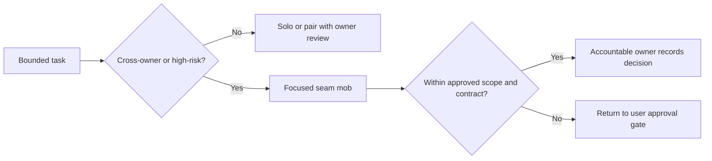

# Mob Composition — W3-04 Booking Request Completeness

## Composition basis

The collaboration model implements the vertical scope in `scope-document.md`, the dependency order in `intent-backlog.md`, and the Conditional GO controls in `feasibility-assessment.md`. It is a role composition, not a claim that named people or capacity are already assigned.

## Core Booking delivery cell

The persistent stream-aligned cell is intentionally small:

- Booking product owner or user delegate — outcome, field semantics, acceptance and gates.
- Booking technical/domain owner — end-to-end technical accountability.
- Booking frontend/BFF engineer — shared-shell interaction and transport boundary.
- Booking backend/domain engineer — aggregate, completeness, orchestration and contracts.
- Booking data/migration engineer — versioned persistence and legacy correction.
- Quality engineer — vertical test design, contract evidence, migration evidence, accessibility and live exit.
- Delivery facilitator — dependency, decision and capacity coordination.

UX, Shared Platform, Charge, CMM, LinerCore/W2-02, security/privacy/compliance, and operations participate through focused seam sessions and reviews rather than permanent shared ownership.

## Focused seam mobs

| Session | Trigger and objective | Required roles | Expected output | Exit condition |
|---|---|---|---|---|
| A. Field dictionary and voyage authority | Before PB-01/Requirements freeze; resolve typed commercial and requested/derived schedule semantics | Product, Booking domain, Shared Platform, architect, QA, privacy reviewer | One approved field/authority/validation dictionary and typed cutoff/deadline ownership | No ambiguous name, unit, requiredness, authority or temporal meaning |
| B. Equipment request and migration | Before PB-01/PB-03 commitment; remove physical-ID/quantity-one assumptions safely | Booking domain, data/migration, frontend/BFF, QA, operations | Versioned request model, compatibility/upcast strategy, representative migration proof plan | Positive quantity/no-ID and old records have deterministic behavior |
| C. Exact pricing contract | Before PB-04 commitment; freeze exact mapping and failures | Booking integration, Charge owner, product, contract QA | Bilateral mapping, repricing triggers, Pact/provider cases, recovery matrix | No guessed/default commercial basis; provider window accepted |
| D. Compatible confirmation | Before PB-05 commitment; preserve downstream compatibility | Booking integration, CMM owner, contract QA, security/privacy | Minimal BACKWARD event decision and consumer proof plan | Full routing/quantity, absent unassigned ID, no party/cargo leakage |
| E. UI state and design-system review | At each UI-bearing stage and before implementation; govern one-shell behavior | Product, UX, frontend/BFF, LinerCore owner, accessibility QA | Approved page behavior, state matrix, shared-vs-page ownership, responsive/a11y evidence plan | No second shell/local theme; shared changes have W2-02 approval |
| F. Live exit proof | Before PB-05 completion; execute same-run operational evidence | Booking cell, Shared/Charge/CMM as needed, QA, operations, security | Compose evidence manifest, traces/contracts/audits and defect decisions | Full journey and required audits are green |

## Solo and pair work policy

- Use solo execution for bounded, well-understood tasks with an explicit owner, reviewed contract, and required automated evidence.
- Use pairing when changing a high-risk invariant, migration path, provider/consumer mapping, shared UI primitive, privacy control, or production-operational behavior.
- Escalate to the focused mob when a decision crosses ownership boundaries or invalidates an approved artifact.
- Never use solo implementation to silently decide Shared Platform, Charge, CMM, LinerCore, scope, or exit-gate policy.

## Async-first operating rhythm

1. Decisions, proposals, mappings, and evidence are written in the intent record or governed repository artifact before review.
2. Synchronous sessions are reserved for the focused seams above, unresolved conflicts, and approval gates.
3. Each session has a decision owner, pre-read, bounded agenda, recorded outcome, dissent/risks, and follow-up owner.
4. Unknown time zones are handled by asynchronous review windows; no co-location assumption is made.
5. Delivery Planning records actual locations, overlap windows, response expectations, and escalation paths after the roster is named.

## Decision and escalation flow

Text fallback: bounded work proceeds solo or paired with owner review; cross-owner or high-risk work goes to a focused seam mob; accountable owners record decisions within approved boundaries, while changes to scope or binding contracts return to a user approval gate.

## Participation and capacity rules

- A named person may cover multiple compatible roles only when Delivery Planning verifies capacity, conflict-of-interest separation, and backup coverage.
- Critical seam reviews must be scheduled before dependent work is committed, not requested after implementation.
- Contributors are released after their accepted contract/evidence obligation; they do not become permanent co-owners of Booking.
- Missing required participation blocks the dependent proto-increment and triggers replanning or an approval-gated scope decision.
- External support remains unnecessary unless the skill matrix later proves a gap that existing teams cannot remediate.

## Mob readiness checklist

- Named facilitator, accountable decision owner, participants, backups and review window.
- Relevant approved artifacts and exact contract/version loaded.
- Decision question, non-negotiable constraints, and evidence standard stated.
- Sensitive data excluded from examples, logs, and diagnostics.
- Outcome written, owners assigned, dependency graph updated if needed, and any scope impact routed to a user gate.

