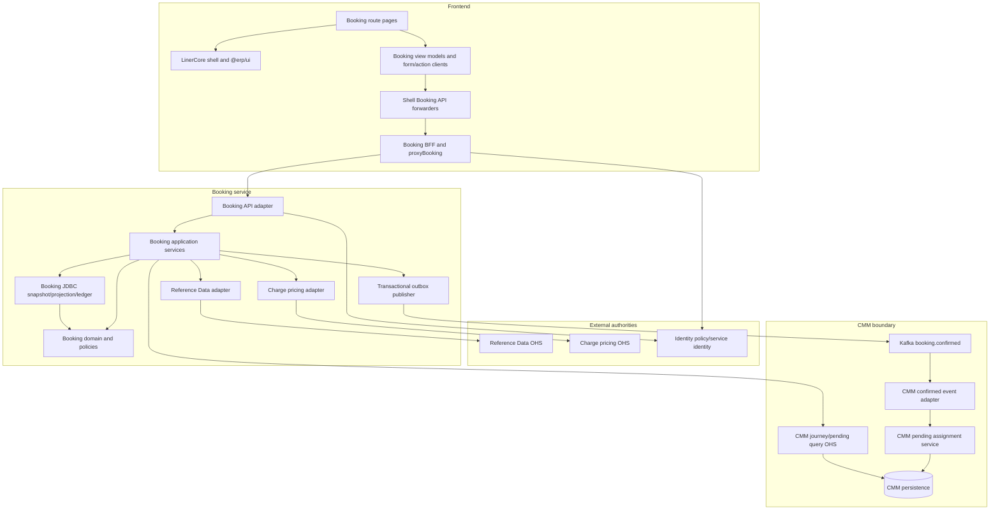
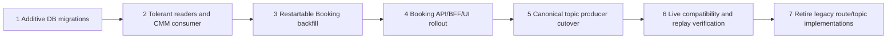

# W3-04 Booking Request Completeness — Component Dependencies

## Dependency principles

- Dependencies point inward through existing hexagonal ports; domain core depends on no adapter.
- Frontend application boundaries follow product ownership, not microservice deployment boundaries.
- `apps/shell` owns shell composition; the Booking team owns only its `/booking` subtree. Apps do not import other apps.
- Browser code has one domain edge: the same-origin Booking BFF path. Reference Data and Charge are not browser dependencies.
- Every database is service-owned. No cross-service SQL, shared persistence entity, or distributed transaction is introduced.
- Asynchronous delivery begins only after Booking confirmation commits locally.

## Logical dependency graph



Text fallback: Booking UI composes LinerCore and calls the shell forwarder, which calls the Booking BFF and API. The Booking application layer depends inward on its domain and outward through data, Reference Data, Charge, CMM journey-view, and outbox adapters. Kafka is the only write bridge to the transactional CMM pending-assignment path; a separate bounded CMM read serves the Journey route.

## Component dependency matrix

Legend: `R` runtime dependency, `B` build/import dependency, `D` data ownership, `E` event dependency, `-` none.

| Consumer \ Provider | LinerCore | Shell route | Shell forwarder | Booking BFF | Booking domain/app | Booking DB | Reference Data | Charge | Kafka | CMM |
|---|---:|---:|---:|---:|---:|---:|---:|---:|---:|---:|
| Shell route | B | - | R | - | - | - | - | - | - | - |
| Booking form/action client | B | B | R | - | - | - | - | - | - | - |
| Shell forwarder | - | - | - | R | - | - | - | - | - | - |
| Booking BFF | - | - | - | - | R | - | - | - | - | - |
| Booking domain/app | - | - | - | - | - | D | R | R | E | R: privacy-shaped journey view |
| Reference Data | - | - | - | - | - | - | D | - | - | - |
| Charge | - | - | - | - | - | - | - | D | - | - |
| CMM pending assignment | - | - | - | - | - | - | optional validation via own port | - | E | D |

No provider calls synchronously back into Booking, so no cyclic synchronous service call is added. Booking has one bounded read edge to CMM's booking-journey OHS for the Journey route; CMM remains authoritative and Booking stores no copy. This read does not participate in confirmation atomicity. Confirmed demand still reaches CMM only through the asynchronous canonical event.

## Route and module dependencies

### Canonical page composition

`apps/shell/app/booking/**` may import:

- the shell layout/session conventions within `apps/shell`;
- Booking-owned sibling components/view models within the same route subtree or shell Booking library;
- public released `@erp/ui` primitives and shared approved types, including the W2-02-owned multiline `TextArea`/counter once available.

It may not import from `apps/booking`, any other app, Reference Data UI, or private `packages/ui` internals. It may not implement a Booking-local `TextArea` while the platform dependency is unresolved. `/booking/new` and `/booking/{bookingId}/correct` initialize the same Booking-owned form composition in different modes; `/booking/{bookingId}` remains the operational detail. `apps/booking/app/bookings/**` page code is retired to redirects/thin delegates; its BFF routes and Booking transport library remain active.

### BFF chain

The transport chain is intentionally two thin boundaries:

1. shell same-origin API route → `forwardToBookingBff`;
2. Booking BFF route → `proxyBooking` → Booking service API.

The shell forwarder preserves headers/cookies and has no policy. `proxyBooking` performs session/origin/body/timeout/safe-error enforcement and operation-specific permission checks. Booking service repeats domain authorization before dependency or mutation work.

## Command dependency paths

### Save or correct

```text
Booking form
  -> shell forwarder
  -> Booking BFF policy(create|correct)
  -> Booking API mapper
  -> BookingCommandService
  -> BookingRequest invariants + BookingCompletenessPolicy
  -> BookingSnapshotCodecV2 / projection / activity / idempotency
  -> Booking PostgreSQL commit
```

No Reference Data dependency is required merely to preserve a draft. Authoritative validation is a separate command so provider degradation cannot erase user work.

Every create/correct/validate/price/confirm path also writes or resolves the Booking-owned operation/idempotency journal keyed by the opaque client operation identity. The read-only recovery path is `BookingActionController -> shell GET /api/booking/operations/{operationId} -> Booking BFF GET /api/bookings/operations/{operationId} -> BookingQueryService`; it does not enter a command handler. This path remains usable when an uncertain create has no returned booking ID.

### Validate

```text
Booking action
  -> BFF policy(validate)
  -> BookingCommandService.validateRequest
  -> owned-shape completeness
  -> ReferenceValidationPort + VoyageSchedulePort
  -> Reference Data OHS
  -> persisted validation/schedule disposition in Booking
```

### Price

```text
Booking action
  -> BFF policy(price)
  -> current-revision validation gate
  -> exact PricingInput + stable fingerprint/identity
  -> PricingPort -> Charge
  -> persisted accepted/uncertain/terminal outcome in Booking
```

### Confirm and consume

```text
Booking action
  -> BFF policy(confirm)
  -> Booking local preconditions
  -> one Booking transaction(state + snapshot + activity/audit + idempotency + outbox)
  -> outbox publisher -> booking.confirmed
  -> CMM consumer adapter
  -> one CMM transaction(pending assignment + consumer idempotency + safe audit)
```

### Journey view

```text
Route-backed Journey tab via RouteTabs
  -> shell forwarder / Booking BFF policy(read)
  -> BookingQueryService.getBookingJourneyView
  -> CmmJourneyViewPort
  -> authenticated GET /api/container-movement/bookings/{bookingId}/journey
  -> 200 PENDING_ASSIGNMENT | 200 JOURNEY_AVAILABLE
  -> authorized 404 HANDOFF_PENDING | 403 ACCESS_DENIED | timeout/5xx DEPENDENCY_UNAVAILABLE
```

The client uses 500 ms connect and 1.5 s read bounds and propagates service identity, actor/tenant context, and correlation. The UI never treats the Booking equipment request, Booking confirmation, or CMM 404 as proof of CMM acceptance; only a CMM 200 pending/journey representation is acceptance evidence.

## Data dependency paths

| View/decision | Booking-owned source | External authority required now? |
|---|---|---|
| Reopen/correct draft | Snapshot v2/upcast plus projection | No; preserve recorded facts and show authority state |
| Reference dropdown/options | Facade response, not stored master | Yes, bounded Reference Data query |
| Requested departure | User-owned POL-local date | No |
| Derived schedule display | Captured voyage version/source snapshot | Refresh only when stale/partial or user requests candidates |
| Completeness | Booking policy over owned/captured evidence | No new call once evidence is present |
| Validation | Persisted fingerprint/result | Reference Data call only for validate command |
| Price action | Persisted validation/price currency | Charge call only for price/status/retry command |
| Confirm | Persisted current evidence rechecked locally | No new provider call required if current; fail closed if stale |
| CMM pending assignment | Confirmed event | Kafka event only; no Booking DB call |
| Journey tab | CMM booking-journey OHS | Bounded privacy-shaped synchronous query; explicit partial-data state on failure |

## Failure propagation and isolation

| Provider/component failure | Propagation boundary | Isolated state | Prohibited fallback |
|---|---|---|---|
| One Reference Data option subset | Booking facade response | Other form fields/subsets remain usable | Copied/static master or arbitrary first option |
| Voyage schedule stale/partial | Validation/schedule disposition | Draft/request remains saved | Guessed ETD/ETA/cutoff/deadline |
| Charge pending/unknown | Pricing status record | Request, validation and UI context remain | New commercial request or guessed total |
| Booking command response pending/unknown | Operation/idempotency journal keyed without booking ID | Form/detail context and committed result remain recoverable | Blind resubmit or new identity |
| Charge malformed | Adapter contract error | No accepted price; confirmation blocked | Flattened partial amount acceptance |
| Booking optimistic conflict | Repository compare-and-swap | Server revision unchanged; client input retained locally | Last-write-wins overwrite |
| Outbox publish failure | Outbox row | Confirmation remains committed | Direct non-transactional publish from controller |
| CMM consumer failure | Kafka/consumer retry boundary | Booking confirmation unaffected | Booking writing CMM tables |
| CMM journey OHS 404/403/timeout/5xx | Booking outbound adapter mapping | CMM state remains uncopied; Journey shows handoff-pending/denied/partial data | Treating Booking request as accepted pending assignment |
| Legacy snapshot missing fact | Upcaster/completeness | Same record remains correctable | Synthetic party, schedule, quantity, or price |

## Deployment dependency order



Text fallback: apply additive schemas first, then deploy tolerant readers plus the canonical-topic pending consumer and legacy-contract rejection, run backfill, ship the Booking vertical slice with W3-04 confirmation still disabled, enable single-destination canonical publication, verify all inventoried paths live, and only then retire legacy behavior.

Every outbox row freezes one destination; no confirmation is dual-published. Pre-cutover legacy rows and post-cutover canonical-contract rows may drain concurrently in separate consumer groups, but a canonical record never reaches the legacy journey application method. Rollback disables new W3-04 confirmation and retains the canonical pending consumer until those rows drain; it never reroutes them. New nullable/additive tables remain safe.

## Test and evidence dependencies

The design is not complete at construction unless evidence follows the same graph:

- domain/mapping tests precede adapter contract tests;
- migration v0/v1/v2, restart, rerun, and drift tests precede live backfill;
- Reference Data and Charge stubs/contracts cover every approved outcome before Compose provider tests;
- Booking transaction/idempotency/outbox tests precede Kafka replay and CMM state assertions;
- route/BFF authorization tests precede real-browser permission/a11y flows;
- canonical-route duplication checks and LinerCore fidelity checks precede `erp-fidelity-audit`;
- all live dependencies must be healthy before the W3-04 end-to-end manifest can be PASS; otherwise it is BLOCKED.

## Upstream basis and traceability

This dependency model consumes `requirements.md`, `stories.md`, brownfield `architecture.md`, `component-inventory.md`, and `team-practices.md`. It also binds the frontend paths to `interaction-spec.md`, `design-system-mapping.md`, and `accessibility-checklist.md`. It traces the full US-01–US-12 and FR-001–FR-030 flow without converting intended dependencies into observed evidence.
