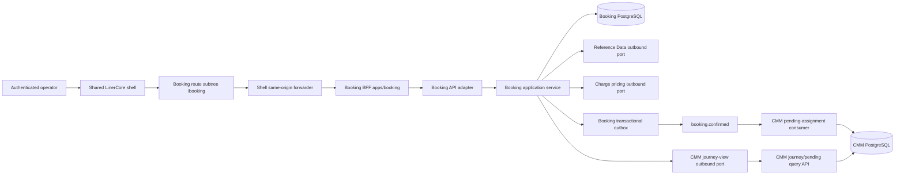

# W3-04 Booking Request Completeness — Components

## Design outcome

W3-04 extends the existing Booking vertical slice; it does not introduce a new service, frontend shell, workflow engine, cache, database, or cloud dependency. Booking remains the system of record for the request, completeness, revision, validation evidence, schedule snapshot, price evidence, confirmation, and outbox. Reference Data remains authoritative for parties, commodities, package types, locations, equipment types, voyages, and schedule facts. Charge Management remains authoritative for exact pricing. CMM receives a privacy-minimized confirmed-booking contract and owns pending equipment assignment.

The canonical experience is `/booking` inside the authenticated LinerCore shell. `apps/shell/app/booking/**` is a Booking-domain-owned route subtree composed inside the UI-platform-owned shell. `apps/booking` remains the sole Booking BFF/edge adapter. Duplicate plural page implementations become redirects or thin delegates and cannot evolve independently.

Text fallback: the browser renders the Booking-owned `/booking` pages in the shared shell, sends same-origin commands through the shell forwarder and Booking BFF to Booking, and Booking alone calls Reference Data and Charge. Confirmation is written with an outbox event; CMM consumes it into its own pending-assignment store.

## Ownership and change boundaries

| Area | Owner | W3-04 change | Must not change |
|---|---|---|---|
| Root shell, navigation, tokens, primitives | UI platform / W2-02 | Reuse released primitives; consume the approved shared `TextArea`/counter dependency when available | No shell fork, theme, token fork, Booking-local `TextArea`, or W3-04 `packages/ui` edit |
| `/booking` route subtree and workflow composition | Booking domain | Complete create/correct/detail flow and state mapping | No second canonical composition |
| `/bookings/**` compatibility routes | Booking domain | Redirect or thin delegate to `/booking/**` | No duplicated form/detail behavior |
| Booking BFF (`apps/booking`) | Booking domain | Typed payloads, per-action permission checks, stable errors | No business authority or copied reference masters |
| Booking service | Booking domain | Complete request aggregate, completeness, correction, migration, orchestration | No Reference Data, Charge, or CMM table access |
| Booking PostgreSQL | Booking domain | Additive snapshot/projection/ledger/outbox evolution | No destructive rewrite or cross-service schema |
| Reference Data service | Reference Data | Existing OHS extended only where schedule facts are absent | Booking may not invent or persist masters as authority |
| Charge Management | Charge Management | Existing exact-pricing port/contract specialized to complete request | No fallback trade lane, commodity, quantity, or total in Booking |
| CMM | Container Movement Management | Pending-assignment consumer and store | No synthetic equipment ID or journey at confirmation |
| Compose/Kafka/observability | Platform/owning services | Add canonical topic/config and evidence seams | No AWS-only resource or new deployment topology |

## Frontend and BFF components

### `BookingRequestPage` and `BookingCorrectionPage`

- `BookingRequestPage` is `/booking/new`; `BookingCorrectionPage` is the explicit `/booking/{bookingId}/correct` route. Both are server components under `apps/shell/app/booking/**`, establish the authenticated shell, read permitted initial data, and render one shared Booking-owned request-form composition with the approved five groups: Booking and parties, Cargo, Route and schedule, Equipment request, Review and save.
- Focused client components own transient field values, dirty state, dependent-option refresh, submit identity, conflict reconciliation, and deterministic focus restoration.
- Inputs and states use exported `@erp/ui` contracts: Field, Input, Select/Combobox, Button, Badge, Card, Table, Dialog, Skeleton, EmptyState, StatusStrip, FailureState, PartialDataNotice, ConflictStrip, and TechnicalDetails, exactly as mapped in `design-system-mapping.md`. Cargo description consumes the W2-02-owned shared multiline `TextArea`/counter after release; until then, executable UI evidence for that field is BLOCKED and Booking must not substitute a single-line input or local primitive.
- The route never imports from another app. Booking-domain code may live in its owned shell subtree; reusable primitives continue to come only from `@erp/ui`.

### `BookingDetailPage`

- Retains Overview, Charges, Journey, and Activity as route-backed navigation rendered with exported `RouteTabs`, not a local or generic tab implementation.
- Overview owns completeness, canonical request facts, requested-versus-derived schedule provenance, equipment request, and reference status.
- Charges owns detailed immutable price evidence and recovery outcome.
- Journey calls a Booking-owned `CmmJourneyViewPort`, which reads the existing CMM booking-journey OHS extended with a discriminated pending-assignment result. It shows CMM-accepted pending type/quantity/null-ID state honestly until later physical assignment; confirmation alone never implies a container journey. CMM degradation renders `PartialDataNotice`/`FailureState` without falling back to the Booking request as if it were CMM acceptance.
- Activity shows safe lifecycle and audit-derived facts; diagnostics remain collapsed and privacy-safe.
- A pure `deriveBookingNextAction` view-model function applies the approved action precedence and returns exactly one authorized action or safe terminal path.

### `BookingActionController`

- A focused client boundary coordinates Correct, Validate, Price, Confirm, Refresh, Retry once, and Inspect without becoming business authority.
- It uses stable DOM targets and Booking-owned status regions defined by `interaction-spec.md`: validation summary or first invalid field, conflict banner/refresh action, pricing status, confirm trigger, or page heading after navigation.
- Pending and unknown create, correct, validate, price, and confirm outcomes preserve request/tab/list context, disable duplicate submission, and refresh `GET /api/booking/operations/{operationId}` with the same opaque command identity. Refresh is a read and never resubmits a command; retry is exposed only when the recorded disposition is `NOT_ACCEPTED` and `retryEligible=true`.

### Shell forwarder and Booking BFF

- `apps/shell/app/api/booking/**` remains a thin same-origin forwarder using `forwardToBookingBff`; it contains no domain policy.
- `apps/booking/app/api/**` and `apps/booking/lib/bookings.ts` remain the edge security boundary through `proxyBooking`.
- W3-04 adds explicit permission checks for `read`, `create`, `correct`, `validate`, `price`, and `confirm` before protected downstream work.
- Existing safeguards remain: authenticated actor propagation, cookies, origin validation, 32 KiB request ceiling, correlation and idempotency headers, `cache: no-store`, 2.5-second bounded upstream timeout, and safe error shaping.

## Booking domain and application components

### `BookingRequest`

The aggregate gains typed request state rather than placing new authoritative values into an open-ended attribute map:

- `bookingCustomerPartyId`
- normalized `customerBookingReference`
- `shipperPartyId`, optional `consigneePartyId`, optional `notifyPartyId`
- normalized `cargoDescription`
- `commodityId` plus captured canonical code/version
- `packageCount`, `packageTypeId/code`
- `grossWeight` with fixed `KGM`; optional `volume` with fixed `MTQ`
- `polLocationId`, `podLocationId`, POL-local `requestedDepartureDate`
- selected `voyageId`, selected version/source, carrier voyage number, ETD, ETA, cargo cutoff, documentation deadline
- `equipmentTypeId/code`, positive quantity, and initially null `equipmentId`
- currency fixed to `USD`

The aggregate preserves immutable booking identity and revision lineage. Any pricing-determining correction increments revision and invalidates current validation and pricing evidence atomically.

### `BookingCompletenessPolicy`

- Computes stable missing/invalid/stale reasons from owned values and captured authority.
- Distinguishes user-correctable absence, invalid canonical references, incomplete/stale schedule, validation currency, price currency, conflict, and provider uncertainty.
- Is used by detail projection and every validate/price/confirm precondition; client validation is advisory only.
- Produces safe field keys that the BFF/UI map to persistent labels and focus targets.

### `BookingCommandService`

- Creates and saves drafts.
- Fully replaces the same request through a correction command guarded by `expectedRevision` and idempotency key.
- Delegates canonical validation and schedule refresh through outbound ports.
- Requests exact pricing through the existing Charge port using a complete, fallback-free input and stable fingerprint.
- Confirms only a complete, currently validated, authoritatively priced revision.
- Uses one client-generated opaque UUID operation identity as the idempotency key for create, correct, validate, price, and confirm. The Booking-owned operation journal records type, actor/tenant scope, nullable booking identity, requested/committed revision, state, recovery, safe result reference, correlation, timestamps, expiry, and retry eligibility.
- Stores the command result and operation/idempotency disposition atomically. Confirmation additionally stores state, audit/activity, confirmation snapshot, and outbox record in the same Booking transaction.

### `BookingQueryService`

- Returns privacy-shaped list/detail projections and correction form data.
- Exposes reference-option and voyage-schedule facade queries without becoming the reference authority.
- Returns explicit completeness, reference, schedule, validation, pricing, migration, and next-action inputs.
- Resolves an operation by opaque identity even when an uncertain create has not returned a booking ID. Authorization uses the recorded actor/tenant scope and original operation policy before any result is exposed; inaccessible and absent identities share the same safe not-found response.
- Does not hide migrated incompleteness or fabricate required values.

### Outbound ports

- `ReferenceOptionsPort`: bounded option reads for permitted party roles, commodity, package type, location, equipment type, and voyage candidates.
- `ReferenceValidationPort`: authoritative batch validation for the exact current request revision.
- `VoyageSchedulePort`: route-compatible voyage lookup and confirmation-grade schedule snapshot with source/version.
- `PricingPort`: exact synchronous price request/status retrieval using stable request identity and fingerprint.
- `BookingEventPublisherPort`: existing outbox publisher emitting the canonical confirmed contract only after commit.
- `CmmJourneyViewPort`: bounded, authenticated read of the existing CMM `GET /api/container-movement/bookings/{bookingId}/journey` OHS. A CMM 200 supplies `PENDING_ASSIGNMENT` or `JOURNEY_AVAILABLE`; an authorized 404 is mapped to the distinct, non-acceptance `HANDOFF_PENDING` state only when Booking is confirmed. Denial and provider failure remain separate safe outcomes; no CMM state is persisted as Booking authority.

## Persistence and migration components

### `BookingSnapshotCodecV2`

- Reads legacy flat snapshots as v0 and current unversioned `routing`/`equipment` snapshots as v1.
- Writes `schemaVersion: 2` with the complete typed request, schedule authority, validation evidence, pricing evidence, confirmation snapshot, and preserved unmapped legacy attributes.
- Upcasting derives only values backed by old authoritative fields. Missing party, cargo, schedule, quantity, or pricing authority becomes an explicit incomplete reason.
- Rejects mixed or internally inconsistent evidence instead of guessing.

### Additive relational projection

The Booking-owned projection adds queryable columns/tables for request identity/revision, party references, cargo measures, route preference, voyage schedule snapshot, equipment request, completeness status, validation fingerprint, and migration status. JSON snapshot remains the aggregate persistence boundary; the projection is rebuildable and never a second authority.

### `BookingMigrationLedger`

- Records booking ID, source version, target version, source digest/baseline, outcome, safe reason, attempt timestamps, and completion marker.
- A restartable bounded backfill selects unprocessed rows, verifies expected baseline/digest, upcasts, writes projection plus ledger atomically, and can be rerun without duplicating effects.
- Baseline drift produces a safe conflict outcome and no mutation.
- Unsupported facts remain incomplete and are repaired only by an authorized same-record correction.

## Downstream confirmation component

### `PendingEquipmentAssignmentService` in CMM

The existing `consumeBookingConfirmed` path creates or reconciles a `ContainerJourney`; that behavior is not reused for W3-04 confirmation. A distinct transactional application path:

- deduplicates by Avro event `id` (the same value as the event-delivery idempotency header), never by the originating command operation identity;
- rejects stale booking revisions;
- stores booking ID/revision plus each requested equipment type, quantity, and nullable equipment ID;
- records status `PENDING_PHYSICAL_ASSIGNMENT`;
- creates no `ContainerJourney`, journey ID, container ID, or movement-status outbox event;
- audits duplicate, stale, accepted, and contract-rejected outcomes safely.

Later physical equipment-assignment events, outside W3-04, may reconcile these requests into journeys.

### `PendingEquipmentAssignmentQueryService` in CMM

- Extends the existing `GET /api/container-movement/bookings/{bookingId}/journey` OHS with a negotiated v2 discriminated representation. HTTP 200 returns `PENDING_ASSIGNMENT` with CMM-persisted booking revision, requested type/quantity/null equipment ID and `acceptedAt`, or `JOURNEY_AVAILABLE` with the existing `JourneyResponse`; both include `checkedAt` and correlation.
- Authorizes the authenticated Booking service identity plus propagated actor/tenant context before lookup, returns no Booking customer/party/cargo/pricing facts, and preserves an existence-safe 404 for no CMM projection. The v1 representation remains available during consumer migration; clients do not infer the v2 state from nullable v1 fields.
- Is called through Booking's `CmmJourneyViewPort` with 500 ms connect and 1.5 s read bounds. For a confirmed Booking, an authorized CMM 404 maps to `HANDOFF_PENDING` (event not yet observed; not acceptance); 403 maps to safe denied, and timeout/5xx maps to `DEPENDENCY_UNAVAILABLE`. Only CMM 200 `PENDING_ASSIGNMENT` proves acceptance.

### Confirmed-event routing invariant

- CMM deploys a dedicated consumer group subscribed only to `booking.confirmed`; the legacy journey consumer remains subscribed only to `booking.events` during the compatibility window.
- Each Booking outbox row stores one immutable destination/contract at creation. A W3-04 canonical-contract row targets only `booking.confirmed`; the publisher never broadcasts or dual-publishes it to `booking.events`.
- W3-04 confirmation remains disabled until the canonical topic and pending-assignment consumer are healthy. Pre-cutover legacy rows may finish on the legacy path, but no complete W3-04 confirmation can enter that path.
- As defense in depth, the legacy mapper rejects/quarantines the canonical `BookingConfirmed` record before invoking `ContainerJourney.create`. Rollback stops new W3-04 confirmations and drains canonical rows with the pending consumer; it never reroutes those rows to the legacy handler.
- One canonical-contract confirmation therefore produces exactly one idempotent pending-assignment effect and zero journey or movement-status effects throughout rollout.

## Integration, security, and failure seams

| Seam | Style | Timeout/retry | Persisted disposition | User-safe behavior |
|---|---|---|---|---|
| Browser → shell/BFF | Same-origin HTTP | One in-flight command; same identity on permitted recovery | Booking command/idempotency record | Preserve context; exact focus/status target |
| Booking → Reference Data | Synchronous port | Bounded; no guessed fallback | validation/schedule result, source/version, correlation | Block dependent action only; preserve draft |
| Booking → Charge | Synchronous port | Status refresh for uncertain acceptance; one bounded retry only after explicit unavailable/no acceptance | request identity, fingerprint, terminal/uncertain outcome | Exact FR-018 next action |
| Booking → Kafka | Transactional outbox | Publisher retry; event replay-safe | outbox status and confirmation idempotency | Confirmation response remains tied to committed state |
| Kafka → CMM | At-least-once asynchronous | Consumer retry/DLQ per existing policy | consumer idempotency and pending assignment | No user-visible fabricated journey |
| Booking → CMM journey query | Bounded synchronous read | No automatic mutation/retry; user refresh may re-read | CMM remains authority; Booking stores no copy | Journey shows partial-data/failure state, never inferred acceptance |

The browser recovery seam uses the read-only operation resource for every uncertain command, including create without a booking ID. The CMM read seam is the exact existing booking-journey OHS with 500 ms connect/1.5 s read bounds; 200, authorized 404, denied, and unavailable are mapped separately.

Authorization is enforced at the BFF and Booking command/query boundary. Denial precedes provider calls, mutation, and outbox work. The confirmed Avro payload is mapped exactly to `id`, `source`, `type`, `time`, `correlationId`, `dataSchemaVersion`, and nested `data`; `data` contains only booking identity/revision, full routing legs, and full equipment type/quantity/nullable ID. Command idempotency and other internal deduplication metadata are not added to the Avro payload.

## LinerCore and UI/UX disposition

UI/UX Pro Max advice was filtered through LinerCore authority. The design retains data-dense operational grouping, persistent labels, clear keyboard focus, skeleton/status feedback, responsive stacking, and non-color state meaning. It rejects the external Enterprise Gateway/hero/sales framing, logo carousel, replacement Cinzel/Josefin typography, alternate palette, decorative effects, generic spinner-first behavior, and dark-default recommendations. Loading uses existing LinerCore Skeleton/status patterns; page composition follows the approved `mockups.md`, `interaction-spec.md`, `design-system-mapping.md`, and `accessibility-checklist.md`.

The approved shared multiline `TextArea`/counter is an explicit UI-platform dependency because executable `@erp/ui` does not currently export it. W2-02 owns the primitive and consumer compatibility; W3-04 consumes the released version and keeps affected UI evidence BLOCKED until then. Current Combobox behavior is used only within its executable contract—no automatic collision/flip or custom option-count announcement is assumed. Any further general gap stops for UI-platform review; W3-04 does not patch `packages/ui` locally.

## Deployment and operational posture

The canonical target remains the existing on-premise Compose stack. Existing Booking, Reference Data, Charge, CMM, Identity, PostgreSQL, Kafka, BFF, health-check, correlation, audit, and observability seams are reused. The only runtime additions are additive Booking/CMM migrations and canonical topic/configuration. No AWS resource, managed service, cloud credential, or cloud-only dependency is introduced. AWS review is limited to portability: standard HTTP/Kafka/PostgreSQL contracts, configuration-driven endpoints, deterministic migrations, and no host-specific assumptions.

## Verification obligations

This document specifies design intent, not observed PASS. Construction must prove:

- additive migration, v0/v1 read, v2 write, restart, rerun, and baseline-drift behavior;
- exact field round-trip, normalization, quantity/measure bounds, optional-field preservation, and same-ID correction;
- Reference Data and Charge contract positive/negative/degraded matrices with no fallback;
- optimistic conflict, idempotent replay, pricing uncertainty, atomic confirmation/outbox, single-destination topic routing, legacy-handler v2 rejection, and CMM pending assignment without journey creation;
- route consolidation, permission isolation, privacy-safe event/error/log shape, and correlation across every seam;
- browser behavior at 375, 390, 768, 1024, and 1440 px, 200% zoom, keyboard-only, reduced motion, and light/dark themes;
- live Compose `aidlc-audit` and `erp-fidelity-audit` green. Missing prerequisites remain BLOCKED, never inferred PASS.

## Upstream basis and traceability

The component boundaries directly consume `requirements.md`, `stories.md`, brownfield `architecture.md`, `component-inventory.md`, and `team-practices.md`. They also specialize the approved UI artifacts `mockups.md`, `interaction-spec.md`, `design-system-mapping.md`, and `accessibility-checklist.md`. Key requirement coverage is FR-001–FR-030 and NFR-001–NFR-010; key story coverage is US-01 through US-12.

## Review

**Verdict:** **NOT-READY**  
**Reviewer:** aidlc-architecture-reviewer-agent  
**Date:** 2026-08-09  
**Iteration:** 2

### Findings

- **Critical - command uncertainty has no implementable refresh contract.** FR-015/FR-027 require non-mutating status refresh for unknown/pending save and confirm outcomes, but the route and method contracts define only `price-status`. This is especially unresolvable for an uncertain create that has no returned booking ID. Define the shell/BFF/Booking status resource, lookup identity, permission, terminal/expiry states, and retry distinction for create, correct, validate, and confirm.
- **Major - the proposed confirmation wire type conflicts with the authoritative Avro envelope.** `BookingConfirmedV2` names `schemaVersion`, `eventId`, `occurredAt`, and wire `idempotencyKey`, while the checked-in contract is `id`, `source`, `type`, `time`, `correlationId`, `dataSchemaVersion`, and nested `data`; command idempotency is not a published field. Specify an exact Avro mapping and keep internal deduplication metadata out of the minimal event unless an additive defaulted contract change is approved.
- **Major - the CMM Journey read boundary remains underspecified.** The design names a discriminated port but not the exact Booking-to-CMM HTTP route/status schema, timeout/error mapping, or how an expected pre-consumption `NOT_FOUND` differs from protected absence and provider failure. Bind it to the existing CMM booking-journey OHS and define the eventual-handoff state so the UI cannot infer CMM acceptance from Booking data.

### Summary

The explicit `/booking/{bookingId}/correct` shared-form route, W2-02-owned `TextArea`/counter block with no local workaround, service-owned transaction boundaries, nullable pending-assignment truth, and single-destination outbox rollout are coherent; no synchronous call cycle or dual-publication path was found. The unresolved recovery and wire contracts still require developer guesswork and can break runtime compatibility.

## Review Resolution

After the second and final reviewer iteration, the builder resolved all three reported gaps across the binding artifacts:

- one actor/tenant-scoped `GET /api/bookings/operations/{operationId}` status resource now covers create, correct, validate, price, and confirm, including uncertain create without a booking ID; it defines exact states, expiry, recovery, permission, non-mutating refresh, and same-identity retry rules;
- the confirmed-event table now maps field-for-field to `contracts/avro/booking.confirmed.avsc` and explicitly keeps command/outbox idempotency metadata out of the Avro payload;
- the Journey boundary now binds to `GET /api/container-movement/bookings/{bookingId}/journey`, specifies authenticated context, v2 200 schemas, 500 ms connect/1.5 s read bounds, and distinct handoff-pending, denied, and unavailable mappings. Only CMM HTTP 200 proves acceptance.

The reviewer iteration cap prevents a third independent verdict. These post-review corrections are therefore presented transparently at the human Application Design gate rather than relabeling the recorded NOT-READY verdict.
