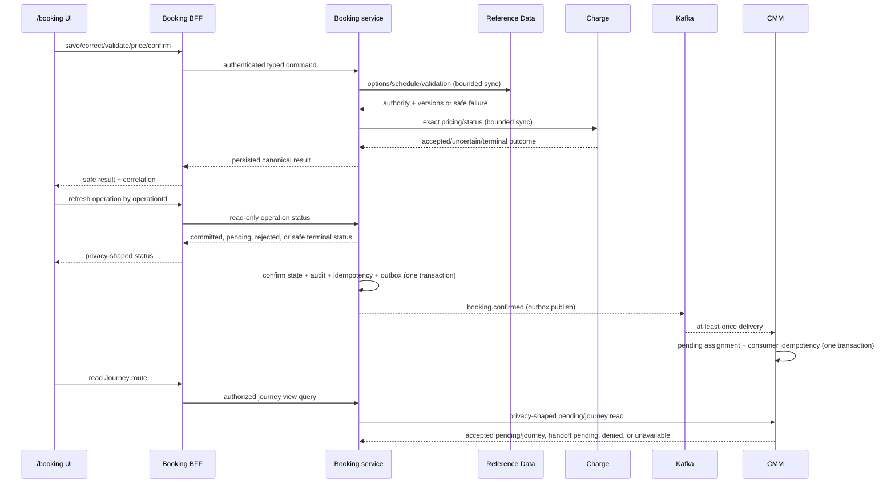

# W3-04 Booking Request Completeness — Services

## Service topology decision

W3-04 is implemented inside the existing service topology. No new microservice is justified: the workflow is a Booking aggregate lifecycle whose supporting authorities already exist behind defined ports. A new orchestration service would split Booking state ownership, add distributed transactions, and duplicate retry/idempotency responsibility.

| Runtime | Responsibility in W3-04 | Data owner | Change posture |
|---|---|---|---|
| `apps/shell` | Authenticated LinerCore shell and canonical `/booking` route composition, including shared-form `/booking/new` and `/booking/{id}/correct` modes | No domain database | Booking-owned route subtree; thin BFF forwarding |
| `apps/booking` | Booking BFF, session/actor boundary, permission and safe transport mapping | No domain database | Extend existing `proxyBooking` and APIs |
| `packages/ui` | Shared LinerCore tokens and primitives | UI Platform / W2-02 | W2-02 supplies the approved multiline `TextArea`/counter; W3-04 consumes the released primitive and makes no package edit |
| Booking service | Request aggregate, completeness, revision, validation/schedule/price evidence, confirmation/outbox | Booking PostgreSQL | Primary implementation owner |
| Reference Data service | Canonical reference options, role/status/version validation, voyage schedule authority | Reference Data PostgreSQL | Existing OHS used/extended additively |
| Charge Management service | Exact authoritative price and request-status semantics | Charge PostgreSQL | Existing pricing port contract specialized |
| CMM service | Pending equipment assignment after confirmation | CMM PostgreSQL | New pending-assignment path; legacy journey path not reused |
| Identity service | Independent action permission decisions/service identity | Identity PostgreSQL | Existing policy boundary reused |
| Kafka/outbox infrastructure | Replay-safe confirmed-booking handoff | Service-owned outbox/consumer state | Canonical `booking.confirmed` rollout |

## Booking service design

### Domain core

Owns typed request values, normalization/shape invariants, completeness classification, revision lineage, validation/pricing currency, and confirmation eligibility. Domain code depends on no HTTP, Kafka, JDBC, Next.js, or provider implementation. Existing hexagonal boundaries are retained.

### Application service

Coordinates commands and queries through owned repositories and outbound ports. Synchronous pre-confirmation calls are bounded and their outcomes are persisted so UI recovery is deterministic. Confirmation is the only W3-04 cross-domain event transition, and the transactional outbox is the consistency boundary.

### API adapter

Extends the existing Booking controller with typed draft/correction, option/schedule facade, unified operation-status, and current detail contracts while retaining validate/price/confirm endpoints. `GET /api/bookings/operations/{operationId}` resolves create/correct/validate/price/confirm uncertainty without a booking ID or a new mutation. API mapping performs shape parsing only; it does not calculate authority, completeness, price, or confirmation eligibility.

### Data-access adapter

Introduces snapshot v2, additive projections and migration ledger through Flyway. Aggregate snapshot, projection, activity/audit, idempotency, confirmation snapshot, and outbox use the Booking-owned transaction manager. No adapter queries a Reference Data, Charge, Identity, or CMM database.

### Messaging adapter

Publishes the privacy-minimized checked-in `BookingConfirmed` Avro record on canonical `booking.confirmed` from committed outbox rows. The wire fields are exactly `id`, `source`, `type`, `time`, `correlationId`, `dataSchemaVersion`, and nested `data`; command idempotency remains internal. Publication retries do not recreate domain effects. Metrics distinguish pending, published, retried, failed, and replayed rows by safe labels.

## Reference Data interaction

Reference Data is an Open Host Service for selection and authoritative validation. Two logical contracts may share the existing adapter/client:

- bounded option/schedule queries for form composition;
- batch authoritative validation for the current request revision.

Voyage results carry voyage ID, version/source, carrier voyage number, ETD, ETA, cargo cutoff, documentation deadline, active/stale/partial flags, and route compatibility. Booking captures the confirmation-grade selected snapshot but does not become the master. Degradation is subset-aware: an unavailable voyage subset blocks dependent schedule/confirm work while unrelated draft correction remains available.

## Charge Management interaction

Booking keeps the existing synchronous `PricingPort` seam. The input is exact and complete; the adapter supplies no fallback trade lane, commodity, quantity, currency, or rate. Charge remains authoritative for immutable agreement/rate version, basis, itemized lines, total and currency.

Booking owns commercial-request identity, current-revision fingerprint, outcome state, and UI recovery. Status refresh never creates a new Charge request. A retry is permitted once only after an explicit unavailable/timeout result demonstrates that no operation was accepted, and it reuses the same identity.

## CMM interaction

The current CMM `consumeBookingConfirmed` implementation creates a `ContainerJourney`, including a journey/container identifier path. W3-04 adds a separate pending-assignment application service and persistence model because confirmed demand is not physical assignment.

The new consumer accepts equipment quantity greater than one and null equipment ID, stores requested count/type against booking revision, and stops. Later assignment reconciliation is a future event. This separation makes the domain state truthful and avoids branching the existing journey aggregate into a partly fictitious state.

CMM extends the exact existing `GET /api/container-movement/bookings/{bookingId}/journey` OHS with a negotiated v2 pending/journey representation. Booking reads it through `CmmJourneyViewPort` using authenticated Booking service identity, propagated actor/tenant context and correlation, with 500 ms connect and 1.5 s read bounds. CMM 200 is authoritative pending/journey state; confirmed+authorized-404 becomes non-acceptance `HANDOFF_PENDING`; 403 and timeout/5xx remain denied and unavailable. CMM remains the authority, Booking stores no duplicate projection, and no Booking fact is substituted as evidence of CMM acceptance.

Booking also owns an operation journal keyed by the opaque command/idempotency identity for create, correct, validate, price, and confirm. The shell/BFF status GET is read-only, can resolve an uncertain create before `bookingId` is known, and is authorized by recorded actor/tenant scope plus original operation policy. `IN_PROGRESS`/`OUTCOME_UNKNOWN` refresh only; a retry is available solely for recorded `NOT_ACCEPTED` evidence and reuses the same identity.

Topic routing is single-destination by construction. The pending consumer group subscribes only to `booking.confirmed`; the legacy journey group subscribes only to `booking.events`. Each outbox row freezes one destination/contract, and canonical-contract rows are never dual-published. W3-04 confirmation is enabled only after the pending consumer is healthy. The legacy mapper rejects/quarantines the canonical record before journey mutation, and rollback drains canonical rows with the pending consumer rather than rerouting them.

## Synchronous and asynchronous boundaries

Text fallback: UI commands traverse the BFF to Booking. Booking synchronously consults Reference Data and Charge and persists every useful outcome. Confirmation commits an outbox event, which Kafka delivers at least once to a transactional CMM pending-assignment consumer. The Journey route separately reads privacy-shaped CMM-owned pending/journey state through Booking without copying it.

## Data ownership and consistency

| Data | Authority | Booking copy/snapshot rule | Consistency |
|---|---|---|---|
| User request and revision | Booking | Primary state | Strong inside Booking transaction |
| Party/commodity/package/location/equipment masters | Reference Data | IDs/codes/versions captured for evidence, never master copy | Validated synchronously per revision |
| Selected voyage schedule | Reference Data | Confirmation-grade immutable provenance snapshot | Refreshed/validated before confirm |
| Price authority/basis/lines/total | Charge | Immutable accepted evidence tied to fingerprint | Persisted after synchronous outcome/status |
| Command operation status | Booking | Opaque identity, type, actor/tenant scope, nullable booking/revisions, state/recovery, safe result/correlation, expiry | Written with command/idempotency disposition; read-only refresh |
| Confirmation publication | Booking | Outbox row is publication source | Atomic with Booking confirm; eventual publish |
| Pending assignment | CMM | Own state derived idempotently from event | Eventual after confirmation |
| Physical journey/container | CMM | Not created by W3-04 confirmation | Later assignment event only |
| Journey tab projection | CMM | Exact booking-journey OHS through Booking facade; no Booking copy | 200 accepted state; 404 handoff pending; denied/unavailable distinct |

Cross-service transactions and database joins are prohibited. The only atomic scopes are local Booking confirmation/outbox and local CMM consumption/pending-assignment/idempotency.

## Security and privacy model

- Browser access is same-origin through the authenticated shared shell.
- BFF and Booking service independently enforce `read`, `create`, `correct`, `validate`, `price`, and `confirm`; permissions are not inferred as a bundle.
- Denial happens before Reference Data/Charge calls, mutation, audit detail, or outbox work that could reveal protected facts.
- Service-to-service calls use existing service identity and correlation conventions.
- Errors/logs/audit/events use safe codes and identifiers; event payload excludes customer/party/cargo/free-text/price/user data.
- Request bodies retain the existing 32 KiB BFF ceiling. The existing 2.5-second BFF boundary is observed and reported as local evidence, not promoted into a production SLO.

## Availability and recovery behavior

| Failure | Service behavior | UI behavior |
|---|---|---|
| Reference subset unavailable | Persist safe failure/correlation; retain draft; block only dependent action | Preserve input; refresh/correct affected subset |
| Schedule partial/stale/incompatible | Persist exact reason; no guessed milestone | Show variance/reason; block confirm |
| Charge pending/unknown | Persist request identity and state; no resubmit | Refresh status |
| Charge unavailable/no acceptance | Persist retry eligibility | One explicit retry with same identity |
| Charge manual/validation | Persist terminal safe reason | Correct, then revalidate/reprice |
| Create/correct/validate/confirm response unknown | Read unified operation resource by the same identity | Refresh only; no second effect while acceptance is unknown |
| Optimistic conflict | No mutation | Refresh latest and reapply explicitly |
| Outbox publisher down | Confirm remains committed; row retries | Detail shows committed confirmation/publication diagnostics safely |
| CMM consumer down | Kafka/outbox replay; no duplicate assignment | Confirmation remains truthful; operational alert/diagnostics |
| CMM authorized 404 after confirmation | Record nothing in Booking; CMM has not exposed acceptance | Show Handoff pending and Refresh, not Pending assignment |
| CMM denied or timeout/5xx | Preserve no CMM copy | Safe denied or partial-data Refresh; never collapse to not-found |
| Unknown snapshot version | Fail closed and correlate | Inspect/support; no fabricated detail |

## Deployment and compatibility plan

1. Apply additive Booking and CMM Flyway migrations; old code must tolerate new nullable/additive structures during the allowed rollout window.
2. Deploy readers/upcasters and the dedicated CMM checked-in `BookingConfirmed` pending-assignment consumer subscribed only to `booking.confirmed`; add rejection of the current contract on the legacy journey path before domain mutation.
3. Run restartable Booking backfill and record ledger outcomes without requiring completion of user-correctable records.
4. Deploy Booking command/query/API/BFF/UI behavior behind canonical routes.
5. After consumer health/contract evidence, enable W3-04 confirmation so newly created canonical-contract outbox rows freeze destination `booking.confirmed`; never dual-publish a row.
6. Drain pre-cutover legacy rows on `booking.events` and canonical-contract rows on `booking.confirmed` in their separate groups. Verify every canonical confirmation produces one pending assignment and zero journey/movement effects, then retire legacy configuration after all inventoried consumers converge.
7. Rollback stops new W3-04 confirmations and preserves the pending consumer to drain committed canonical rows; it never redirects them to the legacy handler. Additive schemas remain.

## Observability and evidence seams

Each seam propagates correlation ID and stable booking/event/request identity. Metrics and safe logs cover:

- command counts/outcomes and optimistic conflicts by operation;
- completeness reason code counts without record/PII labels;
- Reference Data and Charge duration/outcome by safe category;
- operation status refresh/retry/replay and duplicate-effect prevention across create/correct/validate/price/confirm;
- migration batch/outcome/source-target version and baseline drift;
- outbox lag/retry/dead-letter and canonical topic publication;
- CMM pending assignment accepted/duplicate/stale/rejected and any prohibited journey-creation regression.
- CMM journey-view query outcome/freshness by safe category, with no PII labels.

No design-time dashboard or intended metric is evidence of PASS. Tests and the live Compose run must capture actual traces, audit rows, data state, event counts, accessibility results, and durations.

## AWS portability review

AWS support is advisory only. The design remains portable because dependencies use standard PostgreSQL, Kafka, HTTP, configuration-driven endpoints, deterministic Flyway migrations, and stateless BFF/service instances. There is no AWS infrastructure design, resource provisioning, IAM change, managed queue/database selection, or cloud-specific failover claim in W3-04.

## Upstream basis and traceability

Service decisions consume `requirements.md`, `stories.md`, `architecture.md`, `component-inventory.md`, and `team-practices.md`. Route and state behavior also follows `interaction-spec.md`, `design-system-mapping.md`, and `accessibility-checklist.md`. The topology addresses FR-001–FR-030, NFR-001–NFR-010, and US-01–US-12 while deferring observed proof to construction.
