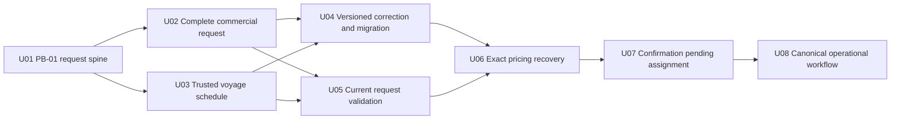

# W3-04 Unit of Work Dependency Topology

## Source Alignment

This topology is derived from approved `components.md`, `component-methods.md`, `services.md`, `component-dependency.md`, and `decisions.md`, and is checked against `requirements.md` plus `stories.md`. It preserves the Application Design’s service/data ownership, operation-status, Reference Data, Charge, Avro/Kafka, CMM and LinerCore constraints.

## Topology Semantics

An edge “A depends on B” means B supplies a real implementability prerequisite that A consumes. Edges are minimal and direct; transitive prerequisites are not repeated. The graph describes architecture topology only and deliberately does not choose a recommended implementation order, Bolt sequence, economic heuristic or critical path.

External program prerequisites—W2-02 shared `TextArea`/counter, provider-owned Reference Data/Charge/CMM contracts, canonical topic/Schema Registry readiness and consumer inventory—are recorded at the affected unit and can BLOCK its evidence. They are not fabricated as W3-04 units and do not permit local substitutes.

## Dependency Graph



Text fallback: U01 is the single root. U02 and U03 each depend directly on U01. U04 and U05 each depend directly on both U02 and U03. U06 depends on U04 and U05; U07 depends on U06; U08 depends on U07. No other direct edge exists.

## Machine-Readable Direct Edges

```yaml
units:
  - name: U01-pb01-request-spine
    depends_on: []
  - name: U02-complete-commercial-request
    depends_on: [U01-pb01-request-spine]
  - name: U03-trusted-voyage-schedule
    depends_on: [U01-pb01-request-spine]
  - name: U04-versioned-correction-migration
    depends_on: [U02-complete-commercial-request, U03-trusted-voyage-schedule]
  - name: U05-current-request-validation
    depends_on: [U02-complete-commercial-request, U03-trusted-voyage-schedule]
  - name: U06-exact-pricing-recovery
    depends_on: [U04-versioned-correction-migration, U05-current-request-validation]
  - name: U07-confirmation-pending-assignment
    depends_on: [U06-exact-pricing-recovery]
  - name: U08-canonical-operational-workflow
    depends_on: [U07-confirmation-pending-assignment]
```

## Direct Edge Rationale

| Dependent unit | Direct prerequisite | Why the edge is required |
|---|---|---|
| U02 | U01 | Complete fields extend the proven canonical form, create identity, persistence and reopen spine rather than creating a parallel path. |
| U03 | U01 | Full schedule authority extends the proven route/requested-date/voyage snapshot seam. |
| U04 | U02, U03 | Snapshot v2/correction/backfill must preserve the complete field dictionary and complete schedule/provenance semantics. |
| U05 | U02, U03 | Current validation requires the complete request/reference set and complete schedule basis. |
| U06 | U04, U05 | Exact pricing is authorized only by current server validation/fingerprint evidence, and US-07’s manual/no-rate/validation recovery must reach the live same-record correction route. |
| U07 | U06 | Confirmation requires an authoritative current price in addition to transitive request/schedule/validation prerequisites. |
| U08 | U07 | Canonical operational convergence consumes the completed lifecycle; U04 correction/migration and all request/validation/price prerequisites arrive transitively through U06 and U07. |

U04 is not a prerequisite of U05 because new/current records can validate without the legacy migration path. It is a prerequisite of U06 because the primary US-07 outcome must exercise a live `Correct` recovery for manual/no-rate/validation results. Once U06 depends on U04, a separate U04 → U08 edge would be transitive, so U08 depends directly only on U07. These omissions are intentional minimal-edge decisions, not missing coverage.

## Integration Points Between Units

| Provider unit | Consumer unit(s) | Integration point | Contract constraint |
|---|---|---|---|
| U01 | U02, U03 | Canonical Booking form/view model, create/read DTO, Booking identity/revision, snapshot/projection seam, operation identity/status | Extend additively; no second route/form, new identity or blind retry path |
| U02 | U04, U05 | Complete typed request/value objects, canonical reference evidence, explicit optional-null semantics | Full replacement and validation consume the same field dictionary |
| U03 | U04, U05 | Selected voyage schedule snapshot, provenance, completeness/degradation codes | No guessed schedule value; requested date remains separate authority |
| U04 | U06 | Snapshot v2/upcast/migration status, correction DTO/route, conflict and activity evidence | Same booking ID; optimistic expected revision; restartable additive migration; live Correct recovery for US-07 |
| U05 | U06 | Current validation fingerprint/result and safe reason/field contract | Only current `VALID` evidence permits pricing |
| U06 | U07 | Immutable authoritative pricing snapshot tied to current fingerprint/revision | No fallback/malformed/partial price can satisfy confirmation |
| U07 | U08 | Confirmed state/outbox evidence, exact Avro contract, CMM pending/journey facade states | Only CMM 200 proves acceptance; 404 handoff pending, denial and failure stay distinct |

Provider-owned seams remain owned by their runtime: Reference Data OHS (U01/U02/U03/U05), Charge request/status OHS (U06), Kafka/Schema Registry and CMM pending consumer/OHS (U07), and released LinerCore/`@erp/ui` primitives (U01/U02/U08). No unit may satisfy an edge with a placeholder publisher, fake production adapter, cross-service SQL or copied master data.

## Parallel Development Opportunities

The following are dependency-independent sets when all of their respective prerequisites are satisfied. They are possibilities, not a chosen schedule:

- `U02-complete-commercial-request` and `U03-trusted-voyage-schedule` share only U01 and have no edge between them.
- `U04-versioned-correction-migration` and `U05-current-request-validation` share U02/U03 and have no edge between them.

Coordination is still required on additive shared Booking types/routes, but coordination does not create a dependency unless one unit consumes another unit’s output. Delivery Planning selects the economic path through these valid topologies.

## Cycle and Completeness Verification

- Every declared unit appears exactly once in the YAML block.
- Every `depends_on` name is declared, no unit depends on itself, and all ten direct edges point away from U01 toward U08.
- Kahn-style removal succeeds in layers `{U01}`, `{U02,U03}`, `{U04,U05}`, `{U06}`, `{U07}`, `{U08}`; this is a cycle check, not a recommended Bolt order.
- U01 has no internal prerequisite; U08 is the only convergence sink; no orphan unit exists.
- The prose, Mermaid graph and YAML block express the same direct edges.

## Topology Guardrails

- Do not convert provider programs or the W2-02 shared primitive into W3-04 units merely to make a missing dependency appear owned.
- Do not add an integration-only, test-only, security-only or final-hardening unit; attach those obligations to every affected vertical unit.
- Do not add a direct transitive edge for convenience; Delivery Planning can topologically evaluate the authoritative YAML.
- A topology change requires revisiting the Units Generation approval gate before Delivery Planning consumes it.
