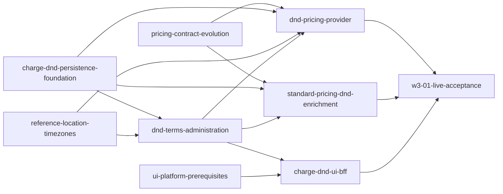

# Unit of Work Dependency DAG - W3-01 D&D Rules and Rates

## Source authority and edge semantics

This DAG is the topology derived from approved `requirements.md`, `stories.md`, and Application Design `components.md`, `component-methods.md`, `services.md`, `component-dependency.md`, and `decisions.md`. Unit definitions are binding in `unit-of-work.md`.

An edge `A depends on B` means A cannot satisfy its independent proof without B's merged contract, schema, package revision, or callable behavior. Only direct hard dependencies appear. The graph does not encode value, risk, staffing priority, a recommended build order, a walking skeleton, or a critical path; Delivery Planning 2.8 chooses an economic path through the valid topology.

## Dependency graph



Text fallback: four units have no incoming hard dependency: contract evolution, persistence foundation, Reference Data timezone support and W2-02 UI platform prerequisites. Terms administration depends on persistence and Reference Data. The pricing provider depends directly on contract, persistence, Reference Data timezone behavior and terms administration. Standard-pricing enrichment depends on contract, persistence and terms administration. Charge UI/BFF depends on terms administration and the UI platform prerequisite. Live acceptance depends on provider, enrichment and UI/BFF; their prerequisites are inherited transitively.

## Machine-readable direct edges

```yaml
units:
  - name: pricing-contract-evolution
    depends_on: []
  - name: charge-dnd-persistence-foundation
    depends_on: []
  - name: reference-location-timezones
    depends_on: []
  - name: ui-platform-prerequisites
    depends_on: []
  - name: dnd-terms-administration
    depends_on: [charge-dnd-persistence-foundation, reference-location-timezones]
  - name: dnd-pricing-provider
    depends_on: [pricing-contract-evolution, charge-dnd-persistence-foundation, reference-location-timezones, dnd-terms-administration]
  - name: standard-pricing-dnd-enrichment
    depends_on: [pricing-contract-evolution, charge-dnd-persistence-foundation, dnd-terms-administration]
  - name: charge-dnd-ui-bff
    depends_on: [dnd-terms-administration, ui-platform-prerequisites]
  - name: w3-01-live-acceptance
    depends_on: [dnd-pricing-provider, standard-pricing-dnd-enrichment, charge-dnd-ui-bff]
```

## Direct dependency rationale

| Dependent | Prerequisite | Hard integration point |
| --- | --- | --- |
| `dnd-terms-administration` | `charge-dnd-persistence-foundation` | Aggregate/version/activity repositories, overlap lock/query and optimistic persistence contract |
| `dnd-terms-administration` | `reference-location-timezones` | Approved LOCATION validation/timezone evidence needed for approval and reference option behavior |
| `dnd-pricing-provider` | `pricing-contract-evolution` | Generated request/result/error/header types and provider fixtures |
| `dnd-pricing-provider` | `charge-dnd-persistence-foundation` | Standard evidence read, D&D claims/replay/completion/release and attempt evidence repository |
| `dnd-pricing-provider` | `reference-location-timezones` | Active IANA port timezone read, bounded timeout and approved unavailable/no-rate distinctions |
| `dnd-pricing-provider` | `dnd-terms-administration` | Exact immutable Approved terms/version lookup and domain value types |
| `standard-pricing-dnd-enrichment` | `pricing-contract-evolution` | Structured trigger and basis-version/effective-date response shapes |
| `standard-pricing-dnd-enrichment` | `charge-dnd-persistence-foundation` | Typed Standard receipt evidence plus owner-fenced Standard release/completion |
| `standard-pricing-dnd-enrichment` | `dnd-terms-administration` | Exact applicable Approved trigger query and fixed rule metadata |
| `charge-dnd-ui-bff` | `dnd-terms-administration` | Stable list/detail/version/history/relationship/mutation endpoints and field errors |
| `charge-dnd-ui-bff` | `ui-platform-prerequisites` | Merged `PlatformShell` active-module/landmark and accessible `Dialog` seams |
| `w3-01-live-acceptance` | `dnd-pricing-provider` | Live zero/non-zero/historical/error/idempotency/performance provider surface |
| `w3-01-live-acceptance` | `standard-pricing-dnd-enrichment` | Fresh/replay trigger evidence and W2 regression surface |
| `w3-01-live-acceptance` | `charge-dnd-ui-bff` | Live administration, AgreementVersion, LinerCore, responsive and accessibility surface |

## Integration contracts

| Boundary | Contract style | Producer responsibility | Consumer responsibility |
| --- | --- | --- | --- |
| Contract -> provider/enrichment | Generated OpenAPI models/fixtures | Exclusively publish additive exact v1 shapes, signed fixtures and contract-compatibility evidence | Compile against generated types/fixtures; preserve exact semantics and error precedence; do not regenerate or re-own signoff |
| Persistence -> Charge application units | Java ports/JDBC/Flyway | Provide namespace-qualified atomic repositories and upgrade-safe schema | Use ports only; do not bypass fencing, locks, evidence or namespace predicates |
| Reference Data -> terms/provider | Synchronous REST through Charge adapter | Validate/serve active IANA timezone attribute | Fail closed with approved 404/422/503 distinctions and bounded timeout |
| Terms -> provider/enrichment/UI | Charge application/domain/API contracts | Publish exact Approved/version/applicability queries and stable admin API | Never select latest/current as a fallback or infer missing applicability |
| W2-02 package -> Charge UI | Versioned `@erp/ui` workspace package | Publish tested shell/Dialog seams and merged revision | Consume shared primitives without local fork or shell mutation |
| Runtime branches -> acceptance | Live API/UI/fixture evidence | Expose production behavior and focused automated tests from their primary units | Verify and collect evidence/signoff without recreating fixtures or claiming primary ownership |

No async event, queue, saga, new database, direct cross-service database read, Booking runtime trigger, or CMM runtime integration is introduced.

## Parallel-development opportunities

The following are antichains: units inside a set have no dependency path between one another and may be developed concurrently if repository coordination permits. This is not a recommended execution order.

- `{pricing-contract-evolution, charge-dnd-persistence-foundation, reference-location-timezones, ui-platform-prerequisites}`
- `{dnd-pricing-provider, standard-pricing-dnd-enrichment, charge-dnd-ui-bff}` once each member's own prerequisites are satisfied
- Contract-focused tests, persistence migration tests, Reference Data contract tests and UI package tests remain independently attributable even if Delivery Planning places them in the same Bolt.

Multiple valid topological orders therefore exist. Delivery Planning chooses Bolt composition and sequencing; this stage deliberately makes no economic recommendation.

## Cycle and completeness verification

The YAML block declares each of the nine unit names exactly once, uses only declared direct dependencies, contains no self-edge and is acyclic. A valid level partition used only to prove acyclicity is:

1. dependency-free set: contract, persistence, Reference Data, UI platform;
2. terms administration after persistence and Reference Data;
3. provider, enrichment and UI/BFF after their declared prerequisites;
4. live acceptance after all three runtime/UI branches.

Every edge in the Mermaid/text representation appears in the YAML block and rationale table. No prose-only dependency is required for correctness.

## Constraints inherited by downstream planning

1. W2-02-owned UI platform work must be merged and package-tested before Charge UI consumption; W4-01 is not a shared-shell owner.
2. Schema migration and legacy Standard-row migration-compatibility proof are inseparable from the persistence foundation's completion; contract fixtures/signoff and Standard runtime/replay regressions remain owned by their named units.
3. Provider and enrichment may share code only through the approved Charge domain/application ports; neither may reuse current-authority selection for historical D&D validation.
4. The live acceptance unit cannot waive transitive prerequisites, dual contract signoff, security resolution, changed-line coverage, measured p99, or the two exit audits.
5. Any later split/merge of a unit must preserve this graph's contract ownership, story coverage and cycle-free topology.

## Architecture review

The mandatory reviewer completed two iterations.

- **Iteration 1 - NOT READY:** corrected one stale UI route and duplicate ownership of generated fixtures, W2 compatibility and bilateral signoff.
- **Iteration 2 - READY:** verified the exact `/charge-agreements/dnd/terms` route family; consistent nine-unit names and direct edges; valid cycle-free YAML; exclusive contract, migration, runtime/replay and verification ownership; full story/requirement/acceptance coverage; and topology-only posture.

No orphan unit/story, hidden hard dependency, invented scope, selected implementation order or critical path remains.
