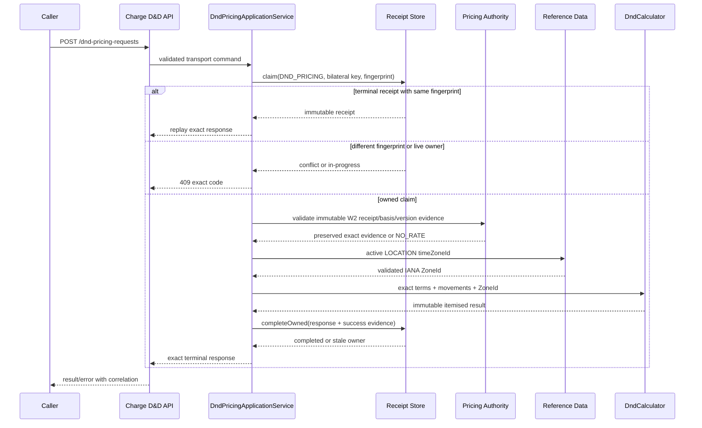

# Services - W3-01 D&D Rules and Rates

## Traceability basis

Service boundaries derive from [requirements.md](../requirements-analysis/requirements.md), [stories.md](../user-stories/stories.md), [architecture.md](../../../../codekb/TST_Codex_W3-01/architecture.md), [component-inventory.md](../../../../codekb/TST_Codex_W3-01/component-inventory.md), and [team-practices.md](../practices-discovery/team-practices.md). UI service use follows the approved [interaction-spec.md](../refined-mockups/interaction-spec.md). The design preserves the existing Compose topology and approved W2-03 pricing contracts.

## Deployable service definitions

| Existing deployable | W3-01 responsibility | Lifecycle/scaling |
| --- | --- | --- |
| `charge-agreement-service` | Host D&D domain, admin APIs, exact-snapshot evaluator, PostgreSQL adapters, identity/reference clients, audit and telemetry | Same stateless JVM/container lifecycle; horizontal replicas share PostgreSQL claim leases and locked approval constraints |
| `apps-charge-agreements` | Host authenticated list/create/detail/edit/successor pages and same-origin BFF routes | Same Next.js process and shared shell; no separate frontend or local theme |
| `reference-data-service` | Validate and return `LOCATION.attributes.timeZoneId` | Existing service and storage; no D&D tables or logic |
| Identity service | Existing W2-03 `charge-rates` capability decisions and subject evidence | Existing fail-closed local/HTTP profile behavior |
| PostgreSQL | Existing Charge-owned schema plus additive tables/migration | Existing Compose volume; no cross-service table access |

No new deployable or AWS mapping is justified. Local Compose acceptance does not assert production scaling, backup, disaster recovery, or cloud availability.

## Communication contracts

| Caller -> provider | Pattern | Contract | Failure posture |
| --- | --- | --- | --- |
| Charge UI BFF -> Charge service | Synchronous REST | Additive D&D admin endpoints | Preserve field errors/correlation; bounded timeout; denied remains denied |
| Direct test/future Booking -> Charge service | Synchronous REST | `POST /dnd-pricing-requests`, `pricing.dnd-request/result` | Exact FR-06 status/code; no guessed or partial response |
| Charge service -> Reference Data | Synchronous REST | Existing reference validation/read seam plus `LOCATION.timeZoneId` attribute | Missing/invalid/unavailable timezone fails closed |
| Charge service -> Identity | Existing synchronous decision seam | Admin: `charge-rates` lifecycle actions; provider: `charge-agreement:price` | 401/403/503 remain distinguishable |
| Charge -> Booking fixtures | Build-time contract verification | Regenerated consumer/provider fixtures | Dual owner signoff; no W3-01 runtime trigger |
| Container Movement -> Booking | Existing asynchronous contract, future W3-02 | `containermovement.status` | No W3-01 Charge subscriber |

The orchestration style is request/response within Charge. There is no new choreography, event topic, queue, saga, or distributed transaction.

## Fresh booking-time pricing enrichment

The existing `PricingApplicationService` continues current Agreement-first/Tariff-fallback selection. On a newly owned claim, after a complete `ResolvedPricingAuthority` is selected and before terminal rendering, `DndTriggerMetadataResolver`:

1. derives `pricingBasisVersionId` (`agreementVersionId` for Agreement; the existing ordered tariff composite `pricingRef` for Tariff) and `pricingEffectiveDate=requestedDepartureDate`;
2. queries Approved D&D terms using exact basis/version, POL for export detention, POD for import rule types, trade lane, equipment type, and effective date;
3. returns structured fixed-code metadata, ordered by rule type, with no free-day/rate fields;
4. on repository failure or duplicate applicable authority, owner-fenced releases the existing `STANDARD_PRICING` claim through `PricingRequestRepository.releaseOwned(idempotencyKey, ownerToken)` before failing the fresh request as `PRICING_UNAVAILABLE`; a lost release reclassifies the winner.

`PricingResult`, controller DTO, OpenAPI runtime all-or-none evidence, and `JacksonPricingTerminalRenderer` carry these fields. Completion stores the enriched bytes plus typed immutable original-request evidence (`pol`, `pod`, trade lane, equipment type, effective date) on the `STANDARD_PRICING` receipt. A handled enrichment failure leaves no live Standard claim after a successful fenced release, so immediate retry can claim; a crash retains the existing lease/takeover semantics. An exact replay is not re-queried or changed when a D&D successor later becomes effective. The D&D provider requires the caller to echo the stored `pricingRequestId`, basis, reference, basis-version id, effective date, derived-side port, trade lane, and equipment type; every value is compared to the receipt before terms lookup.

## D&D pricing request sequence

Text fallback: the provider claims the namespaced key before calling authorities. An identical completed claim replays; a different fingerprint or live owner stops. Only an owned claim may validate the exact snapshot, resolve timezone, calculate, and atomically complete. Stale ownership never emits a newly calculated response.

For any handled 400/404/422/503 after claim, the service appends outcome evidence then calls owner-fenced `releaseOwned` before responding. A lost release reclassifies the winning row. A process crash retains only the bounded lease and is eligible for database-time takeover. This distinguishes a handled unavailable response (immediate retry can reclaim) from a crashed/in-progress owner (409 until lease expiry).

## Transaction and consistency boundaries

1. Terms create/update/successor each persist the aggregate version and activity in one Charge database transaction.
2. Approval calls `pg_advisory_xact_lock(hashtextextended(canonicalApplicabilityKey, 0))`, where the canonical key length-prefixes basis, basis-version id, rule type, derived side, port, trade lane, and equipment type. Under that transaction-scoped lock it checks inclusive `daterange(effective_from,effective_to,'[]') && candidate`, then approves and appends activity atomically. Hash collision can only over-serialize and cannot admit overlap. A conflict maps to `422 DND_TERMS_OVERLAP` with `effectiveFrom`/`effectiveTo` errors and the authorised conflicting version/window.
3. Pricing claim and takeover use database time. Completion compares operation namespace, bilateral key, owner token, and `IN_PROGRESS` status before storing the exact terminal payload.
4. Reference/identity calls occur outside database locks. Their failures abort before a calculation result is persisted.
5. A successful D&D result is immutable. Historical terms and pricing receipts are read, never upgraded to a successor.
6. `dnd_pricing_attempts` is the durable evaluation-audit boundary. New success evidence commits in the receipt completion transaction; replay/rejection evidence commits before response. Nullable terms ids never prevent retrieval: unique attempt lookup and bounded search by correlation, booking/equipment/closing-event identity, outcome/time, or terms id are indexed. Audit write failure fails application work as `503 PRICING_UNAVAILABLE`; filter-level identity rejection keeps its required status and emits a bounded fallback error if the audit store itself is down.

The system is strongly consistent inside Charge's database boundary and fail-closed across synchronous authority calls. There is no cross-service transaction.

## Persistence evolution and compatibility

An additive Flyway migration introduces `dnd_terms`, `dnd_terms_versions`, `dnd_terms_activity`, and `dnd_pricing_attempts`, then evolves `pricing_requests` under an access-exclusive table lock in one Flyway transaction:

1. add/backfill `operation_namespace='STANDARD_PRICING'`, plus nullable D&D identity columns and nullable Standard evidence columns `pricing_pol`, `pricing_pod`, `pricing_trade_lane`, `pricing_equipment_type`, `pricing_effective_date`; expand `idempotency_key` to 512;
2. drop `pricing_requests_pkey`, `pricing_requests_booking_ref_amendment_seq_key`, `ck_pricing_requests_terminal_shape`, and `uq_pricing_requests_terminal_request`; drop `amendment_seq NOT NULL`;
3. add `pk_pricing_requests_namespace_key(operation_namespace,idempotency_key)` and a namespace enum check;
4. add an identity-shape check: Standard requires amendment and forbids D&D ids; D&D requires equipment/closing ids and forbids amendment;
5. add partial uniques `uq_pricing_requests_standard_booking_amendment`, `uq_pricing_requests_dnd_tuple`, and namespace-qualified terminal-request uniqueness;
6. replace the terminal-shape check: Standard retains existing `PRICED/pricing.v1` and MANUAL behavior; D&D permits only `COMPLETED`, HTTP 200, `DND_PRICED`, `pricing.dnd.v1`, response bytes, request id, completion time, and no manual case;
7. replace the lease index with `(operation_namespace,status,lease_until)` and validate all new constraints before releasing the lock.

Existing rows must pass the Standard branch before constraint replacement. Existing W2-03 repository method signatures and serialization stay unchanged; the only port addition is owner-fenced `releaseOwned` for the new enrichment-failure path. Every SQL statement qualifies `STANDARD_PRICING`; regression tests cover reads, claims, takeovers, completion, enrichment release, legacy manual cases, and exact byte replay before/after migration. D&D rows use `DND_PRICING` and the distinct D&D renderer.

Rollback is forward-fix at the schema level after production data exists. Application rollback remains possible while new nullable/defaulted columns and D&D tables are unused; once D&D receipts exist, old code must ignore them safely rather than delete them. No destructive down migration is part of W3-01.

## API compatibility strategy

- Keep every existing `pricing.v1` W2-03 required field, operation id, response shape, error, and fixture.
- Keep the existing required `applicableDndRuleTypes` array and populate its structured items with only rule type and fixed movement codes/qualifiers.
- Add backward-compatible `pricingBasisVersionId` and `pricingEffectiveDate`; fresh provider successes emit both and D&D requests must echo them with `pricingRequestId`.
- Add `pricing.dnd-request`, `pricing.dnd-result`, their exact errors, and `/dnd-pricing-requests`.
- Regenerate Charge provider and Booking consumer fixtures and require both owners to sign the same generated shapes.
- Prove W3-01 through direct provider calls; do not add the Booking runtime trigger owned by W3-02.

## Security and trust boundaries

The provider reuses W2-03 subject propagation, correlation, service identity, and the existing `charge-agreement:price` decision. `PricingServiceIdentityFilter.shouldNotFilter` is extended to protect both exact POST paths `/pricing-requests` and `/dnd-pricing-requests`, preserving the implementable filter order: actor/subject spoof rejection (400), trusted service id/token authentication (401), then correlation validation (400). Controller media/idempotency/body validation runs only after that filter, and application authorization follows controller validation. D&D admin actions separately reuse `charge-rates` read/create/update/approve/create-successor; `RateServiceIdentityFilter.shouldNotFilter` is extended to protect `/api/charge-dnd-terms` and all descendants in addition to `/api/charge-rates`. Filter contract tests enumerate every new path, assert this precedence, and prove unrelated routes are not intercepted.

The D&D media type is `application/vnd.api.v1+json`; `Idempotency-Key` is the exact length-prefixed `bookingRef/equipmentId/endMovement.movementEventId` tuple defined in `component-methods.md`. Because the security filter precedes the controller, spoofing wins first, missing/bad trusted service identity is `401 PRICING_SERVICE_IDENTITY_REQUIRED`, correlation validation follows, then media/idempotency/body transport validation, and denied `charge-agreement:price` is `403 PRICING_FORBIDDEN`.

The BFF is the browser trust boundary: it reads the authenticated server session, forwards only approved identity/correlation evidence, applies same-origin protections already used by Charge, and never serializes internal service credentials to the browser.

## Reliability, performance, and observability

- Determinism: pure calculation from immutable terms, exact snapshot, movements, and ZoneId.
- Idempotency: namespaced database-time lease plus owner-token fenced completion.
- Atomicity: no persisted partial line; replay returns the exact stored bytes/status/schema.
- Performance: provisional warm-local p99 <= 1.5 seconds, with host/build/concurrency/sample/distribution evidence. Timeouts are bounded below the caller budget and do not trigger fallback pricing.
- Metrics: bounded operation/outcome/rule-type/replay tags; no commercial identifiers as labels.
- Logs/audit: correlation, disposition, source-version ids only when they exist, and no secrets/raw payload as the primary record.
- Restart: terms and terminal receipts survive normal service restart in the existing Compose volume.

Reference Data keeps `LOCATION.attributes.timeZoneId` optional for legacy compatibility, validates a present value as IANA with field-level `422 REFERENCE_ATTRIBUTE_INVALID`, and backfills the accepted lane ports `SGSIN=Asia/Singapore` and `NLRTM=Europe/Amsterdam`. D&D approval requires timezone evidence. Charge uses existing Reference Data service credentials/correlation with 250 ms connect and 500 ms response timeouts, no automatic retry, no direct database access, and no guessed/cache fallback. Missing configuration is provider unavailability; a mismatched/inactive echoed port remains `NO_RATE`.

## UI delivery and platform dependency

The Charge pages render through `PlatformShell` with `journeyStage={null}` and compose `@erp/ui`. Generic `StatusStrip`, explicit-tone `Badge`, and section-safe markup satisfy partial/status/scoped-error composition now; they are not blockers.

The W2-02 UI platform owner must deliver two `packages/ui` changes against the W3-01 baseline before the dependent Charge frontend Bolt: (1) explicit active-module metadata plus canonical rail and shared skip-link/main landmark in `PlatformShell`; (2) a `Dialog` description/`aria-describedby` seam. W4-01 owns Reference Data page work only and has no `packages/ui` or shared-shell authority. The binding owner artifacts are `design-system/linercore/MASTER.md` and `design-system/linercore/pages/dnd-rules-and-rates.md`. Package tests must prove the rail/landmark/keyboard contract and dialog name/description/focus contract. Delivery Planning records the merged commit/workspace revision; W3-01 route Playwright then verifies consumption at 375/768/1024/1440 in light/dark. No Charge-only shell/dialog substitute is allowed.

The existing Agreement detail route gains a read-only D&D section backed by `/api/charge-dnd-terms/relationships/agreement-versions/{agreementVersionId}`. The BFF discriminates ready/empty/denied/unavailable, and denial discloses no count or identifiers. D&D list query encoding is fixed to `q`, `ruleType`, `port`, `lifecycle`, `effectiveState`, `sort`, `page`, `size`; detail history uses `?version=<dndTermsVersionId>`.

## Release topology and verification

The isolated live Compose stack is the only W3-01 deployment target. Release evidence must include domain/repository/contract tests, changed-line coverage, W2-03 regressions, Playwright at 375/768/1024/1440 in light/dark, direct zero/non-zero/successor API behavior, p99 measurement, provider/consumer signoff, required security-gate evidence, `aidlc-audit`, and `erp-fidelity-audit`.
