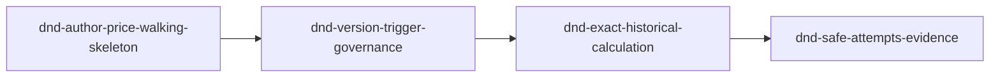

# Unit of Work Dependency DAG - W3-01 Vertical D&D Rules and Rates

## Source authority and dependency semantics

This DAG derives from approved `requirements.md`, `stories.md`, Application Design `components.md`, `component-methods.md`, `services.md`, `component-dependency.md`, `decisions.md`, the LinerCore `mockups.md`, `team-practices.md` and binding vertical-slice practices. Unit definitions are in `unit-of-work.md`.

An edge `A depends on B` means A cannot deliver its live outcome without B's proved behavior, owned schema/contract or immutable evidence. The chain is a hard architectural/story constraint, not an economic recommendation or critical-path claim. Delivery Planning chooses Bolt grouping and confidence sequencing but may not violate the direct dependencies.

## Dependency graph



Text fallback: the author-and-price walking skeleton proves and owns the shared migration/contract foundation. Version/trigger governance consumes it. Exact historical calculation consumes the complete lifecycle/trigger behavior. Safe-attempt/evidence completeness consumes the exact happy and historical provider path. There is one valid unit-level topological order because each outcome extends an observable prerequisite from the prior slice.

## Machine-readable direct edges

```yaml
units:
  - name: dnd-author-price-walking-skeleton
    depends_on: []
  - name: dnd-version-trigger-governance
    depends_on: [dnd-author-price-walking-skeleton]
  - name: dnd-exact-historical-calculation
    depends_on: [dnd-version-trigger-governance]
  - name: dnd-safe-attempts-evidence
    depends_on: [dnd-exact-historical-calculation]
```

## Direct dependency rationale

| Dependent unit | Direct prerequisite | Hard reason |
| --- | --- | --- |
| `dnd-version-trigger-governance` | `dnd-author-price-walking-skeleton` | Consumes the one migration chain, aggregate/provider foundation, signed generated fixtures and proved UI/provider path before adding immutable lifecycle, successor and W2 enrichment behavior |
| `dnd-exact-historical-calculation` | `dnd-version-trigger-governance` | Historical/old/successor evaluation requires immutable version lineage, exact trigger/basis evidence and successor behavior to exist first |
| `dnd-safe-attempts-evidence` | `dnd-exact-historical-calculation` | Error/no-rate/idempotency/audit dispositions must wrap the exact provider path and distinguish existing success/source evidence from unresolved/failed outcomes |

No unit depends on a later unit, itself or an undeclared name. The Mermaid, text, YAML and rationale table contain the same three edges.

## Cross-slice integration contracts

| Boundary | Producer guarantee | Consumer guarantee |
| --- | --- | --- |
| Unit 1 -> Unit 2 | Upgrade-safe namespaced schema, fixed terms/provider value types, additive signed `pricing.v1` fixtures, representative live path | Extend lifecycle/enrichment against those owned seams; do not rewrite migrations, regenerate fixtures or re-own signoff |
| Unit 2 -> Unit 3 | Immutable all-type versions, successor/AgreementVersion lineage, exact fresh trigger/basis evidence and replay invariance | Resolve only preserved exact versions/evidence; add Agreement/Tariff/timezone calculation breadth without current selection |
| Unit 3 -> Unit 4 | Deterministic exact happy/historical provider results and authorised evidence semantics | Add error/security/idempotency/evidence dispositions without changing success bytes, calculation formula or version selection |

All cross-slice calls stay within approved Charge ports, REST contracts and shared packages. No async topic, new service, new database, direct cross-service persistence read, Booking runtime trigger or CMM edge is introduced.

## External prerequisites and non-unit gates

These items are not W3-01 Units because they are owned outside W3-01 or apply to the integrated intent rather than one delivery slice:

| Item | Owner | Units affected | Completion evidence |
| --- | --- | --- | --- |
| `PlatformShell` active-module/canonical-rail/skip-main seam | W2-02 `packages/ui` owner | Unit 1 minimum UI and all later Charge UI | merged workspace revision and package tests; no local substitute |
| `Dialog` programmatic-description seam | W2-02 `packages/ui` owner | Unit 2 approval/successor UI and later evidence states | merged workspace revision and accessible Dialog tests |
| Isolated Compose reservation/demo guards | Release-review owner | integrated Units 1-4 | guarded stack evidence; serialized environment use |
| Final p99/coverage/security/signoff verification and both audits | W3-01 release owners | integrated Units 1-4 | accepted/revised p99 record, consolidated coverage, security resolution, signed manifest verification, green audits |

Delivery Planning must map these external dependencies/gates to Bolts and cannot convert an unmet item to a local workaround or false green.

## Parallel-development opportunities

There is no pair of units with no dependency path, so there is no safe unit-level parallel antichain. This is a topology fact, not a recommendation to serialize every task. Within a unit, repository-safe workstreams such as focused Reference Data, Charge, contract and UI changes may proceed concurrently only when one owner controls the protected migration/contract files and the unit converges as one live slice.

This stage authorises no Bolt bundling. U01 must remain a solo, separately gated walking-skeleton Bolt. Delivery Planning may evaluate compatible grouping only among U02-U04, and any choice must preserve each unit's independently attributable live DoD and the hard chain.

## Cycle and completeness verification

The YAML declares all four unit names exactly once, uses only declared direct dependencies, contains no self-edge and is acyclic. Kahn-style removal yields U1, then U2, then U3, then U4. Each dependency corresponds to an upstream story/architecture requirement; no prose-only hard edge is omitted.

## Constraints for downstream planning

1. The first Construction Bolt must honor the affirmed walking-skeleton stance and remain separately gated.
2. Migration/contract file ownership stays with Unit 1. U01 is never bundled; later slices consume rather than co-own those files.
3. W2-02 package prerequisites must merge before dependent integrated UI proof; no Charge-local shell/Dialog fork is allowed.
4. Focused tests travel with every unit; the integrated exit gates do not become a fifth Unit or substitute for unit proof.
5. W2-03 compatibility, exact immutable evidence, port-local calculation, owner fencing, authorization and disposition-specific audit semantics remain mandatory across every Bolt boundary.

## Architecture review

The mandatory reviewer completed two iterations on the clean vertical redo.

- **Iteration 1 - NOT READY:** required binding template headings/seam proof, concrete per-unit running-stack DoDs, attributable UI proof for all UI-bearing slices, and an unambiguous no-bundling rule for U01.
- **Iteration 2 - READY:** verified all binding headings and sensors, real cross-module seam exercise, guarded live observations with engine-real Build and Test 3.6 evidence paths, focused UI/accessibility/responsive proof, solo gated U01, exclusive ownership, cycle-free DAG and complete traceability.

No horizontal/test-only unit, orphan story, hidden seam, invalid evidence path, selected economic sequence or implementation blocker remains.
